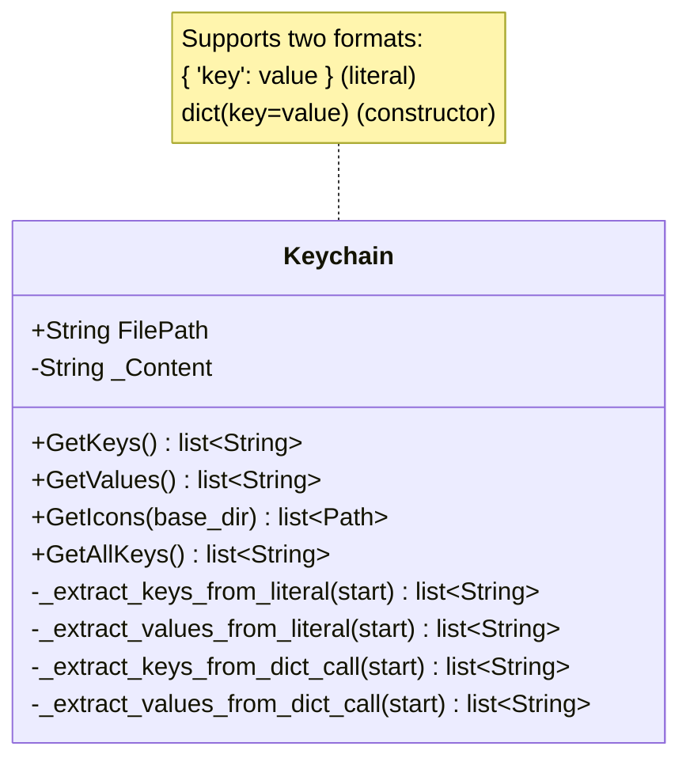

# Keychain

> **File:** `Dav/scr/ComponentesDAV/Keychain/Keychain.py`

Extracts the keys and icons from a `.py` dictionary **without running it**:
it parses the file's text. It is used to read the dictionaries from outside
FreeCAD, where `import FreeCADGui` would fail.

## Why the module is not imported

The dictionaries in `Dav/dic/` do `import FreeCADGui` in their header. Outside
FreeCAD that raises `ModuleNotFoundError`, so any external tool that wants to
list the commands (a test, an audit script, the GUI when it ran as a separate
process) cannot simply import them.

`Keychain` reads the file as text and extracts the keys by parsing. It does not
execute anything, so it does not need FreeCAD.

## Design notes

- **It is tolerant but not infallible.** Since it parses text rather than an AST,
  unusual formats can slip past it. If a dictionary does not show up where it
  should, first check that it uses one of the two supported formats.
- The `Browser` does **not** use `Keychain`: inside FreeCAD it really imports the
  modules via `DictionaryLoader`, which can resolve the callables.
