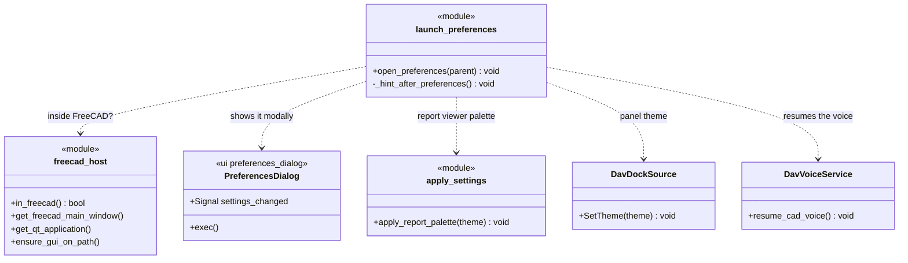
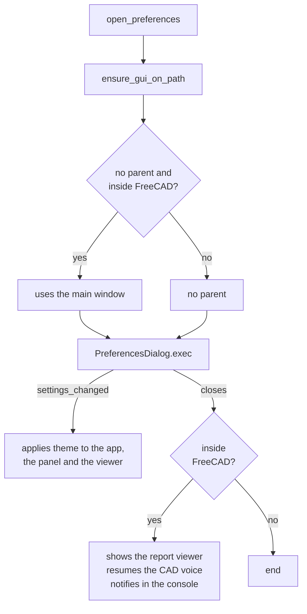

# LaunchPreferences

> **File:** `Dav/scr/ComponentesDAV/IntegracionGUI/GUIFreeCad/integration/launch_preferences.py`

Opens the **DAV Preferences dialog** inside FreeCAD (or standalone, in tests)
and, when it closes, applies what changed: the theme, the docked panel and the
voice. It is the callable run by the "preferencias" (preferences) command of the root dictionary.

## What happens on open

## Design notes

- **It is modal.** When it is closed inside FreeCAD, `DavVoiceService.resume_cad_voice()`
  is called so the voice goes back to controlling CAD.
- **Changes are applied live** (`settings_changed`), without restarting FreeCAD.
- **Each application is in its own `try`:** if the panel does not exist or the palette
  fails, the rest is still applied.
- It can be opened from the voice thread with
  [`FreecadGuiBridge`](FreecadGuiBridge.md) (`request_open_preferences`).
- See also [`Preferences`](Preferences.md), which stores and persists the settings.
