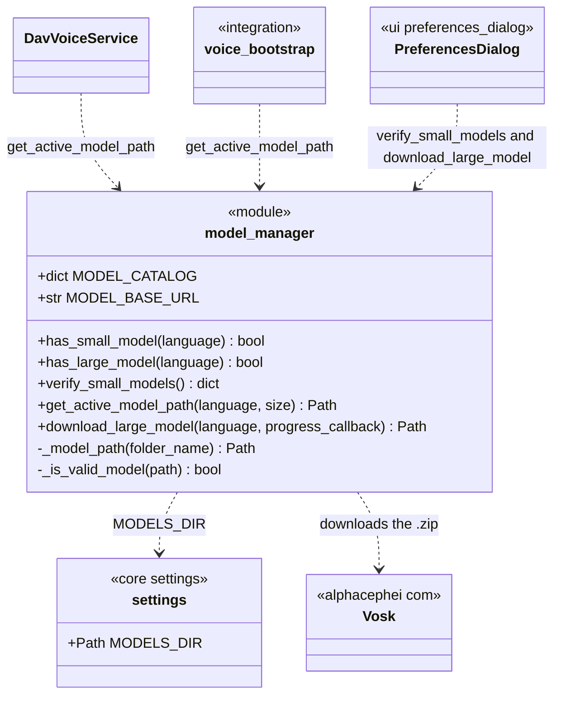
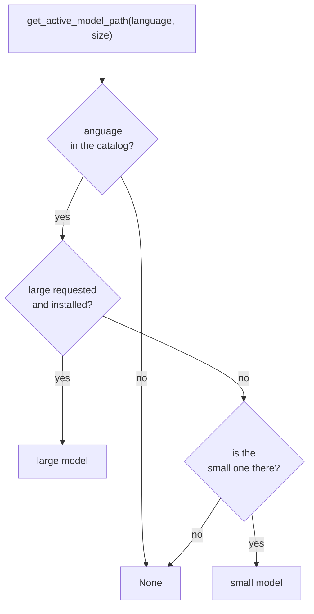

# ModelManager

> **File:** `Dav/scr/ComponentesDAV/IntegracionGUI/GUIFreeCad/core/model_manager.py`

A module of functions (not a class) that **verifies and downloads the Vosk models**.
Each language has a *small* model (shipped with the project) and a *large* one
(downloaded on demand). It decides which folder to use based on the size
preference and what is on disk.

## Catalog

| Language | Small model | Large model |
| --- | --- | --- |
| `es` | `vosk-model-small-es-0.42` | `vosk-model-es-0.42` |
| `en` | `vosk-model-small-en-us-0.15` | `vosk-model-en-us-0.22` |
| `pt` | `vosk-model-small-pt-0.3` | `vosk-model-pt-fb-v0.1.1-20220516_2113` |

## Which model is chosen

## Design notes

- **A model is valid if its folder contains any of its characteristic files**
  (`am`, `graph`, `conf`, `ivector`, `final.mdl`, `Gr.fst`). An empty or half-downloaded
  folder does not count.
- **Requesting the large model without having it falls back to the small one**, so
  recognition is never left without a model as long as the small one is present.
- **`download_large_model`** downloads the `.zip`, extracts it into `MODELS_DIR`, deletes the `.zip`
  and validates the result; if the extracted folder has a different name, it renames it. It reports
  progress through a `progress_callback(downloaded, total)`.
- **The size** comes from `settings.model_size` (user preference).
- **The models folder** comes from `core/settings.py` and honors `DAV_MODELS_DIR`.
- A large model does **not** improve command recognition: see `pendientes-dav.md` §10.
