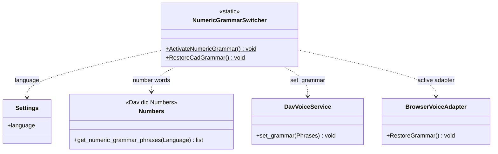

# NumericGrammarSwitcher

> **File:** `Dav/scr/ComponentesDAV/IntegracionGUI/GUIFreeCad/InputPrompts/NumericGrammarSwitcher.py`

Switches the Vosk grammar **between the CAD grammar and the number-dictation
grammar**. It is deliberately separate from [`PromptVoiceRouter`](PromptVoiceRouter.md): the router only
knows *which prompt is active*; switching the grammar is a different responsibility, with its
own dependencies.

## Responsibilities

| Method | What it does |
| --- | --- |
| `ActivateNumericGrammar()` | Asks `Numbers` for the number phrases of the active language and hands them to Vosk |
| `RestoreCadGrammar()` | Asks the `Browser`'s active adapter to recompute the grammar for the current context |

## Design notes

- **The numeric vocabulary lives in the dictionary** (`Dav/dic/Numbers/`), not in the
  code: adding a synonym means editing a `TraduceTo*.py`. See
  [`numbers-dictionary-grammar.md`](../numbers-dictionary-grammar.md).
- **It fails silently:** both methods catch exceptions. If there is no voice (for
  example in tests), a numeric prompt keeps working with simulated text.
- It is triggered by `PromptVoiceRouter` when the registered prompt returns `True` from
  `RequiresNumericGrammar()`; see [`NumericInputPrompt`](NumericInputPrompt.md).
