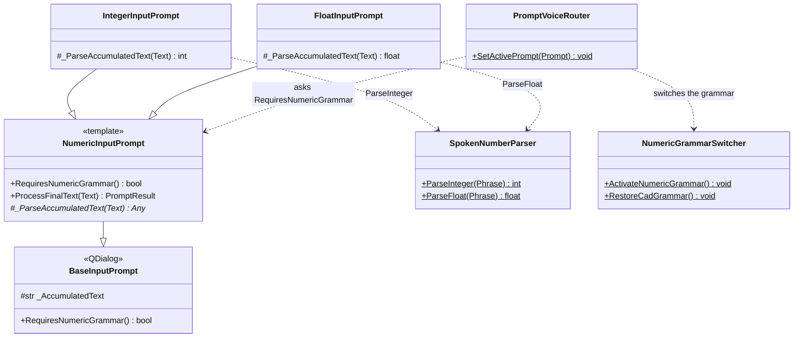
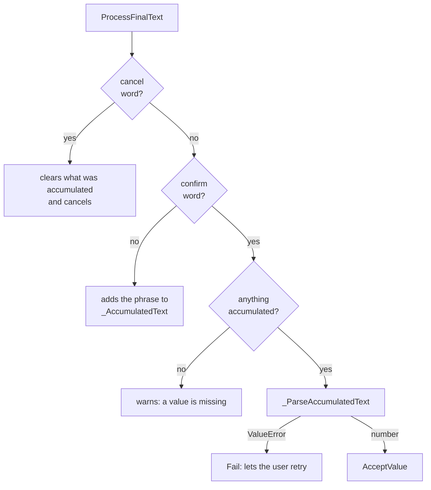

# NumericInputPrompt

> **File:** `Dav/scr/ComponentesDAV/IntegracionGUI/GUIFreeCad/InputPrompts/NumericInputPrompt.py`

Template for the prompts that ask for **a dictated number**. It stores what the user
says even when it is spread over several phrases ("cinco" (five) ... "coma" (point) ... "dos" (two) ... "okey") and
only converts it once it hears a confirmation word. Subclasses only
implement **how to convert** the accumulated text.

## Flow of a phrase

## Design notes

- **Template pattern.** The accumulate / confirm / cancel flow lives here only once; a new
  numeric type just overrides `_ParseAccumulatedText`.
- **`RequiresNumericGrammar()` returns `True`.** This way [`PromptVoiceRouter`](PromptVoiceRouter.md)
  switches the Vosk grammar to the number words **without checking concrete types**.
- The conversion from words to number (including "coma" (point), "menos" (minus) and tens) is in
  [`SpokenNumberParser`](SpokenNumberParser.md).
- A conversion error (`ValueError`) uses `Fail`: the dialog stays open and what was accumulated
  has already been discarded, so the user dictates the number again.
