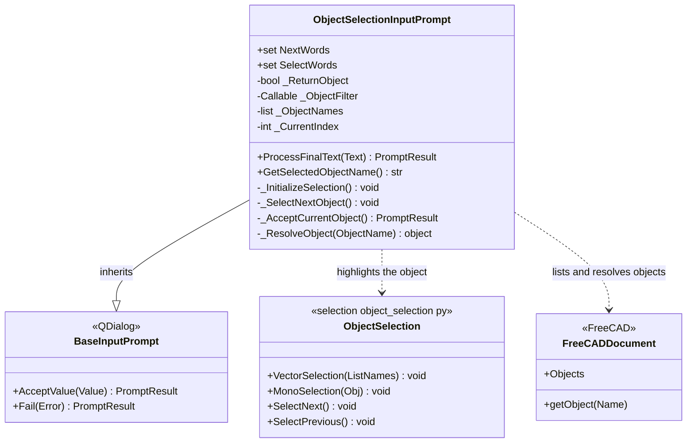

# ObjectSelectionInputPrompt

> **File:** `Dav/scr/ComponentesDAV/IntegracionGUI/GUIFreeCad/InputPrompts/ObjectSelectionInputPrompt.py`

Chooses **one object of the active document** by cycling through them by voice: *siguiente* (next)
highlights the next one (in the 3D view and in the tree) and *okey* or *seleccionar* (select) confirms it.
It is the prompt that `ParameterCollector` creates for object-type parameters.

## How it works

1. When created, it takes the objects of the active document. If an `ObjectFilter` was passed, only
   those that return `True` are kept.
2. With no document, or no objects that qualify, it calls `Fail` with a message and offers nothing.
3. `siguiente` (or *otro*, *avanzar*, *next*, *seguinte*...) moves to the next one, wrapping
   around to the start.
4. `okey` or `seleccionar` accepts the highlighted object.

| `ReturnObject` | Accepted value |
| --- | --- |
| `False` (default) | The object's **name** (text) |
| `True` | The FreeCAD object; if it cannot be resolved, it falls back to the name |

## Design notes

- **The filter is what makes it reusable.** `askObject` in `Workbench/_prompts.py`
  uses it with filters such as `isProfile` or `isSolid` to offer only sketches or only parts.
- **It imports `ObjectSelection` with several path fallbacks**, because `scr/selection/`
  may not be on `sys.path` when running inside FreeCAD.
- Details on how `selection/` is integrated into the program: `pendientes-dav.md` §12.
