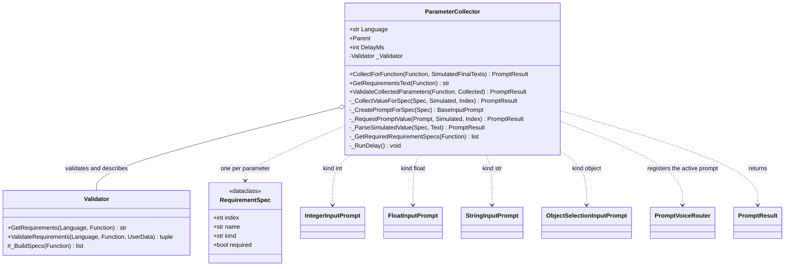

# ParameterCollector

> **File:** `Dav/scr/ComponentesDAV/IntegracionGUI/GUIFreeCad/InputPrompts/ParameterCollector.py`

Gathers **all the parameters a dictionary function needs**. It looks at the
function signature (with help from the [`Validator`](Validator.md)), opens a
voice dialog for each required parameter according to its type, and at the end
validates the whole set. It returns a `PromptResult` whose value is the
dictionary of arguments ready to call the function.

## Which prompt each type opens

| `kind` | Prompt | Value |
| --- | --- | --- |
| `int` | [`IntegerInputPrompt`](NumericInputPrompt.md) | `int` |
| `float` | [`FloatInputPrompt`](NumericInputPrompt.md) | `float` |
| `str` | `StringInputPrompt` | text without the confirmation word |
| `object` (and everything else) | [`ObjectSelectionInputPrompt`](ObjectSelectionInputPrompt.md) | object name |

## Responsibilities

| Method | What it does |
| --- | --- |
| `CollectForFunction(Function, Simulated)` | Walks the **required** parameters, asks for them one by one and validates the set. With no required parameters it returns `Ok({})` |
| `_RequestPromptValue` | Registers the prompt in [`PromptVoiceRouter`](PromptVoiceRouter.md), shows it modally and **always** releases it when done |
| `GetRequirementsText(Function)` | Localized text of the requirements (built by `Validator`) |
| `ValidateCollectedParameters` | Converts and validates the values with `Validator.ValidateRequirements` |
| `_RunDelay()` | Pauses `DelayMs` with a `QEventLoop` between one prompt and the next, without freezing the interface |

## Design notes

- **If any parameter is cancelled, everything is cancelled:** the cancelled result bubbles up as-is and the function is not run.
- **Simulated mode.** `SimulatedFinalTexts` replaces the voice with a list of phrases
  (one per parameter, each ending in "okey"). It allows testing the collection without a
  microphone or windows.
- **The language is read every time.** `Language` queries `ResolveLanguage()` live: the
  collector is created only once when the voice starts and, if it stored the language of that
  moment, the titles would stay in the previous language after changing it in Preferences.
- **Fallback without `Validator`:** `_BuildFallbackSpecs` builds the specifications from the
  function's type annotations (`int`, `float`, `str`; anything else is `object`).
- Full flow: [`CommandWithParametersFlow`](CommandWithParametersFlow.md).
