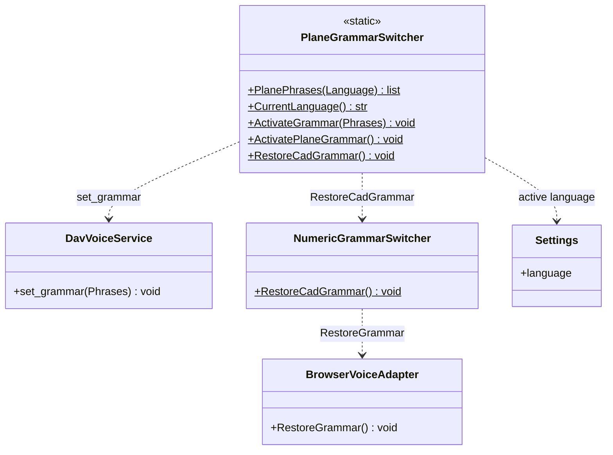

# PlaneGrammarSwitcher

> **File:** `Dav/scr/ComponentesDAV/IntegracionGUI/GUIFreeCad/InputPrompts/PlaneGrammarSwitcher.py`

Narrows the Vosk grammar to **the few words a dialog understands**. With an open
vocabulary, Vosk confuses navigation words with similar ones; with a small
grammar, recognition improves a lot. Although it is called
"Plane", today it is used by all prompts with their own vocabulary.



## Responsibilities

| Method | What it does |
| --- | --- |
| `PlanePhrases(Language)` | Minimal phrases: up/down, confirmation (okey, enviar, listo...) and cancellation |
| `CurrentLanguage()` | Configured language (`es` if it cannot be read) |
| `ActivateGrammar(Phrases)` | Restricts Vosk to those phrases. If it fails, recognition continues with open vocabulary |
| `RestoreCadGrammar()` | Returns the grammar of the `Browser`'s current context |

## Usage pattern

```python
PlaneGrammarSwitcher.ActivateGrammar(prompt.GrammarPhrases(idioma))
PromptVoiceRouter.SetActivePrompt(prompt)
try:
    resultado = prompt.RequestValue()
finally:
    PromptVoiceRouter.ClearActivePrompt(prompt)
    PlaneGrammarSwitcher.RestoreCadGrammar()
```

## Design notes

- **The words must also exist in `NavCommands/TraduceTo*.py` or in
  `SpokenNumberParser`**, so the prompt recognizes them when the final text arrives.
- **It never breaks the dialog:** all the methods that talk to Vosk are inside
  `try` / `except`. Without a narrowed grammar it is noticeable, but the selector keeps working.
- How the `Browser` grammar is narrowed: [`vosk-grammar-shortener.md`](../vosk-grammar-shortener.md).
