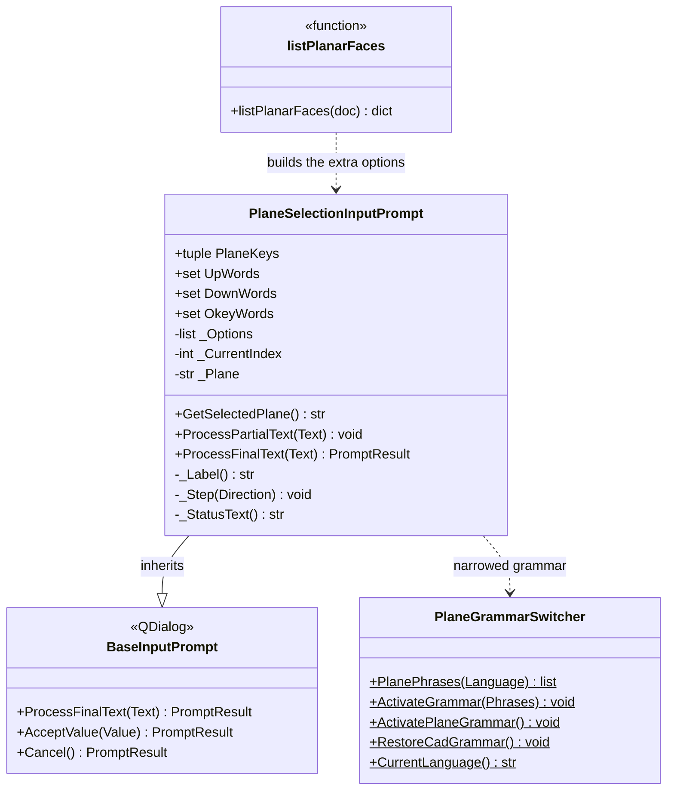

# PlaneSelectionInputPrompt

> **File:** `Dav/scr/ComponentesDAV/IntegracionGUI/GUIFreeCad/InputPrompts/PlaneSelectionInputPrompt.py`

Voice selector that replaces FreeCAD's native dialog for choosing where to
draw a sketch. It shows the three base planes (`XY`, `XZ`, `YZ`) and, when there is
a solid, **the faces** on which you can draw. It is used by "nuevo croquis" (new sketch)
(PartDesign, Part and Sketcher) and `grabar` (engrave).

How it looks to the user: see
[`voice-sketch-and-engraving-manual.md`](../voice-sketch-and-engraving-manual.md).

## Responsibilities

| Method | What it does |
| --- | --- |
| `__init__(..., ExtraOptions)` | Lists the three planes and, after them, the extra `(key, label)` options (the faces) |
| `ProcessFinalText(Text)` | `arriba` (up) / `abajo` (down) cycle through the list circularly; `okey` accepts; `cancelar` (cancel) aborts |
| `GetSelectedPlane()` | Key of the highlighted option: `XY`, `XZ`, `YZ` or the key of a face (`Face3`) |

## Design notes

- **The planes always come first.** With empty `ExtraOptions` the behavior
  is identical to the previous one; a caller without faces (for example the mirror's
  `askPlane()`) still sees only `XY`, `XZ` and `YZ`.
- **The prompt does not know what a face is.** It only receives `(key, label)`; the
  caller keeps track of which solid and which face is behind each key
  (`listPlanarFaces`, in `Sketcher/new_sketch/_faces.py`).
- **Same text as always for the planes** ("Plano XY (1/3)..."); faces
  show their label ("Cara superior").
