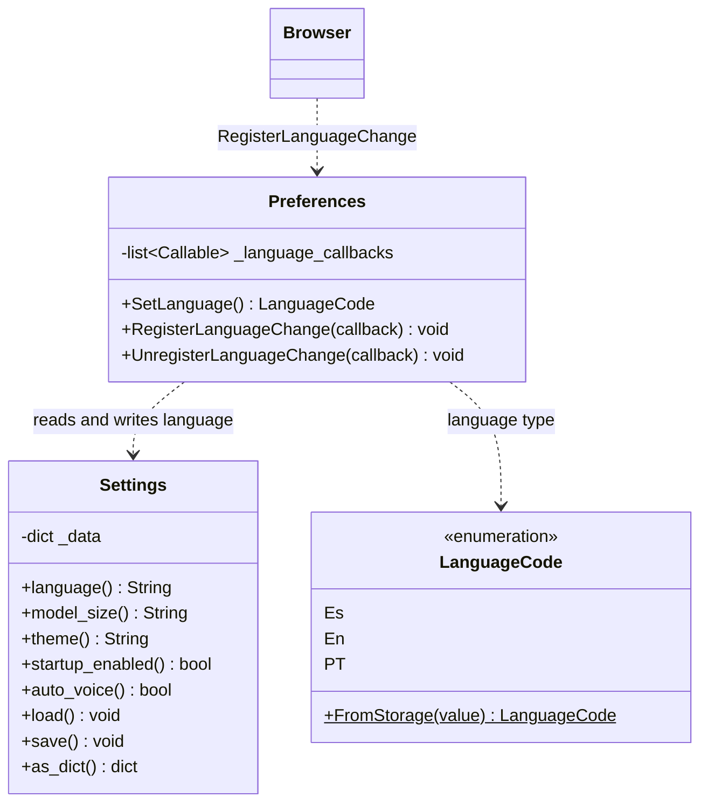

# Preferences and Settings

> **Files:**
> `Dav/scr/ComponentesDAV/IntegracionGUI/GUIFreeCad/core/preferences.py`
> `Dav/scr/ComponentesDAV/IntegracionGUI/GUIFreeCad/core/settings.py`

Two classes with different roles that should not be confused: `Settings` persists the
configuration to disk; `Preferences` exposes the active language to the `Browser` and
notifies when it changes.



## The flow of a language change

```mermaid
sequenceDiagram
    participant D as Preferences dialog
    participant P as Preferences
    participant S as Settings
    participant B as Browser
    participant V as DavVoiceService

    D->>P: SetLanguage = LanguageCode.Es
    P->>S: language = "es" ; save()
    P->>B: callback(previous, new)
    B->>B: ResetFromBase()
    Note over B: reloads TraduceToEs.py<br/>of the whole tree
    D->>V: restarts the microphone
    Note over V: the model must be reloaded:<br/>it is a different Vosk file
```

## Design notes

- **`Preferences` should be the only one writing the language.** It is the point where
  the dictionary reload is triggered; writing `settings.language` by hand skips
  it.
- **The observer is a list, not a single callback** (`RegisterLanguageChange`),
  so several interested parties can subscribe without overwriting each other.
- `Settings` saves to `config/settings.json`, which is in `.gitignore`: it is
  user configuration, not repository configuration.
- Changing the language **requires restarting the voice thread**, because the Vosk model
  is loaded only once when the recognizer is created and each language is a
  different model.
