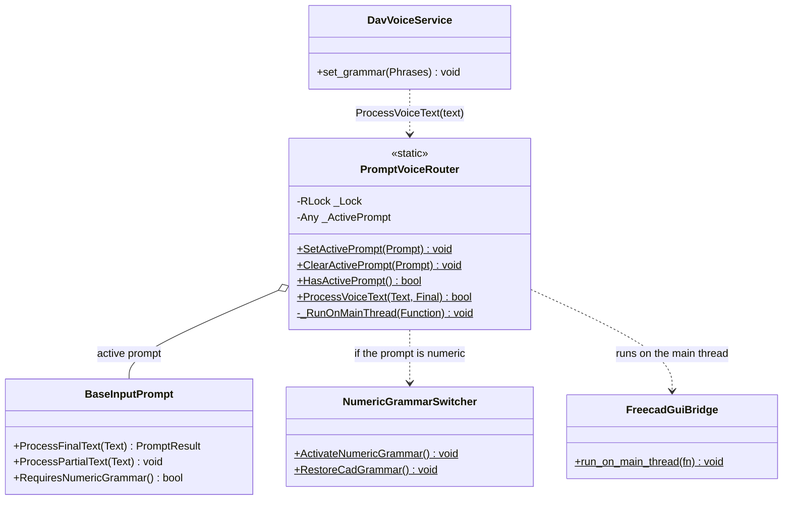

# PromptVoiceRouter

> **File:** `Dav/scr/ComponentesDAV/IntegracionGUI/GUIFreeCad/InputPrompts/PromptVoiceRouter.py`

Registry of **who receives what is said**. While a voice dialog is open,
everything recognized goes to that dialog and **not** to the `Browser`: this way "cinco" (five)
inside a numeric prompt is not interpreted as a command. It is a global registry
with a lock, safe across threads.

## Responsibilities

| Method | What it does |
| --- | --- |
| `SetActivePrompt(Prompt)` | Registers it; if `RequiresNumericGrammar()` is `True`, switches the grammar to the number words |
| `ClearActivePrompt(Prompt)` | Releases it (only if it is still the active one) and, if it was numeric, restores the CAD grammar |
| `HasActivePrompt()` | `True` while a dialog is receiving the voice |
| `ProcessVoiceText(Text, Final)` | Delivers the phrase (final or partial) to the prompt. Returns `True` if it consumed it: the engine does not send it to the `Browser` |

## Design notes

- **It is called by `DavVoiceService`, on its microphone thread.** That is why the prompt is
  run with `run_on_main_thread`: Qt widgets may only be touched from the main
  thread.
- **Registration and release always go in `try` / `finally`.** If a dialog were
  closed without releasing the registration, the `Browser` would go deaf. All the helpers
  (`_requestPrompt` in `Workbench/_prompts.py`, `_browse` in Proyecto, `_RequestPromptValue`)
  respect this.
- **There is only one active prompt.** Registering another replaces the previous one.
- **It does not switch grammars on its own**, except the numeric one; prompts with their own
  vocabulary use [`PlaneGrammarSwitcher`](PlaneGrammarSwitcher.md).
