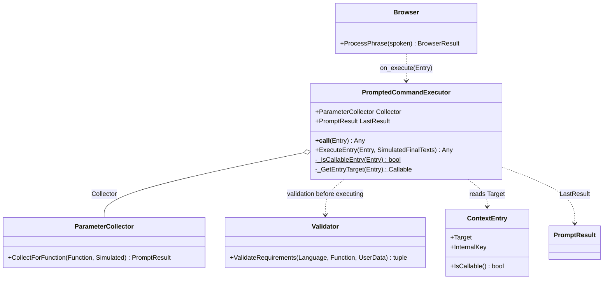
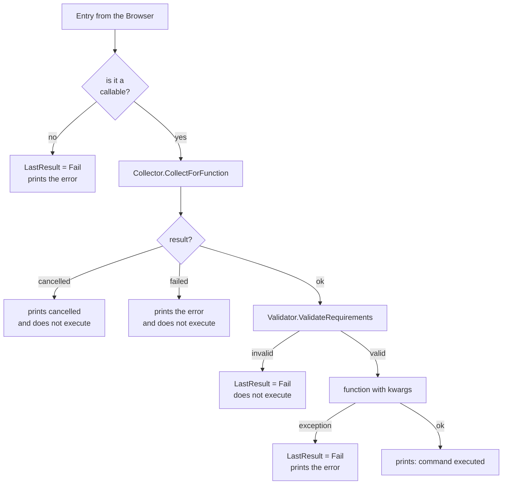

# PromptedCommandExecutor

> **File:** `Dav/scr/ComponentesDAV/IntegracionGUI/GUIFreeCad/InputPrompts/PromptedCommandExecutor.py`

The `Browser`'s **command executor**. It is passed in as `on_execute`, and every time
the `Browser` resolves a phrase to a function, it hands it over here. If the
function needs parameters it collects them by voice; if not, it calls it directly.

## Steps of `ExecuteEntry`

## Design notes

- **A function with no required parameters opens no dialog**: the collector
  returns `Ok({})` and it is called with `function()`.
- **Messages go to the FreeCAD console** (`App.Console.PrintMessage` / `PrintError`)
  and, if FreeCAD is not present (tests), to `print`.
- **The `Validator` is applied twice on purpose:** inside the collector and again right
  before executing, as a pre-check layer. If its integration fails because of an
  import problem, it only warns and executes with the values already collected.
- **`LastResult`** keeps the last result queryable, useful in tests.
- It is built in `integration/voice_bootstrap.py` with the language from the preferences.
