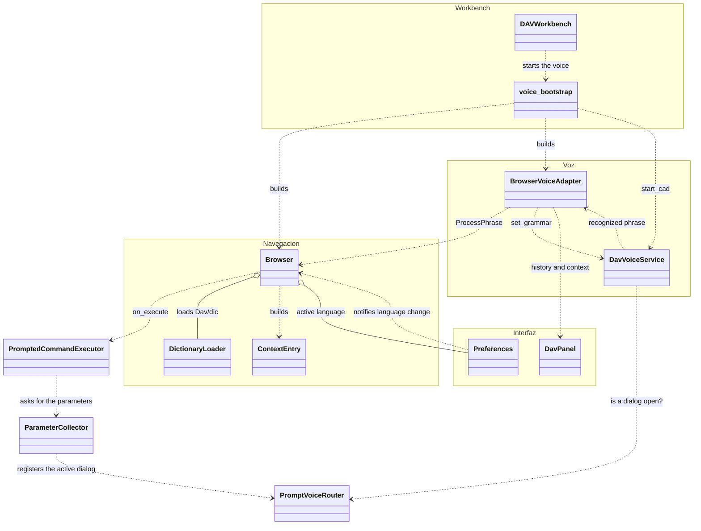
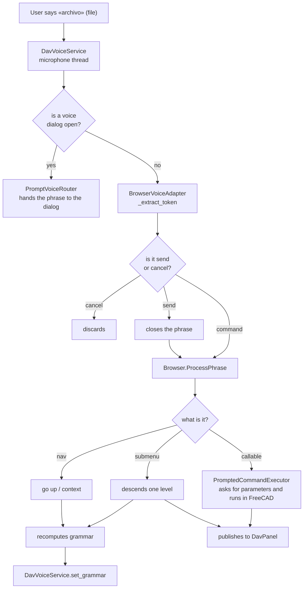

# Class diagrams — DAV

One file per class, named after the class. Each one has the Mermaid diagram, the
responsibilities table and the design notes that are not visible in the method
signatures.

> This used to be a single `diagramas_clases_DAV.md`. It was split up and updated:
> it documented `MainWindow` and `VoiceWorker`, which no longer exist (see
> [`dav-completed.md`](../dav-completed.md)).

## Navigation engine

| Class | Role |
| --- | --- |
| [`Browser`](Browser.md) | Walks the `Dav/dic/` tree and resolves each phrase |
| [`ContextEntry`](ContextEntry.md) | One context entry: phrase → key → target |
| [`DictionaryLoader`](DictionaryLoader.md) | Loads the dictionary modules from disk |

## Voice

| Class | Role |
| --- | --- |
| [`DavVoiceService`](DavVoiceService.md) | Singleton for the microphone and the Vosk recognizer |
| [`BrowserVoiceAdapter`](BrowserVoiceAdapter.md) | Connects the voice with the `Browser` and publishes to the panel |

How the grammar is narrowed to the context:
[`vosk-grammar-shortener.md`](../vosk-grammar-shortener.md).

## Voice dialogs (InputPrompts)

How a value is collected by voice, end to end:
[`CommandWithParametersFlow`](CommandWithParametersFlow.md).

### The dialogs

| Class | Role |
| --- | --- |
| [`BaseInputPrompt`](BaseInputPrompt.md) | Base window of all dialogs: message, status, heard text and result |
| [`NumericInputPrompt`](NumericInputPrompt.md) | Number dictated over several phrases (`IntegerInputPrompt` and `FloatInputPrompt` specialize it) |
| [`YesNoInputPrompt`](YesNoInputPrompt.md) | Yes or no question |
| [`ObjectSelectionInputPrompt`](ObjectSelectionInputPrompt.md) | Chooses an object of the document by cycling through them |
| [`FileSelectionInputPrompt`](FileSelectionInputPrompt.md) | Browses folders and chooses a file or a folder |
| [`PlaneSelectionInputPrompt`](PlaneSelectionInputPrompt.md) | Chooses the plane or face on which to draw a sketch |
| [`ChoiceInputPrompt`](ChoiceInputPrompt.md) | Chooses one option among a few (e.g. pad or pocket) |
| [`SpellingInputPrompt`](SpellingInputPrompt.md) | Builds a text letter by letter |
| [`ExampleChoiceInputPrompt`](ExampleChoiceInputPrompt.md) | Chooses a guided example with back / forward / send |
| [`GuidedExampleInputPrompt`](GuidedExampleInputPrompt.md) | Plays an example frame by frame (non-modal) |
| [`ExampleStep`](ExampleStep.md) | One frame: text, words to say and action |

### What makes them work

| Class | Role |
| --- | --- |
| [`PromptedCommandExecutor`](PromptedCommandExecutor.md) | Runs the command the `Browser` resolved, collecting its parameters first |
| [`ParameterCollector`](ParameterCollector.md) | Asks for each parameter with the dialog that matches its type |
| [`PromptVoiceRouter`](PromptVoiceRouter.md) | Registry of which dialog receives what is said |
| [`PlaneGrammarSwitcher`](PlaneGrammarSwitcher.md) | Narrows the Vosk grammar to the words of a dialog |
| [`NumericGrammarSwitcher`](NumericGrammarSwitcher.md) | Switches the grammar to the number-dictation one |
| [`SpokenNumberParser`](SpokenNumberParser.md) | Converts dictated phrases into numbers; confirm and cancel words |

Full usage: [`voice-sketch-and-engraving-manual.md`](../voice-sketch-and-engraving-manual.md).

## Validation and selection

| Class | Role |
| --- | --- |
| [`Validator`](Validator.md) | Inspects a function and validates and converts the data given to it |
| [`CreateObjects`](CreateObjects.md) | Extracts faces, edges, lines and points from a shape and names them with `Tagger` |

## Dictionary

| Folder | Role |
| --- | --- |
| [`Examples`](Examples.md) | Explorer submenu: user manual and guided examples |

How the whole tree is organized: [`Dav/dic/CONTEXT.md`](../../../dic/CONTEXT.md).

## Interface and configuration

| Class | Role |
| --- | --- |
| [`DavPanel`](DavPanel.md) | The widget docked inside FreeCAD |
| [`Preferences`](Preferences.md) | Active language and configuration persistence |
| [`DAVWorkbench`](DAVWorkbench.md) | FreeCAD workbench and toolbar commands |
| [`Keychain`](Keychain.md) | Reads `.py` dictionaries without running them |
| [`IconLocator`](IconLocator.md) | Finds the SVG for each key for the panel buttons |
| [`LaunchPreferences`](LaunchPreferences.md) | Opens the Preferences and applies the theme and voice on closing them |
| [`FreecadGuiBridge`](FreecadGuiBridge.md) | Passes functions from the voice thread to the main Qt thread |
| [`VoiceHistory`](VoiceHistory.md) | History of phrases and engine status, shared with the panel |
| [`ModelManager`](ModelManager.md) | Verifies and downloads the Vosk models |

---

## Overview

How the pieces connect when the user says something.

## The journey of a phrase

The detail of commands with parameters is in [`CommandWithParametersFlow`](CommandWithParametersFlow.md).

