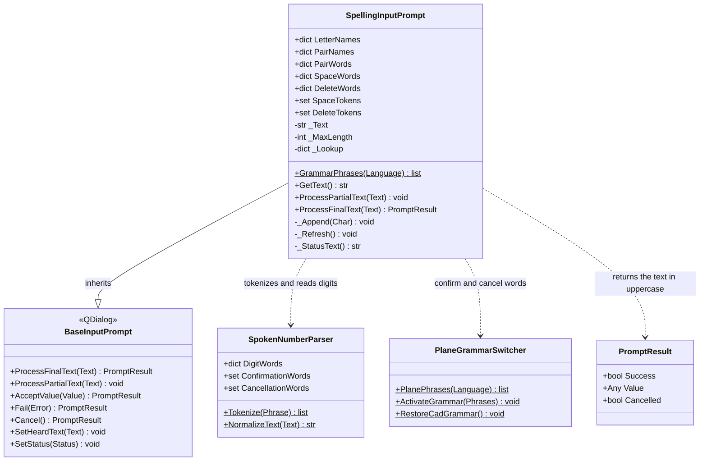
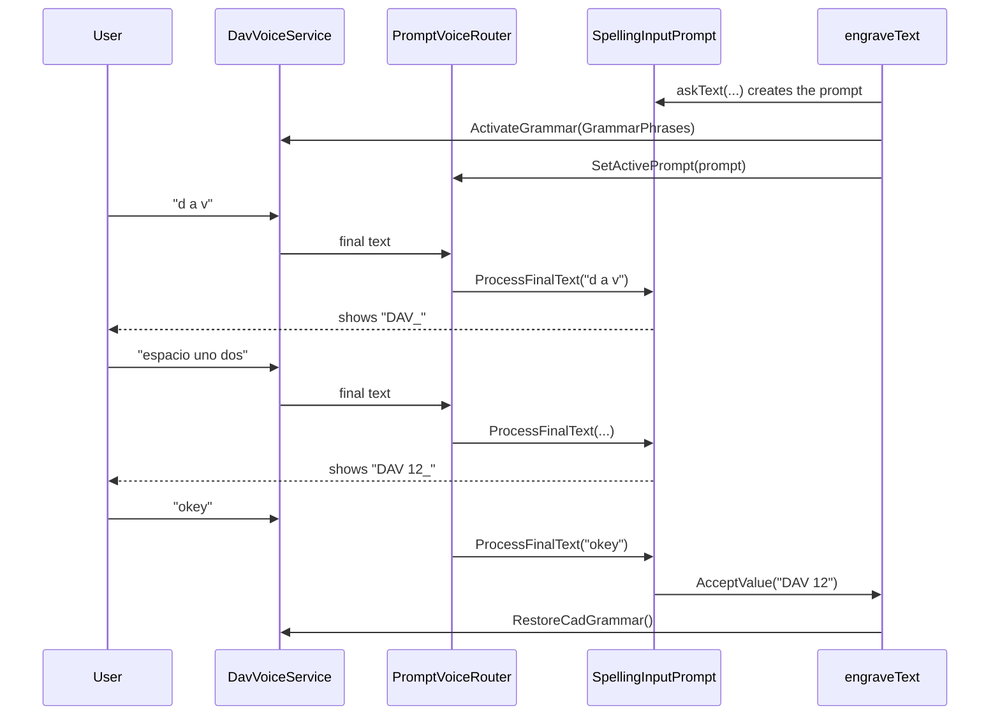

# SpellingInputPrompt

> **File:** `Dav/scr/ComponentesDAV/IntegracionGUI/GUIFreeCad/InputPrompts/SpellingInputPrompt.py`

Voice dialog that builds a text **letter by letter**. It is used by the
`grabar` (engrave) command to ask for the text to engrave (see
[`voice-sketch-and-engraving-manual.md`](../voice-sketch-and-engraving-manual.md)). The
user says the name of each letter, digits, `espacio` (space), `borrar` (delete) and `okey`.

## Responsibilities

| Method | What it does |
| --- | --- |
| `ProcessFinalText(Text)` | Walks the words of the phrase: applies letters, digits, `espacio` and `borrar`; stops at the first confirmation word (`okey`...) and accepts the text. A cancellation word aborts everything |
| `GrammarPhrases(Language)` | Words Vosk must listen for while spelling: letter names of the language, digits, `espacio`, `borrar`, confirmation and cancellation (without `arriba`/`abajo`) |
| `GetText()` | Text built so far |
| `ProcessPartialText(Text)` | Ignores partials: a letter only counts when the final result arrives |

## Journey of a phrase

## Design notes

- **Narrowed grammar.** With the open vocabulary of a small model, single
  letters get confused with any word. That is why, while the prompt
  is active, Vosk only listens to the words in `GrammarPhrases`.
- **One language in the grammar, three when parsing.** The grammar lists only the
  letter names of the active language, but `_Lookup` merges all three languages: if
  the user says a letter in another language, it is understood anyway.
- **The tables only contain words that Vosk knows.** They were checked against the
  vocabulary of the small models. What is missing is said another way: in
  Portuguese `fê`, `n` and `duplo vê` (F, N and W); in Spanish the `ñ` is accepted as a
  standalone `ñ` or `eñe`, although the small model only knows the former.
- **Two-word letters** (`doble uve`, `i griega`) are resolved by looking at the
  next word before interpreting the first one; a lone `i` is the letter I.
- **The Ñ is protected before normalizing.** `SpokenNumberParser.NormalizeText`
  strips accents and `ñ` would become `n`, so `eñe` and `ñ` are replaced by
  an internal marker before tokenizing.
- **Bare letters.** Vosk sometimes returns the bare letter (`d`, `v`); any
  single-letter alphabetic character is accepted.
- **Single digits only.** The one-character entries of `DigitWords` are used;
  `veinticuatro` or `diez` are not recognized and are silently ignored.
- **Output in uppercase**, with a maximum of 40 characters (`MaxLength`).
