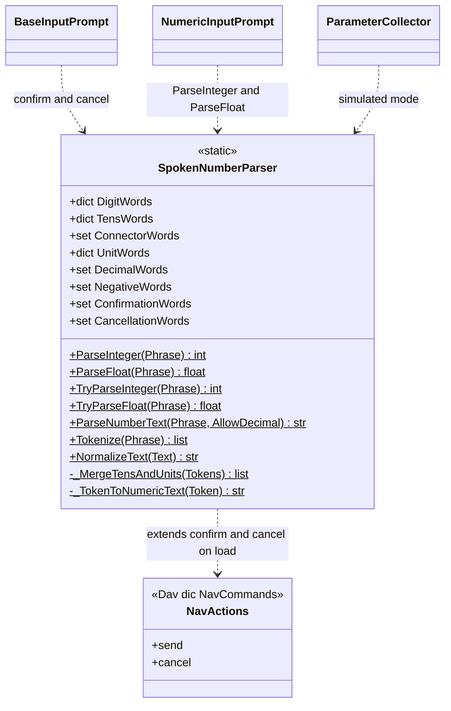
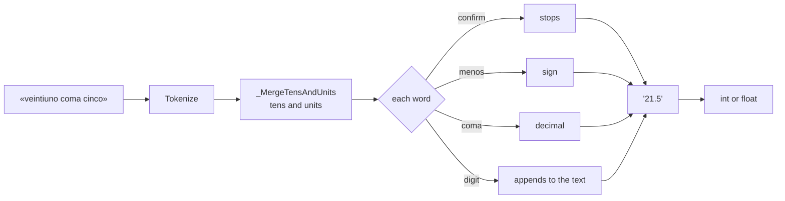

# SpokenNumberParser

> **File:** `Dav/scr/ComponentesDAV/IntegracionGUI/GUIFreeCad/InputPrompts/SpokenNumberParser.py`

Converts **dictated phrases into numbers** ("veintiuno coma cinco" (twenty-one point five) → `21.5`) and provides
the text tools used by all the prompts: normalizing without accents,
tokenizing, and the confirm and cancel words. It is a class with only class
methods, with no per-instance state.

## Responsibilities

| Method | What it does |
| --- | --- |
| `NormalizeText(Text)` | Lowercase, without accents or eñes; the comma becomes a decimal point |
| `Tokenize(Phrase)` | Normalizes and splits into words and numbers |
| `ParseNumberText(Phrase, AllowDecimal)` | Builds the number as text: digits, sign (`menos` (minus)) and decimal separator (`coma` (comma), `punto` (point)) |
| `ParseInteger` / `ParseFloat` | Convert to `int` / `float`; raise `ValueError` if the phrase is not a number |
| `TryParseInteger` / `TryParseFloat` | Same, but return `None` instead of raising |

## How a number is read

## Design notes

- **Three languages in a single table.** Words of any language are accepted at the
  same time; there is no need to know which language was dictated.
- **Confirm and cancel are extended when the module is imported.** `_LoadNavWordsFromDictionaries`
  adds the phrases from `NavCommands/TraduceTo*.py` that point to `send` and `cancel`. This way, a
  new synonym added to the dictionary works in all the prompts without touching code.
  If the dictionary is not available, the basic words written in the class remain.
- **`ConnectorWords`** ("y" / "e", i.e. "and") join tens and units: "treinta y cinco" (thirty-five).
- Limits and improvement proposal for numeric dictation:
  [`voice-numbers-limits-and-proposal.md`](../voice-numbers-limits-and-proposal.md).
