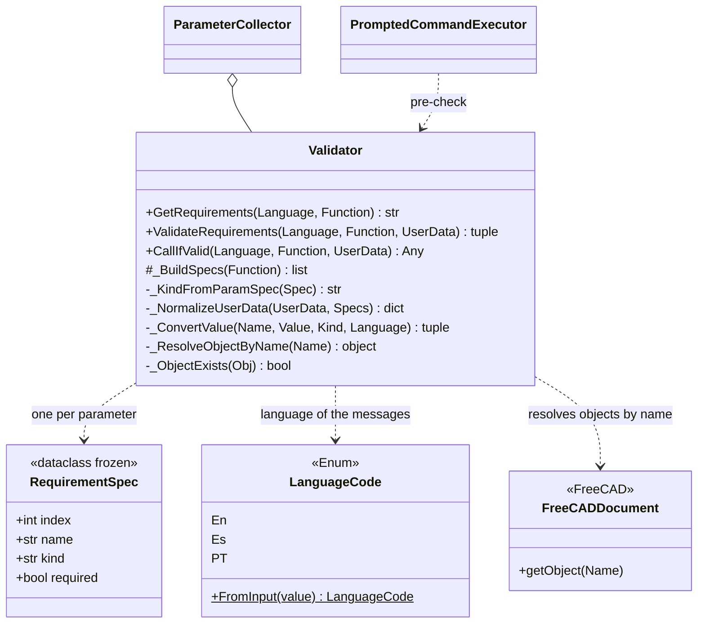

# Validator

> **File:** `Dav/scr/validation/validator.py`

Inspects a dictionary function and **validates the values that will be given
to it**: which parameters it asks for, of what type and whether they are required; then it converts the
user's data to those types. Messages come out in the active language. It does not depend on
the voice: it receives data and returns data.

## Supported types

| `kind` | Expected | Origin |
| --- | --- | --- |
| `int` | An integer | `int` annotation |
| `float` | A decimal number | `float` annotation |
| `str` | A text | `str` annotation |
| `object` | An object of the document | any other annotation or none |

## Responsibilities

| Method | What it does |
| --- | --- |
| `GetRequirements(Language, Function)` | Prints and returns one line per parameter ("Dato1: an integer is expected") |
| `ValidateRequirements(...)` | Converts the data. If a required one is missing or a type does not match, it **prints** the errors and returns `(False, None)`; otherwise `(True, kwargs)` |
| `CallIfValid(...)` | Validates and calls `Function(**kwargs)`; returns `None` if it does not validate |
| `_BuildSpecs(Function)` | Reads `Function._param_specs` if it exists; otherwise, the signature via `inspect` (ignores `*args` and `**kwargs`) |
| `_NormalizeUserData` | Accepts a `dict` by name or a positional list |
| `_ConvertValue` | Converts to the requested type or returns a localized error |
| `_ResolveObjectByName` | For `object`, looks up the object by name in the active document |

## Design notes

- **A parameter with a default value is optional** (`required=False`) and is not asked for by voice.
- **Localized errors** in the three languages: missing parameter, wrong type, nonexistent
  object, no active document, could not be converted.
- **It opens no dialogs and does not listen:** that is the job of [`ParameterCollector`](ParameterCollector.md).
  That is why it can be tested on its own (`validation/run_tests.py`, `test_validator.py`).
- Test documentation: `Dav/scr/validation/docs/`.
