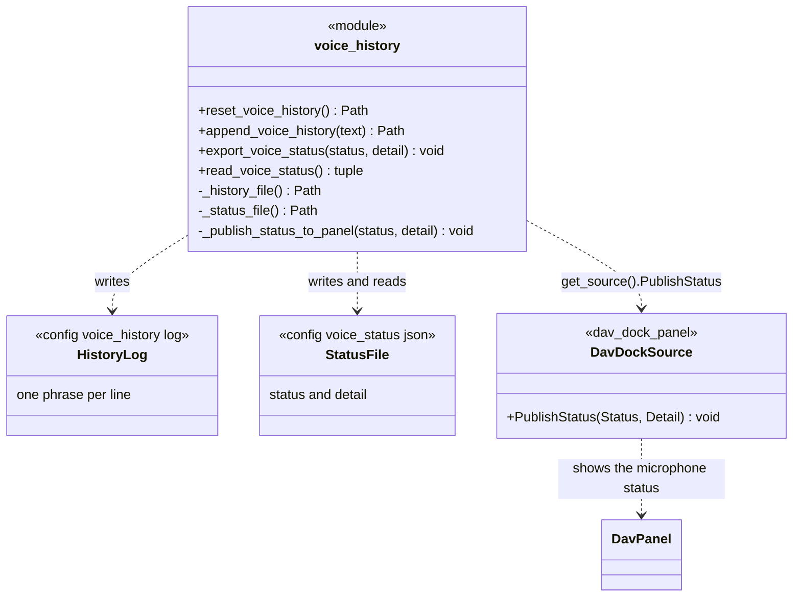

# VoiceHistory

> **File:** `Dav/scr/ComponentesDAV/IntegracionGUI/GUIFreeCad/integration/voice_history.py`

A module of functions that stores two things **shared between the voice engine and the
interface**: the history of spoken phrases and the engine status (listening,
inactive, error...). They are files in the `config/` folder, so any part of the
program can read them without knowing about each other.

## Responsibilities

| Function | What it does |
| --- | --- |
| `reset_voice_history()` | Empties the history (when a voice session starts) |
| `append_voice_history(text)` | Appends a line at the end |
| `export_voice_status(status, detail)` | Writes the status as JSON and **publishes it to the panel** |
| `read_voice_status()` | Reads the status; returns `("inactive", ...)` if the file does not exist or is broken |

## Design notes

- **`export_voice_status` is the only point every status change goes through**, so
  the panel is notified there. The microphone indicator does not depend on someone
  remembering to notify it.
- **Publishing to the panel never fails the engine:** if the panel is not mounted or raises an
  error, it is ignored.
- **The `config/` folder** is searched for by walking up the file's ancestors; if it is not found,
  it is created next to `integration/`.
- **Who writes:** [`BrowserVoiceAdapter`](BrowserVoiceAdapter.md) appends each phrase and
  its result with `append_voice_history`; `voice_bootstrap.py` resets the history when
  the voice starts and exports the statuses (`active`, `error`...).
