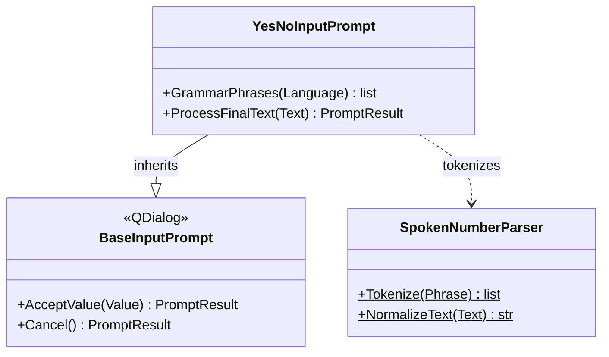

# YesNoInputPrompt

> **File:** `Dav/scr/ComponentesDAV/IntegracionGUI/GUIFreeCad/InputPrompts/YesNoInputPrompt.py`

A question answered with **yes** or **no**. The accepted value is `True` or `False`.
To leave without answering, you say *cancelar* (cancel): `no` is an answer, not a
cancellation. It is opened with `askYesNo` (`Workbench/_prompts.py`); for example, `Correction`
uses it to confirm before deleting.

## Words

| Answer | es | en | pt |
| --- | --- | --- | --- |
| Yes (`True`) | si, okey, ok, dale, aceptar, confirmar, listo, vale | yes, yep, okey, ok, accept, confirm | sim, okey, ok, aceitar, confirmar, pronto |
| No (`False`) | no, negativo | no, nope, negative | não, negativo |
| Cancel | cancelar, cancela, abortar, anular, descartar | cancel, abort, discard | cancelar, cancelamento, abortar, anular |

They are compared without accents and in all three languages at once; the Vosk grammar is narrowed
to the active language with `GrammarPhrases`.

## Design notes

- **Evaluation order:** cancel, then no, then yes. This way a phrase with "no" and
  "okey" counts as *no*.
- **The window's *Accept* button answers "yes"**: it replaces the one from the base prompt,
  which would return the heard text.
- A phrase that matches nothing only updates the status ("No te entendí" (I did not understand you)), without
  closing the dialog.
