# DAV GitFlow: the repository's real history

Reconstructed from `git log --all` (776 commits, 176 merges, 2026-04-27 → 2026-09-25).
The `Pruebas`, `DavCore`, `davcore-integracion` and `hot-fix-v1.0.1` branches have already been deleted from the
remote; they are reconstructed from the merge commits and the tags. Each node summarizes a group of
commits; the number `#N` is the GitHub Pull Request.

## Graph

```mermaid
%%{init: { 'gitGraph': { 'mainBranchName': 'main', 'rotateCommitLabel': true } } }%%
gitGraph
    commit id: "Initial commit (04-27)"
    commit id: "Init"
    commit id: "Init v1 (04-29)"

    %% ============ PHASE 1: Pruebas (integration, May-June) ============
    branch Pruebas
    checkout Pruebas
    commit id: "GestorDeHilos + Vosk model (05-06)"
    branch "forks-Pruebas"
    checkout "forks-Pruebas"
    commit id: "PR forks julianAO2002 #1 #7 (05-11)"
    checkout Pruebas
    merge "forks-Pruebas" id: "merge forks (05-11)"
    commit id: "DAV GUI + init.py (05-16)"

    checkout main
    commit id: "Structure (05-16)"
    commit id: "Structure v1"
    branch DavCore
    checkout main
    commit id: "Update issue templates"

    checkout Pruebas
    commit id: "GPL license + IEEE-830 (05-18)"
    commit id: "Vosk voice module + commands (05-18)"
    commit id: "DAV Workbench + GUI themes/languages (05-22)"
    commit id: "Explorer + Draft/TechDraw/Part dictionaries (05-23)"
    checkout "forks-Pruebas"
    commit id: "PR #61 #68 #69 #86 #89 (05-25 to 05-30)"
    checkout Pruebas
    merge "forks-Pruebas" id: "merge forks (05-30)"

    branch "task/traduce-feature"
    checkout "task/traduce-feature"
    commit id: "TraduceTo ES/EN/PT"
    checkout Pruebas
    merge "task/traduce-feature" id: "PR #70 (05-28)"

    branch "lucas/sketcher-issue75"
    checkout "lucas/sketcher-issue75"
    commit id: "Sketcher issue 75"
    checkout Pruebas
    merge "lucas/sketcher-issue75" id: "PR #88 (05-31)"

    branch "feat/diccionarios-sketcher"
    checkout "feat/diccionarios-sketcher"
    commit id: "Sketcher dictionaries"
    checkout Pruebas
    merge "feat/diccionarios-sketcher" id: "PR #90 (05-31)"

    commit id: "ComponentesDAV restructuring + SVG icons (06-08)"
    checkout "forks-Pruebas"
    commit id: "PR #95 #96 #113 #115-#117 (06-03 to 06-11)"
    checkout Pruebas
    merge "forks-Pruebas" id: "merge forks (06-11)"
    checkout "forks-Pruebas"
    commit id: "PR #134-#139 #162 #163 (06-15 to 06-22)"
    checkout Pruebas
    merge "forks-Pruebas" id: "merge forks (06-22)"
    commit id: "Copyright + ES translations (06-23)"

    %% ============ PHASE 2: DavCore (integration, June-September) ============
    branch "davcore-integracion"
    checkout "davcore-integracion"
    commit id: "Restructure to Dav/scr, Dav/dic layout (06-24)"
    commit id: "validation/Validator module"
    checkout DavCore
    merge "davcore-integracion" id: "PR #166 (06-24)"
    checkout "davcore-integracion"
    commit id: "Dictionaries PROGRESS (06-25)"
    checkout DavCore
    merge "davcore-integracion" id: "PR #167 (06-25)"
    commit id: "Completed dictionaries (08-03)"
    checkout main
    merge DavCore id: "PR #169 DavCore to main (08-03)"

    checkout "davcore-integracion"
    commit id: "Voice integration #170 #172 #173 (08-06/07)"
    checkout DavCore
    merge "davcore-integracion" id: "PR #173 (08-07)"

    branch "Tade-Cami-Mica"
    checkout "Tade-Cami-Mica"
    commit id: "Tade-Cami-Mica (08-07)"
    checkout DavCore
    merge "Tade-Cami-Mica" id: "PR #174 (08-09)"

    checkout "davcore-integracion"
    commit id: "Voice integration #175 #177 #178 #179 (08-09/10)"
    checkout DavCore
    merge "davcore-integracion" id: "PR #179 (08-10)"

    branch "forks-DavCore"
    checkout "forks-DavCore"
    commit id: "Vosk grammar per context - SoPerez1 #176 (08-10)"
    checkout DavCore
    merge "forks-DavCore" id: "PR #176 (08-10)"

    %% Abrilpoggio-patch-3: to main, reverted, and reapplied in DavCore
    checkout main
    branch "Abrilpoggio-patch-3"
    checkout "Abrilpoggio-patch-3"
    commit id: "README patch (web)"
    checkout main
    merge "Abrilpoggio-patch-3" id: "PR #182 (08-14)"
    branch "revert-182"
    checkout "revert-182"
    commit id: "Revert PR #182"
    checkout main
    merge "revert-182" id: "PR #186 revert (08-14)"
    checkout DavCore
    merge "Abrilpoggio-patch-3" id: "PR #187 reapplied in DavCore (08-14)"

    branch "techDraw_-SketcherGeometry"
    checkout "techDraw_-SketcherGeometry"
    commit id: "TechDraw + Sketcher geometry"
    checkout DavCore
    merge "techDraw_-SketcherGeometry" id: "PR #181 (08-16)"

    checkout "forks-DavCore"
    commit id: "juan-mrtn #184, brianschelll #185 (08-16)"
    checkout DavCore
    merge "forks-DavCore" id: "PR #185 (08-16)"

    branch "feature-partdesign-benja"
    checkout "feature-partdesign-benja"
    commit id: "PartDesign by voice"
    checkout DavCore
    merge "feature-partdesign-benja" id: "PR #192 (08-16)"

    branch "feature-pointplacement-benja"
    checkout "feature-pointplacement-benja"
    commit id: "Point placement"
    checkout DavCore
    merge "feature-pointplacement-benja" id: "PR #193 (08-18)"

    checkout "Tade-Cami-Mica"
    commit id: "Merge DavCore + fix run_interfaz.bat (08-18)"
    checkout DavCore
    merge "Tade-Cami-Mica" id: "PR #183 (08-18)"

    branch "fix/createobjects-draftwork"
    checkout "fix/createobjects-draftwork"
    commit id: "Fix CreateObjects Draft"
    checkout DavCore
    merge "fix/createobjects-draftwork" id: "PR #194 (08-18)"

    checkout main
    branch "chore/remove-agents-issuetemplate"
    checkout "chore/remove-agents-issuetemplate"
    commit id: "Remove AGENTS and issue template"
    checkout main
    merge "chore/remove-agents-issuetemplate" id: "PR #195 (08-18)"

    checkout "forks-DavCore"
    commit id: "brianschelll #196 (08-23)"
    checkout DavCore
    merge "forks-DavCore" id: "PR #196 (08-23)"

    branch ramatemporal
    checkout ramatemporal
    commit id: "Temporary branch"
    checkout DavCore
    merge ramatemporal id: "PR #199 (08-28)"

    checkout "forks-DavCore"
    commit id: "MaitenBlanc #201 (08-28)"
    checkout DavCore
    merge "forks-DavCore" id: "PR #201 (08-28)"

    branch "fix-techdraw-commands"
    checkout "fix-techdraw-commands"
    commit id: "Fix TechDraw commands"
    checkout DavCore
    merge "fix-techdraw-commands" id: "PR #203 (08-30)"

    checkout "forks-DavCore"
    commit id: "Elluis1 techdraw-lista1 #207 (08-31)"
    checkout DavCore
    merge "forks-DavCore" id: "PR #207 (08-31)"

    checkout "davcore-integracion"
    commit id: "Integration #208 #209 #213 #215-#217 (08-31)"
    checkout DavCore
    merge "davcore-integracion" id: "PR #217 (08-31)"

    branch "docs/pruebas-draftwork"
    checkout "docs/pruebas-draftwork"
    commit id: "Draft test report"
    checkout DavCore
    merge "docs/pruebas-draftwork" id: "PR #214 (08-31)"

    branch "traducciones-joint"
    checkout "traducciones-joint"
    commit id: "Joint translations"
    checkout DavCore
    merge "traducciones-joint" id: "PR #200 (08-31)"

    branch "feature/selector-plano-voz"
    checkout "feature/selector-plano-voz"
    commit id: "Plane selector by voice"
    checkout DavCore
    merge "feature/selector-plano-voz" id: "PR #218 (08-31)"

    branch "feature/measure-integration"
    checkout "feature/measure-integration"
    commit id: "Measure integration"
    checkout DavCore
    merge "feature/measure-integration" id: "PR #220 (09-01)"

    branch "fix/explorer-dictionaries"
    checkout "fix/explorer-dictionaries"
    commit id: "Fix Explorer dictionaries"
    checkout DavCore
    merge "fix/explorer-dictionaries" id: "PR #219 (09-04)"

    checkout "forks-DavCore"
    commit id: "juan-mrtn #197 (09-04)"
    checkout DavCore
    merge "forks-DavCore" id: "PR #197 (09-04)"

    branch "feature/geometry-voz-parametrica"
    checkout "feature/geometry-voz-parametrica"
    commit id: "Parametric geometry by voice"
    checkout DavCore
    merge "feature/geometry-voz-parametrica" id: "PR #223 (09-05)"

    branch "feature/guia-desarrollo"
    checkout "feature/guia-desarrollo"
    commit id: "DAV development guide"
    checkout DavCore
    merge "feature/guia-desarrollo" id: "PR #225 (09-07)"

    branch "feature/sketcher-parametric-smile"
    checkout "feature/sketcher-parametric-smile"
    commit id: "Parametric Sketcher"
    checkout DavCore
    merge "feature/sketcher-parametric-smile" id: "PR #226 (09-08)"

    checkout "forks-DavCore"
    commit id: "brianschelll #224, MaitenBlanc #227 #228 (09-08)"
    checkout DavCore
    merge "forks-DavCore" id: "PR #228 (09-08)"

    branch "patch-branches-web"
    checkout "patch-branches-web"
    commit id: "AlexanderGBordaa-patch-1-1 (09-08)"
    checkout DavCore
    merge "patch-branches-web" id: "PR #229 (09-08)"

    branch "feat/global-dav-panel-controls"
    checkout "feat/global-dav-panel-controls"
    commit id: "DAV panel global controls"
    checkout DavCore
    merge "feat/global-dav-panel-controls" id: "PR #231 (09-11)"

    checkout "patch-branches-web"
    commit id: "JoaquinPoggio-patch-1 x4 #232-#237 (09-14)"
    checkout DavCore
    merge "patch-branches-web" id: "PR #237 (09-14)"

    branch "README-Manual-usuario"
    checkout "README-Manual-usuario"
    commit id: "User manual"
    checkout DavCore
    merge "README-Manual-usuario" id: "PR #234 (09-14)"

    branch "feature/panel-commands-pt"
    checkout "feature/panel-commands-pt"
    commit id: "Panel commands in PT"
    checkout DavCore
    merge "feature/panel-commands-pt" id: "PR #239 (09-14)"

    checkout "patch-branches-web"
    commit id: "BiancaTournour-patch-1 (09-14)"
    checkout DavCore
    merge "patch-branches-web" id: "PR #240 (09-14)"

    checkout "forks-DavCore"
    commit id: "juan-mrtn #241 (09-14)"
    checkout DavCore
    merge "forks-DavCore" id: "PR #241 DavCore closing" tag: "v1.0.0"

    %% ============ PHASE 3: release 1.0 and hotfixes on main ============
    checkout main
    merge DavCore id: "PR #242 DavCore to main (09-14)" tag: "V.1.0"
    commit id: "Update README.es.md (09-14)"

    branch "hot-fix-v1.0.1"
    checkout "hot-fix-v1.0.1"
    commit id: "Windows installer GitHub Action (09-15)"
    branch "forks-hotfix-1.0.1"
    checkout "forks-hotfix-1.0.1"
    commit id: "Maiten #248, FDavidGallo #256 (09-18)"
    checkout "hot-fix-v1.0.1"
    merge "forks-hotfix-1.0.1" id: "PR #248 #256 (09-18)"
    checkout "forks-hotfix-1.0.1"
    commit id: "Luigi lista3 StandardViews #257 (09-19)"
    commit id: "Voice dialogs PartDesign/Part/Assembly #258 (09-19)"
    checkout "hot-fix-v1.0.1"
    merge "forks-hotfix-1.0.1" id: "PR #257 #258 (09-19)"
    checkout "forks-hotfix-1.0.1"
    commit id: "Guided examples, camera, project #259-#264 (09-20)"
    checkout "hot-fix-v1.0.1"
    merge "forks-hotfix-1.0.1" id: "PR #259-#264 (09-20)"
    checkout main
    merge "hot-fix-v1.0.1" id: "PR #265 hot-fix-v1.0.1 (09-20)" tag: "v1.0.1"
    commit id: "gitignore issues (09-21)" tag: "V1.0.1"

    branch "Hot-fix-v1.0.2"
    checkout "Hot-fix-v1.0.2"
    commit id: "DAV view styles and voice aliases (09-21)"
    commit id: "Triangle/rectangle bug, SVG example (09-24)"
    commit id: "PT user manual, fix avancar (09-24)"
    commit id: "Readmes and icons (09-25)"
    checkout main
    merge "Hot-fix-v1.0.2" id: "PR #269 Hot-fix-v1.0.2 (09-25)" tag: "v1.0.2"

    branch "hot-fix-v1.0.3"
    checkout "hot-fix-v1.0.3"
    commit id: "Connectors (09-25)"
    commit id: "EN/PT/ES synonyms, dark theme, spelling (09-25)"
    commit id: "Text: bugs and more letters (09-25)"
    commit id: "New project (09-25)"
    checkout main
    merge "hot-fix-v1.0.3" id: "PR #271 hot-fix-v1.0.3 (09-25)" tag: "V1.0.3"
```

## How to read it

| Branch | Role | Lifespan | Merges into |
|---|---|---|---|
| `main` | Production / tagged releases | 04-27 → today | — |
| `Pruebas` | Phase 1 integration (UADER team) | 05-06 → 06-23 | Its content moves to `DavCore` via `davcore-integracion` |
| `DavCore` | Phase 2 integration, `Dav/scr` + `Dav/dic` layout | 05-16 (created) / 06-24 → 09-14 | `main` (PR #169 and #242) |
| `davcore-integracion` | Long-lived branch from a fork: restructuring + voice integration | 06-24 → 08-31 | `DavCore` |
| `forks-*` | Collapse of each fork's `user:Pruebas` / `user:DavCore` branches | depending on phase | `Pruebas` / `DavCore` / hotfix |
| `feature/*`, `feat/*`, `fix/*`, `docs/*` | One task per branch | hours to days | `Pruebas` or `DavCore` |
| `*-patch-N`, `patch-branches-web` | Edits made from the GitHub web UI | same day | `DavCore` |
| `hot-fix-v1.0.x` | Fixes and examples after 1.0 | 1 to 6 days | `main` |

Tags: `V.1.0` (PR #242), `v1.0.0`, `v1.0.1`, `V1.0.1`, `v1.0.2`, `V1.0.3`.

## Deviations from classic GitFlow

- **`hot-fix-v1.0.1` branches off `DavCore`, not `main`**: it was branched at `a83fb75f` (`v1.0.0`), and that is why its PR #265 also brought into `main` what was already in `DavCore`.
- **There is no `develop` branch**: `Pruebas` and then `DavCore` play that role, and neither receives the hotfixes back.
- **Mixed tag names**: `V.1.0`/`v1.0.0` for 1.0 and `v1.0.1`/`V1.0.1` for 1.0.1 (two tags on different commits).
- **Direct commits to `main`** outside a PR: `Update issue templates`, `Actualizar README.es.md` and `gitignore issues`.
- **PR #182 reverted (#186) and reapplied in `DavCore` (#187)**: the same `Abrilpoggio-patch-3` branch went in through two destinations.
- **`hot-fix-v1.0.3` incorporated `main`** with a merge (`1a9ed6dd`) before PR #271; it is not drawn because `main` had not advanced since the branch was created.
