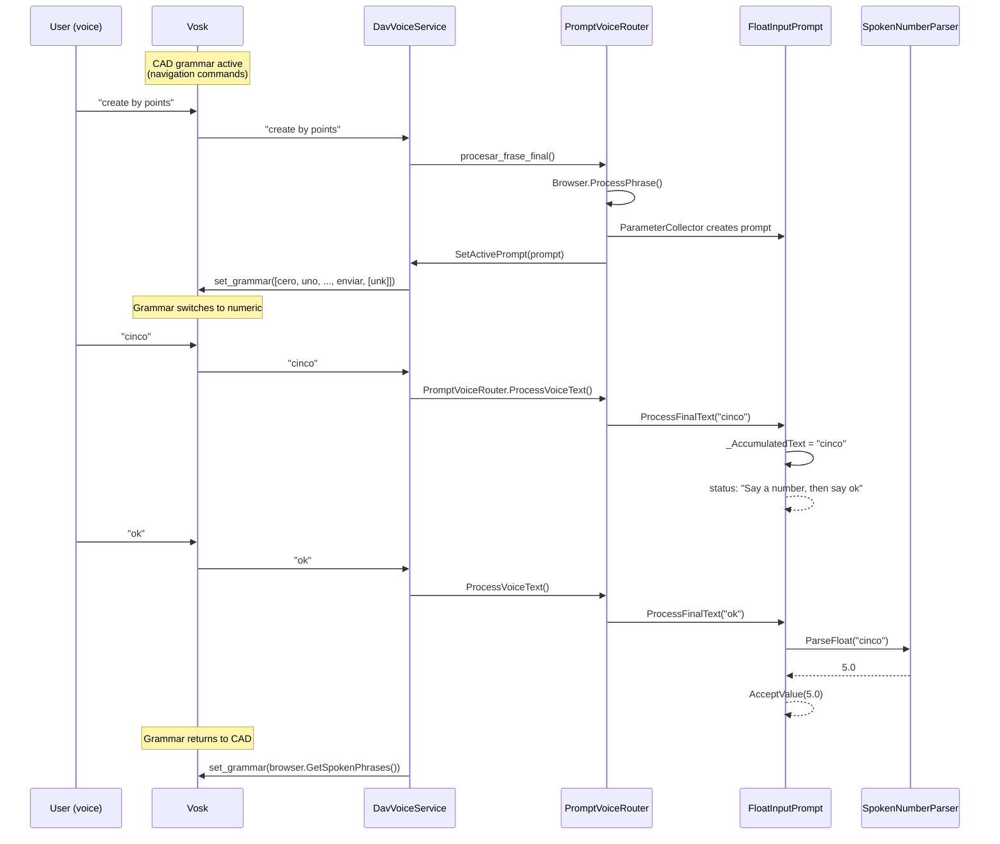
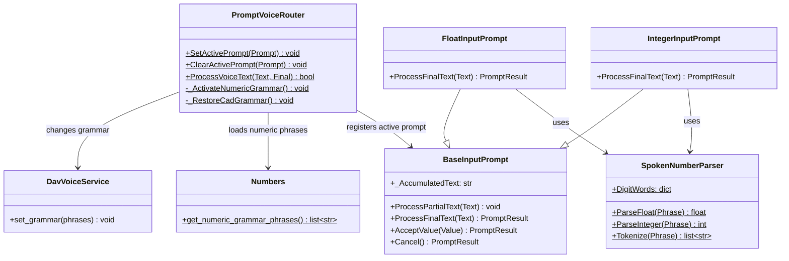

# Numbers Dictionary — Numeric voice input

> Implementation of number recognition by voice for parametric prompts.

---

## Summary

The system allows Vosk to recognize spoken numbers (0-9, decimals, compound figures) when FreeCAD asks the user for a numeric value. What was implemented:

1. **`Dav/dic/Numbers/` dictionary** — numeric words in Spanish, English and Portuguese
2. **Dynamic grammar** — the Vosk grammar changes automatically when a numeric prompt is opened/closed
3. **Text accumulation** — allows saying a number and then "ok" in separate phrases
4. **Wrapper fix** — `create_by_points_with_objects` now forwards parameters

---

## Flow diagram



---

## Numbers dictionary

### File structure

```
Dav/dic/Numbers/
├── __init__.py        # Empty package
├── Numbers.py         # Sentinels + get_numeric_grammar_phrases()
├── TraduceToEs.py     # Spanish words
├── TraduceToEn.py     # English words
├── TraduceToPt.py     # Portuguese words
└── ayuda.py           # Help text
```

### Sentinels (`Numbers.py`)

No-op functions that represent digits and separators:

| Sentinels | Value |
|-----------|-------|
| `Zero`, `One`, ..., `Nine` | Digits 0-9 |
| `DecimalPoint`, `DecimalComma` | Decimal separators |
| `CompoundNumber` | Any numeric word from 10 onward (10-19, tens 20-90, Spanish contractions 21-29) and the connector "y"/"e". A single sentinel for all of them: the value's identity is never used (`get_numeric_grammar_phrases` only reads the *keys*), the real value is computed by `SpokenNumberParser` from the word. |

### Translations — digits 0-9

| Spanish | English | Portuguese | Sentinel |
|---------|---------|------------|----------|
| cero | zero | zero | Zero |
| uno, un, una | one | um, uma | One |
| dos | two | dois, duas | Two |
| tres | three | três, tres | Three |
| cuatro | four | quatro | Four |
| cinco | five | cinco | Five |
| seis | six | seis | Six |
| siete | seven | sete | Seven |
| ocho | eight | oito | Eight |
| nueve | nine | nove | Nine |
| punto, decimal | point, decimal | ponto, decimal | DecimalPoint |
| coma | comma | vírgula, virgula | DecimalComma |

### Translations — compound numbers 10-99

Supported range: **0-99**. Numbers from 100 upward are not implemented:
the word ("cien", "cincuenta", "hundred"...) is not in `DigitWords` nor in
the grammar, so `SpokenNumberParser` silently ignores it instead of
failing — for example "seiscientos cincuenta" gives **50**, not an error (the
tokenizer discards "seiscientos" because it does not recognize it and only parses
"cincuenta"). Extending to hundreds/thousands would require the same
`TensWords`/`_MergeTensAndUnits` mechanism for one more level.

| Spanish | English | Portuguese |
|---------|---------|------------|
| diez..diecinueve | ten..nineteen | dez..dezenove (dezenove also accepts catorze/quatorze) |
| veinte, treinta, ..., noventa | twenty, thirty, ..., ninety | vinte, trinta, ..., noventa |
| veintiuno..veintinueve (single-word contraction) | *(said "twenty one", two words)* | *(said "vinte e um", two words)* |
| connector "y" (treinta **y** dos) | *(no connector: "twenty two")* | connector "e" (vinte **e** um) |

`SpokenNumberParser._MergeTensAndUnits` combines "ten [connector] unit" into
a single value before parsing (`InputPrompts/SpokenNumberParser.py`). The
connector is optional: if Vosk swallows it, "treinta dos" also gives 32. Digit-by-digit
dictation ("uno" "uno" → 11) is kept as an alternative:
a single-digit word without a tens word in front is not combined, it is
concatenated as before.

### `get_numeric_grammar_phrases(language: str = "es")`

Builds the phrase list for the Vosk grammar during numeric input,
**only for the indicated language** — it used to load all three languages at once,
which made Vosk recognize English or Portuguese digits even if the app
was configured in Spanish (or any crossed combination). The
caller (`NumericGrammarSwitcher`) passes `core.settings.settings.language`,
the language actually configured.

1. Loads only the `TraduceTo{Es,En,Pt}.py` matching `language` via `importlib`
2. Adds that language's confirmation words, read from
   `NavCommands/TraduceTo*.py` (same source used by the rest of the app),
   with a fixed fallback per language if the dictionary fails to load
3. Adds that language's cancellation words, with the same fallback
4. Adds `[unk]` (Vosk's wildcard for noise)

An unknown language falls back to Spanish (`"es"`) by default.

---

## Dynamic grammar

### Problem

When an `IntegerInputPrompt` or `FloatInputPrompt` is active, the Vosk grammar only contains navigation commands. Words like "cinco" are not in the grammar, so Vosk discards them or replaces them with similar words ("opciones").

### Solution

`PromptVoiceRouter` detects numeric prompts by polymorphism
(`prompt.RequiresNumericGrammar()`, see `NumericInputPrompt`) and delegates the
grammar change to `NumericGrammarSwitcher`:

```
SetActivePrompt(prompt)
  → _RequiresNumericGrammar(prompt) = True
  → NumericGrammarSwitcher.ActivateNumericGrammar()
  → DavVoiceService.set_grammar(get_numeric_grammar_phrases(settings.language))

ClearActivePrompt(prompt)
  → was_numeric = True
  → NumericGrammarSwitcher.RestoreCadGrammar()
  → BrowserVoiceAdapter.RestoreGrammar() (active adapter)
  → DavVoiceService.set_grammar(browser.GetSpokenPhrases())
```

### Import path

`Dav/dic/` is not in `sys.path` by default. The solution adds the path dynamically:

```python
dic_root = str(Path(__file__).resolve().parent.parent)
if dic_root not in sys.path:
    sys.path.insert(0, dic_root)
```

---

## Text accumulation (Bug 2 fix)

### Problem

When the user said "cinco" (final phrase) and then "ok" (final phrase), the prompt replaced the text. The parser saw only "ok" (no number) and did not confirm.

### Solution

`FloatInputPrompt` and `IntegerInputPrompt` accumulate text in `_AccumulatedText`:

- **Number without confirmation** → accumulated: `"cinco"` → `"cinco"`
- **Confirmation with an accumulated number** → the accumulated text is parsed and cleared
- **Confirmation without a number** → "No value to confirm. Say a number first."
- **Cancellation** → the accumulated text is cleared and the prompt closes

```python
def ProcessFinalText(self, Text):
    tokens = SpokenNumberParser.Tokenize(Text)

    if self._HasCancellation(tokens):
        self._AccumulatedText = ""
        return self.Cancel()

    if self._HasConfirmation(tokens):
        if not self._AccumulatedText:
            self.SetStatus("No value to confirm.")
            return self.GetResult()
        parse_text = self._AccumulatedText
        self._AccumulatedText = ""
        value = SpokenNumberParser.ParseFloat(parse_text)
        return self.AcceptValue(value)

    self._AccumulatedText = (
        (self._AccumulatedText + " " + Text).strip()
        if self._AccumulatedText else Text
    )
    return self.GetResult()
```

---

## Wrapper fix (line.py)

### Problem

`create_by_points_with_objects()` did not declare parameters, so `ParameterCollector` asked for nothing and called `create_by_points()` with no arguments.

### Solution

The wrapper now declares the same parameters as the original function:

```python
# Before (bug)
def create_by_points_with_objects():
    create_by_points()  # ← fails: missing 4 args

# After (fix)
def create_by_points_with_objects(x1: float, y1: float, x2: float, y2: float, label: str = "Segment"):
    create_by_points(x1=x1, y1=y1, x2=x2, y2=y2, label=label)
```

---

## Class diagram



---

## Modified files

| File | Change |
|---------|--------|
| `Dav/dic/Numbers/*` | **New** — complete dictionary (6 files) |
| `InputPrompts/PromptVoiceRouter.py` | Numeric grammar switching |
| `InputPrompts/BaseInputPrompt.py` | `_AccumulatedText` |
| `InputPrompts/FloatInputPrompt.py` | Text accumulation |
| `InputPrompts/IntegerInputPrompt.py` | Text accumulation |
| `integration/browser_voice_adapter.py` | `_ActiveAdapter` global |
| `Workbench/Sketcher/Geometry/line/line.py` | Wrapper with parameters |
