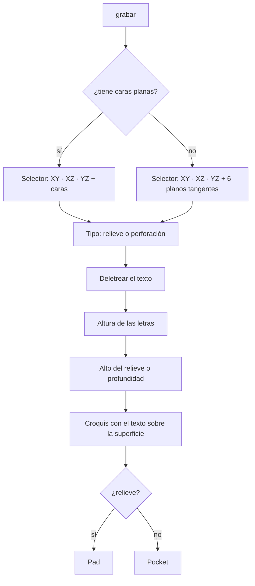
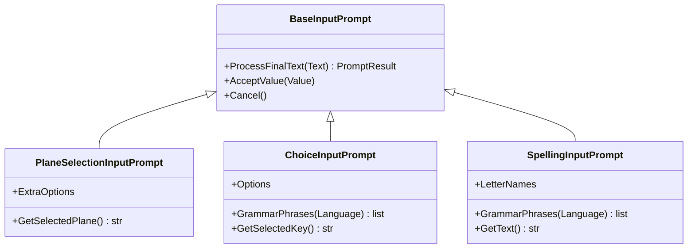

# Manual — Sketches on faces, blind hole, text engraving and revolution by voice

Covers what was added to **PartDesign / Sketcher / Part** to draw on the faces of
a part, drill without going through, engrave text (raised or sunk) and revolve
profiles, all by voice. It includes a complete example (a mallet), what was
tested, what was **not** tested and the problems that came up along the way.

The phrases are taken from the real dictionaries (`Dav/dic/`). For the tests of
the PartDesign commands that already existed, see
[voice-partdesign-testing-guide.md](voice-partdesign-testing-guide.md).

> **Numbers:** 0 to 99 are said normally (`veinticinco` (twenty-five), `sesenta`
> (sixty)). From 100 on you must **spell them out digit by digit** (`dos cinco cero`
> = 250). Words such as «doscientos cincuenta» (two hundred fifty) do **not**
> raise an error: they are read as `50`. Details in
> [voice-numbers-limits-and-proposal.md](voice-numbers-limits-and-proposal.md).
>
> **Confirming:** say each number and, **in a separate phrase**, `okey`. A single
> phrase such as «veinte okey» (twenty okay) is **not** accepted (verified with
> `FloatInputPrompt`).

---

## Summary of what is new

| Command | Where it lives | Phrases (Spanish) |
|---|---|---|
| Sketch on a plane **or face** | `nuevo croquis` / `nuevo boceto` (new sketch) in PartDesign, Part and Sketcher | the usual ones; the selector now lists faces |
| **Blind hole** | `restar` (subtractive) | `agujero ciego`, `agujero ciego por medidas`, `hueco ciego` |
| **Engrave text** | `editar` (modify) | `grabar`, `grabar texto`, `serigrafiar`, `serigrafia`, `texto en relieve`, `poner texto` |
| **Close sketch** | Sketcher (`sketcher`, `geometry`, `tools`) | `cerrar croquis`, `cerrar boceto`, `salir del croquis`, `terminar croquis`, `finalizar croquis` |
| **Revolution** (fixed) | `agregar` (additive) | `transformar` and `revolucion por angulo` |
| Hidden view buttons | DAV panel | (no phrase: GUI only) |

In English and Portuguese:

| Command | English | Portuguese |
|---|---|---|
| Blind hole | `blind hole`, `blind hole by size`, `blind drill` | `furo cego`, `furo cego por medidas`, `buraco cego` |
| Engrave text | `engrave`, `engrave text`, `emboss`, `emboss text`, `silkscreen`, `text relief` | `gravar`, `gravar texto`, `serigrafar`, `texto em relevo`, `colocar texto` |
| Close sketch | `close sketch`, `leave sketch`, `exit sketch`, `finish sketch` | `fechar croqui`, `fechar esboço`, `sair do croqui`, `terminar croqui`, `finalizar croqui` |

---

## 1. Sketches on planes and faces

When you say **«nuevo croquis»** (new sketch) the selector shows, in this order:

1. The three base planes: `XY`, `XZ`, `YZ` (as always).
2. The **flat faces** of the current solid.

Navigate with **arriba** (up) / **abajo** (down) and confirm with **okey** (or
**cancelar**, cancel).

- **Face names:** by the direction they face: *Cara superior* (top face),
  *inferior* (bottom), *frontal* (front), *trasera* (back), *derecha* (right),
  *izquierda* (left). If there are two alike, the second one carries a `2`
  (*Cara superior 2*). The 12 largest are offered.
- **Which solid:** the one you have selected; otherwise the active Body;
  otherwise the last Part body or solid in the document.
- **Origin and orientation:** the sketch origin sits at the **center of the face**
  (so simple coordinates such as ±5 can be dictated) and the normal points
  outward. With a face, the sketch goes into the Body that owns that face.
- **No solid:** the selector keeps the three planes, as before.
- It works the same from the three workbenches: PartDesign has its own version;
  the Part one and the Sketcher Geometry one share the Sketcher version.

Code: [`_faces.py`](../../dic/Workbench/Sketcher/new_sketch/_faces.py),
[Sketcher `new_sketch.py`](../../dic/Workbench/Sketcher/new_sketch/new_sketch.py) and
[PartDesign `new_sketch.py`](../../dic/Workbench/PartDesign/base/new_sketch.py).

---

## 2. Blind hole

Drills **without going through**, with a flat bottom, at the center of each circle
in the sketch. It asks for **diameter** and **depth**.

```
diseño de pieza → restar → agujero ciego → (diámetro) → (profundidad)
```

- Uses the selected sketch; if there is none, the last sketch with drawing that
  does not yet feed another operation.
- Only the **center** of the drawn circle matters: the diameter comes from what you
  dictate.
- If the hole would point out of the part, it **flips direction by itself**.

The same pattern as the die is used: circles on each face and `agujero ciego`.

Code: `blind_hole_by_size` in
[`subtractive/_parametric.py`](../../dic/Workbench/PartDesign/subtractive/_parametric.py).

> **`agujero por medidas` (hole by size) is still broken.** See [Pending items](#pending-items-and-findings).

---

## 3. Engrave text (raised or drilled)

```
diseño de pieza → editar → grabar
```

It then asks, in this order:

| Step | What you say |
|---|---|
| 1. Surface | The same sketch selector (planes and faces). `arriba`/`abajo` + `okey` |
| 2. Type | **`relieve`** (raised; or `saliente`) or **`perforación`** (drilled; or `hundido`); or `arriba`/`abajo` + `okey` |
| 3. Text | **Letter by letter** (see below) and `okey` when done |
| 4. Letter height | A number, in mm |
| 5. Relief height / depth | A number, in mm |

Cancelling at any step **creates nothing**: the sketch and the operation are only
built once all the answers are in.

### Spelling the text

| To | Say |
|---|---|
| One letter | its name: `hache`, `o`, `ele`, `a` (several at once: `d a v`) |
| A digit | `cero`, `uno` … `nueve` (zero, one … nine) |
| Separate words | **`espacio`** (space) |
| Correct | **`borrar`** (delete; removes the last character) |
| Finish | **`okey`** (or `listo`, `vale`, `enviar`…) |
| Abort | **`cancelar`** |

- Letters with two words: **`doble uve`** = W, **`i griega`** = Y. The **Ñ** is said
  `eñe`, although Vosk's small model only knows a standalone `ñ` and may fail.
- Numbers in the text go **digit by digit**: `24` is `dos cuatro`. Words such as
  `veinticuatro` are silently ignored.
- The text always comes out **in capitals**, with a maximum of 40 characters.
- While spelling, Vosk listens only to these words (restricted grammar), which is
  what makes recognition of single letters reliable.
- Letter names from all three languages are accepted at once; each language's
  grammar lists only its own.

Example: `d a v espacio uno dos okey` → **DAV 12**.

### What is generated

The text is drawn as an outline in a sketch on the chosen surface and extruded:
**Pad** for raised, **Pocket** for drilled. The holes inside letters (O, A, D…) are
respected. The text comes out **upright** (top toward +Z on side faces, toward +Y on
horizontal ones) and not mirrored.

- **Typeface:** first the one chosen in the Draft preferences; otherwise the
  system's Arial Bold (or DejaVu Sans Bold); as a last resort, the font FreeCAD
  ships with TechDraw. With thin strokes the relief is fragile.
- **Extrusion direction:** if the first direction does not change the part, it
  tries the opposite one.

### Curved surfaces (sphere, ellipsoid…)

An ellipsoid has no flat face, so instead of faces the selector offers six
**tangent planes**: *Cara superior (curva)* (top face, curved), *inferior*,
*frontal*, *trasera*, *derecha*, *izquierda*. Each one is the plane that touches
the part at its extreme, and the text is drawn flat on that point.

> **The text does not bend with the surface.** In relief, the top of the letters
> stays **flat** at the requested height above the center point; toward the edges,
> where the surface curves away from the plane, the letters end up **taller** than
> that value. With small letters on a large surface it is not noticeable; with
> large text on something very curved it looks like a metal plate. Truly bending it
> requires projecting onto the surface with the Part tools.

The `XY` / `XZ` / `YZ` options still appear, but on a centered part they pass
**through the inside** and are no use for engraving.

Code: [`engrave.py`](../../dic/Workbench/PartDesign/modify/engrave.py),
[`SpellingInputPrompt.py`](../../scr/ComponentesDAV/IntegracionGUI/GUIFreeCad/InputPrompts/SpellingInputPrompt.py),
[`ChoiceInputPrompt.py`](../../scr/ComponentesDAV/IntegracionGUI/GUIFreeCad/InputPrompts/ChoiceInputPrompt.py)
and the `askChoice` / `askText` helpers in
[`_prompts.py`](../../dic/Workbench/_prompts.py). The icon is `engrave.svg`, in the
same folder as `engrave.py`.



One diagram per class, with its design notes, in
[`diagrams/`](diagrams/README.md): [`SpellingInputPrompt`](diagrams/SpellingInputPrompt.md),
[`ChoiceInputPrompt`](diagrams/ChoiceInputPrompt.md) and
[`PlaneSelectionInputPrompt`](diagrams/PlaneSelectionInputPrompt.md).



---

## 4. Revolution and «cerrar croquis» (close sketch)

### Revolution (fixed)

`transformar` and `revolucion por angulo` **did not work**: they created the
operation without a rotation axis, FreeCAD flagged it invalid and the solid did not
appear. They now revolve the profile around the sketch's **vertical axis**: draw the
profile to one side of that axis, with **x = radius** and **y = height** along the
axis, and close it (including the line on the axis).

- `transformar` lets you **pick the sketch by voice** (`avanzar` (next) / `okey`)
  and asks for the angle. **This is the one to use.**
- `revolucion por angulo` also lets you **pick the sketch by voice** (`avanzar` / `okey`)
  and asks for the angle, just like `transformar`: it is no longer necessary to
  select it with the mouse.
- If the profile crosses the axis, it reports an error and leaves no broken objects.

Code: `_revolveProfile` in
[`additive/_parametric.py`](../../dic/Workbench/PartDesign/additive/_parametric.py).

### Close sketch

**`cerrar croquis`** runs FreeCAD's "Leave Sketch" (keeps the drawing and cancels
any drawing tool that is still active). Before, there was no way to leave the
sketch by voice.

- If no sketch is open, it warns and does nothing.
- If the sketch is in a PartDesign Body, it tries to hand the voice back to
  PartDesign. **It only manages this if you say it from `sketcher` or `geometry`.**
  From a deeper context (`line`, `circle`…) the `Browser` leaves the voice in
  `geometry`; from there **`diseño de pieza`** (part design) keeps working.
- It is registered in `sketcher`, `geometry` and `tools` on purpose. The `Browser`
  looks for **approximate** matches in the current context before looking at the
  upper ones, and «cerrar croquis» resembles «crear croquis» (new sketch) and
  «borrar croquis» (**deletes all geometry**). With the exact phrase in those
  contexts, that confusion no longer happens: this was tested in all 29 Sketcher
  contexts.

Code: `_leave_sketch` in
[Sketcher `new_sketch.py`](../../dic/Workbench/Sketcher/new_sketch/new_sketch.py)
and `enterPartDesignContext` in [`_display.py`](../../dic/Workbench/_display.py).

---

## 5. Panel: view buttons

The view commands (`frontal`, `acercar`, `zoom caja`…) are propagated to almost
every context so they can be said from anywhere, and they filled the panel with
out-of-place buttons. Now their **buttons** are only drawn inside the views context
(`stdview`). **By voice they still work everywhere**, and the text listing in the
history still shows them too.

| Context | View buttons |
|---|---|
| Base > workbench, partdesign, part, sketcher | none |
| stdview and its submenus | all |

Code: `_is_view_command` and `_in_view_context` in
[`dav_dock_panel.py`](../../scr/ComponentesDAV/IntegracionGUI/GUIFreeCad/integration/dav_dock_panel.py),
with tests in `tests/test_dav_dock_panel.py`.

---

## 6. Complete example: a mallet, word by word

A mallet is head + handle: a **solid of revolution**. The dimensions are
**examples** (handle Ø20 × 250 mm, head Ø50 × 60 mm). **The DIN 6475 standard is not
in the repository**: replace them with the ones from its table.

How to read the tables: each `like this` cell is **one phrase** that you say and
then wait for it to appear in the panel. Numbers and `okey` always go in separate
phrases.

### A. New document

| # | Say | What happens |
|---|---|---|
| 1 | `explorador` | context Base > explorer |
| 2 | `archivo` | context explorer > file |
| 3 | `nuevo` | new document |

### B. Open the sketch on the XZ plane

| # | Say | What happens |
|---|---|---|
| 4 | `banco de trabajo` | context workbench |
| 5 | `diseño de pieza` | context partdesign |
| 6 | `base` | context base |
| 7 | `nuevo croquis` | the selector appears, highlighting **XY** |
| 8 | `abajo` | moves to **XZ** |
| 9 | `okey` | the body and the sketch are created; it stays open and the voice moves to the sketcher context |

### C. Draw the profile (6 lines)

First, only once:

| # | Say | What happens |
|---|---|---|
| 10 | `geometria` | context geometry |
| 11 | `linea` | context line |

Then, **for each line** you say `linea por puntos` (line by points) and answer the
four values it asks for, in the order **x1, y1, x2, y2**. In the sketch, x is the
radius and y the height along the axis. Each cell is one phrase:

| Line | Start with | x1 | y1 | x2 | y2 |
|---|---|---|---|---|---|
| 1. handle bottom | `linea por puntos` | `cero` `okey` | `cero` `okey` | `diez` `okey` | `cero` `okey` |
| 2. handle side | `linea por puntos` | `diez` `okey` | `cero` `okey` | `diez` `okey` | `dos cinco cero` `okey` |
| 3. step | `linea por puntos` | `diez` `okey` | `dos cinco cero` `okey` | `veinticinco` `okey` | `dos cinco cero` `okey` |
| 4. head side | `linea por puntos` | `veinticinco` `okey` | `dos cinco cero` `okey` | `veinticinco` `okey` | `tres uno cero` `okey` |
| 5. head top | `linea por puntos` | `veinticinco` `okey` | `tres uno cero` `okey` | `cero` `okey` | `tres uno cero` `okey` |
| 6. on the axis | `linea por puntos` | `cero` `okey` | `tres uno cero` `okey` | `cero` `okey` | `cero` `okey` |

Three-digit numbers are spelled out: `dos cinco cero` = 250 and `tres uno cero` =
310. After the six lines you have a closed outline: handle + head, with the axis as
the left side.

### D. Close the sketch and revolve

| # | Say | What happens |
|---|---|---|
| 12 | `cerrar croquis` | the sketch closes; the voice stays in geometry |
| 13 | `banco de trabajo` | context workbench |
| 14 | `diseño de pieza` | context partdesign |
| 15 | `agregar` | context additive |
| 16 | `transformar` | «Elegí el dibujo» (pick the drawing) appears; if the sketch shown is not yours, say `avanzar` |
| 17 | `okey` | picks the sketch |
| 18 | `tres seis cero` | angle: 360 |
| 19 | `okey` | the mallet is created |

Expected result: a solid **310 mm tall and 50 mm wide**, with its axis along Z.

### E. Optional: engrave the standard on the head

| # | Say | What happens |
|---|---|---|
| 20 | `subir` | back to the partdesign context |
| 21 | `editar` | context modify |
| 22 | `grabar` | the selector appears, highlighting **XY** |
| 23 | `abajo` `abajo` `abajo` | XZ, YZ and then **Cara superior** (top face), the top of the head |
| 24 | `okey` | picks that face |
| 25 | `relieve` | picks the type (it is chosen without `okey`) |
| 26 | `de` `i` `ene` `espacio` `seis` `cuatro` `siete` `cinco` | the panel shows `DIN 6475_` |
| 27 | `okey` | ends the text |
| 28 | `cinco` `okey` | letter height: 5 mm |
| 29 | `uno` `okey` | relief: 1 mm |

The text is about **27 mm** wide, within the 50 of the top face. The letters can be
said together in one phrase (`de i ene`) or one at a time.

Alternative without revolution, with the commands that already existed: extrude a
circle of radius 25 by 60 and, in a sketch on the **Cara superior**, a circle of
radius 10 extruded 250. It gives the same solid.

> **Not verified in the FreeCAD window:** that each `linea por puntos` draws
> **inside** the open sketch (the command takes it from the active object; if loose
> lines appear in the tree instead, that is where it fails), and the per-context
> navigation phrases. The modeling itself (360° revolution and engraving) was fully
> checked: see the next table.

---

## What was tested and what was not

Everything was run in **FreeCAD 1.1.3 headless** (`freecadcmd`), calling the real
dictionary functions and, when needed, the real `Browser` with a mocked
`FreeCADGui`.

| Test | Result |
|---|---|
| 21-hole die (20 mm cube, 2 mm fillet, circles per face + 4×2 blind hole) | 21 holes, a single valid solid, 7276.91 mm³ = expected |
| Engraving on a cube: relief on top, drilling on the front, relief on the side | Correct volume, valid solid, upright text |
| Engraving on an ellipsoid (tangent planes) | Relief exactly +1.0 mm on top, drilling on the front, +0.7 mm on the right |
| Spelling: `hache o ele a` → HOLA, `d a v espacio uno dos` → DAV 12, `borrar`, `okey`, `cancelar` | Correct |
| Mallet profile revolved 360° / 180° | 196,349.5 mm³ / 98,174.8 mm³, equal to the calculation |
| Profile that crosses the axis | Clear error, no broken objects |
| Full mallet: XZ sketch in a Body → `transformar` 360° → engrave `DIN 6475` on the Cara superior | 196,349.5 mm³ and 310 × 50 mm; the engraving adds 57.7 mm³ (311 mm tall), a single valid solid; the Cara superior is the first face in the selector |
| «cerrar croquis» in all 29 Sketcher contexts | In all 29 it calls `Sketcher_LeaveSketch` |
| View buttons per context (real Browser and dictionary) | 0 in workbench/part/partdesign/sketcher, all in stdview |
| Panel and Browser tests (`unittest`) | Pass |

**Not tested:**

- Recognition **with real voice** (Vosk) or the on-screen dialogs.
- Anything inside the **FreeCAD window**: context navigation, the sketch-picking
  dialog, the actual closing of the sketch, or that `linea por puntos` draws inside
  the open sketch.
- The letter names were checked against the vocabulary of Vosk's small models.
  **Spanish:** except `eñe`, all are present. **English:** `h` (not `aitch`).
  **Portuguese:** `efe`, `ene` and `dáblio` are missing; they are said `fê`, `n` and
  `duplo vê`.

---

## Pending items and findings

Problems that came up and **are still open** (not touched):

1. **`agujero por medidas` (`hole_by_size`)** fails for three reasons: it assigns the
   profile before putting the hole into the Body ("No base set"), it does not find
   the cube's Body and creates an empty one, and it uses `DepthType = 1`, which in
   FreeCAD 1.x is **through all** (it ignores the depth). Use `agujero ciego`.
2. **Mirrored XY plane in the Sketcher.** `_PLANE_ROTATIONS["XY"]` is `(1,0,0,0)`
   with a comment saying the order is `(w,x,y,z)`, but `App.Rotation(a,b,c,d)`
   takes `(x,y,z,w)`: it is a 180° turn about X. A circle dictated at (5,5) lands at
   (5,−5). It affects the Sketcher's "nuevo boceto" on the XY plane.
3. **`cancelar edición`, `detener edición` and `cancelar`** (Sketcher) run
   `Sketcher_StopEditing`, which does not exist in FreeCAD. The real commands are
   `Sketcher_LeaveSketch` (already used by "cerrar croquis") and
   `Sketcher_StopOperation`.
4. **Workbench `ayuda` (help) overridden.** The views block in
   `Workbench/TraduceToEs.py` (line ~207) redefines `ayuda`, `información` and
   `opciones` with the StdView help.
5. **Part, "nuevo boceto" in English:** `Part/new_sketch/TraduceToEn.py` points to
   `new_sketch["nuevo sketch"]`, a key that does not exist in the dictionary.
6. **Approximate match before exact match.** The `Browser` accepts a similar phrase
   from the current context before looking at an exact one in a higher context.
   A new command with a name similar to another can trigger the wrong one (this was
   seen with "cerrar croquis" → "borrar croquis"). Root fix: prioritize the exact
   match.
7. **Engraved text on curved surfaces:** it stays flat (see section 3).
8. **Numbers ≥ 100** must be spelled out; compound words are misread silently
   (`doscientos cincuenta` → 50).
9. **Test guide with a doubtful detail.** `voice-partdesign-testing-guide.md` says
   `veinte enter` in a single phrase, but `FloatInputPrompt` leaves it pending: the
   number and the confirmation must go in separate phrases. That guide should be
   reviewed in a real-voice test.

### When pushing these changes to git

`.gitignore` ignores `Dav/scr/ComponentesDAV/*` (only `scripts/` is re-included).
The **new** files in that folder do not show up in `git status` and are not picked
up by a plain `git add`, and without them `grabar` fails on import. They must be
added by hand:

```
git add -f Dav/scr/ComponentesDAV/IntegracionGUI/GUIFreeCad/InputPrompts/SpellingInputPrompt.py
git add -f Dav/scr/ComponentesDAV/IntegracionGUI/GUIFreeCad/InputPrompts/ChoiceInputPrompt.py
```

The files in that folder that are already versioned (`PlaneSelectionInputPrompt.py`,
`PlaneGrammarSwitcher.py`, `dav_dock_panel.py`) are detected normally.
