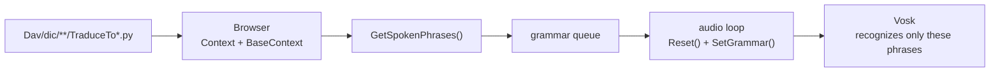
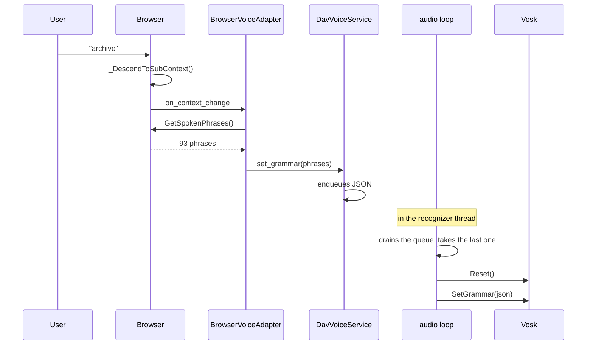

# Vosk grammar shortener

How DAV limits what the recognizer can hear to the valid commands of the
active navigation context, instead of letting it compete against the model's
entire vocabulary.

Solved in PR #178 (integrates #176 by SoPerez1). The analysis that motivated it
is in [`pendientes-dav.md`](pendientes-dav.md) §10.

---

## The problem

`vosk-model-small-es-0.42` loads **100,001 words**. The `Dav/dic/` tree uses
**745** (0.75%), and the median per context is **12 phrases**.

Without a grammar, Vosk picks the most probable word among the 100,001 in every
phrase. Hence the recorded symptoms: "croquis" transcribed as "crockett", a
"traffic" that nobody said.

A bigger model does not fix it — that improves the acoustic model, not the
per-phrase competition. It is fixed by narrowing the candidate vocabulary.

---

## The idea

At any point during navigation, the set of things the user *can* say is small
and known: the commands of the level they are standing on, the jumps to the
root, and the navigation verbs. That list is passed to Vosk as a grammar, and
the recognizer stops considering everything else.

When the level changes, the grammar is recomputed.



---

## Where the phrases come from

`Browser.GetSpokenPhrases()` ([`navigation/browser.py`](../../scr/ComponentesDAV/IntegracionGUI/GUIFreeCad/navigation/browser.py))
gathers four sources, **all from the dictionary**:

| Source | Where it comes from | Example at the root |
| --- | --- | --- |
| `self.Context` | The `TraduceTo*.py` of the folder where the user is standing | `archivo`, `banco de trabajo` |
| `self.BaseContext` | Internal keys of the root level | `explorer` |
| `_base_translate` | `Dav/dic/TraduceTo*.py` — jumps to the root from any level | `explorador`, `dibujar` |
| `_nav_translate` | `Dav/dic/NavCommands/TraduceTo*.py` | `subir`, `volver`, `contexto`, `enviar`, `cancelar` |

From each entry it takes **two** things: the spoken phrase (`Spoken`) and the
internal key (`InternalKey`). That is why `explorador` (Spanish) and
`explorer` (internal key) coexist in the grammar.

The only thing that does **not** come from the dictionary is `[unk]`, the
wildcard with which Vosk absorbs noise and out-of-context words without forcing
an incorrect command.

> **Adding a synonym means editing a `TraduceTo*.py`.** There is no need to
> touch `browser.py` or anything in the voice engine: the word appears in the
> grammar on restart. This also applies to `enviar` and `cancelar`, which until
> PR #178 were written in three places in the code.

### Actual sizes

Measured in a session inside FreeCAD, in Spanish:

| Context | Phrases |
| --- | --- |
| Root | 54 |
| File | 93 |
| File → New | 120 |
| Sketcher | 199 |
| Preferences (`all_grammar_phrases()`) | 82 |

Versus the 100,001 of the open model.

---

## How it is applied

The grammar is applied **inside the thread that owns the recognizer**, never
from the GUI thread. Whoever navigates only enqueues; the audio loop consumes.



### Why `Reset()` before `SetGrammar()`

**Vosk aborts the process** if the grammar is changed on a recognizer that has
already processed audio:

```
SetGrm():recognizer.cc:235
"Can't add speaker model to already running recognizer"
```

It is not a Python exception: no `try/except` catches it, and it takes down the
whole of FreeCAD. In FreeCAD's `crash.log` it appears as `Recognizer::SetGrm`.

Verified against the `pt` model in separate processes:

| scenario | result |
| --- | --- |
| `SetGrammar` before any audio | ok |
| `SetGrammar` after audio | **ERROR → crash** |
| `Reset()` + `SetGrammar` | ok |

`Reset()` returns the recognizer to its initial state, and only then does it
accept the new grammar.

### Why only the last one in the queue

If several grammars were enqueued while the loop was in `AcceptWaveform`, the
intermediate ones no longer describe the current context. Applying all of them
made the preferences grammar (82 phrases) and the CAD grammar (54) overwrite
each other by alternating, and since each application does a `Reset()` — which
discards half-recognized audio — **no phrase ever got to complete**. The
microphone seemed dead.

The loop drains the queue, keeps the last one, and does not reapply it if it is
equal to the current one.

---

## The two modes

`DavVoiceService` serves two consumers with different grammars:

| Mode | Grammar | Origin |
| --- | --- | --- |
| `cad` | Active navigation context | `Browser.GetSpokenPhrases()` |
| `preferences` | 81 configuration phrases + `[unk]` | `speech/voice_commands.all_grammar_phrases()` |

When Preferences is closed, `detach_preferences()` → `resume_cad_voice()`
restores the CAD grammar.

---

## Known limits

**The grammar restricts the vocabulary, not the syntax.** Vosk can combine
several valid words into a meaningless phrase. Things like
`"extender oblongo"` or `"editar de trabajo crear vistas estándar"` showed up in
the log: none of them executed anything, but it shows that with 199 active
phrases (Sketcher) there is more surface for noise to fit something.

**Words that are not in the model cannot be recognized.** If a `TraduceTo*.py`
adds a word that the Vosk model does not know, it enters the grammar but will
never match. `SetGrammar` gives no warning: it fails silently.

**The grammar and the model must be in the same language.** Applying a Spanish
grammar on the Portuguese model does not raise an exception, it simply stops
recognizing everything.

---

## Diagnostics

All of this is recorded in `config/dav.log` (see
[`core/dav_log.py`](../../scr/ComponentesDAV/IntegracionGUI/GUIFreeCad/core/dav_log.py)):

```
14:44:03  cad: frase reconocida 'archivo'
14:44:03  aplicando gramatica: 120 frases
14:44:03  gramatica aplicada
```

The "aplicando" line is written **before** calling `SetGrammar`: if the log
stops there without the "gramatica aplicada" that follows it, that grammar is
the one that brought the process down.

Signs that something is wrong:

- Grammars alternating without the user navigating (`82 / 54 / 82 / 54`) → two
  modes fighting over the recognizer.
- `aplicando` without its `gramatica aplicada` → crash in `SetGrammar`.
- No grammar line in the whole session → the shortener is not kicking in and
  Vosk is recognizing against the full model.

---

## Files

| File | Role |
| --- | --- |
| `navigation/browser.py` | `GetSpokenPhrases()`, `GetNavWords()` |
| `speech/dav_voice_service.py` | Grammar queue, `Reset()` + `SetGrammar()` in the loop |
| `integration/browser_voice_adapter.py` | Enqueues on context change |
| `speech/voice_commands.py` | `all_grammar_phrases()` for preferences mode |
| `Dav/dic/NavCommands/` | `subir`, `contexto`, `enviar`, `cancelar` |
| `Dav/dic/**/TraduceTo*.py` | All the rest of the vocabulary |
