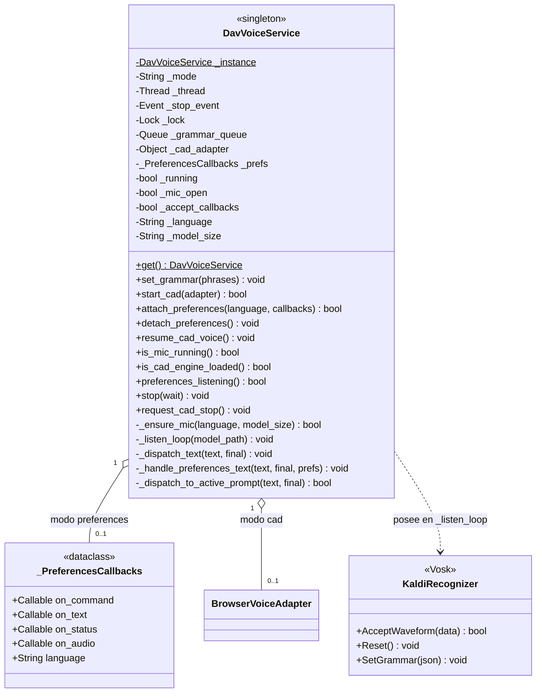
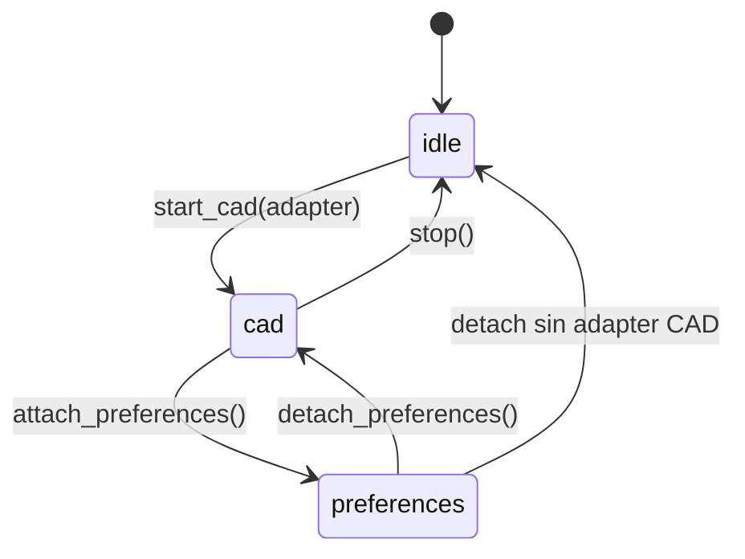

# DavVoiceService

> **Archivo:** `Dav/scr/ComponentesDAV/IntegracionGUI/GUIFreeCad/speech/dav_voice_service.py`

Singleton que posee el micrófono y el recognizer de Vosk. Un solo hilo de audio
para todo DAV: lo comparten la navegación CAD y el diálogo de Preferencias, que
antes competían por el dispositivo.

## Los dos modos

| Modo | Quién consume | Gramática |
| --- | --- | --- |
| `cad` | `BrowserVoiceAdapter` | Contexto de navegación activo |
| `preferences` | Diálogo de Preferencias | 81 frases de configuración |
| `idle` | Nadie | Micrófono cerrado |

## El hilo de audio

`_listen_loop` corre en un hilo aparte (`DAV-VoiceService`) para no bloquear la
UI de FreeCAD. En cada vuelta:

1. Drena `_grammar_queue` y se queda con la última gramática
2. Si cambió: `Reset()` + `SetGrammar()` — **siempre en este hilo**, nunca desde
   la GUI
3. `AcceptWaveform()` y despacha el texto según el modo

Detalle de por qué el `Reset()` es obligatorio (Vosk aborta el proceso sin él):
[`acortador-gramatica-vosk.md`](../acortador-gramatica-vosk.md).

## En Linux: el micrófono corre en un proceso aparte

Dentro de FreeCAD (AppImage), cargar PortAudio y `libvosk.so` puede tumbar el
proceso entero con una caída nativa (segfault, o `Illegal instruction` si la CPU
no ofrece AVX) que Python no puede atrapar. Por eso, en Linux, `_listen_entry`
elige `_listen_loop_worker`, que lanza `speech/voice_worker.py` como proceso
hijo con el Python del `.venv` de GUIFreeCad (`DAV_GUI_FREECAD_ROOT/.venv/bin/python`)
y sin las variables de entorno del AppImage (`LD_LIBRARY_PATH`, `PYTHONHOME`, …).
Si algo se cae, muere el hijo y FreeCAD sigue abierto.

| Sentido | Mensajes (una línea cada uno) |
| :--- | :--- |
| hijo → DAV (stdout, prefijo `@DAV ` + JSON) | `{"t":"ready"}` · `{"t":"text","text":…,"final":bool}` · `{"t":"audio"}` · `{"t":"error","kind":"import\|model\|mic","msg":…}` |
| DAV → hijo (stdin) | `{"cmd":"grammar","json":…}` · `{"cmd":"stop"}` |

- Las líneas sin el prefijo (los logs de Kaldi) se vuelcan a `dav.log`.
- Si stdin se cierra (FreeCAD murió), el hijo termina solo.
- La gramática se aplica en el hijo con el mismo `Reset()` + `SetGrammar()`.
- Si el hijo termina con un código distinto de 0 sin avisar, DAV emite
  `error:mic:El proceso de voz se cerró (<motivo>)`. Para las señales muestra el
  nombre; `SIGILL` indica una CPU o máquina virtual sin AVX. En `dav.log` quedan
  `el proceso de voz termino inesperadamente` y la línea final
  `hilo de voz terminado (proceso aparte, salida=…)`.
- En Windows (u otro sistema, o si no existe el `.venv`) se usa el hilo dentro de
  FreeCAD descrito arriba. `DAV_VOICE_INPROCESS=1` fuerza ese modo también en Linux.
- Si FreeCAD cae por otra causa nativa, `dav_fault.log` (junto a `dav.log`) guarda
  dónde estaba cada hilo de Python.

## Notas de diseño

- **`_ensure_mic` reinicia el hilo si cambió el idioma o el tamaño del modelo**,
  porque el modelo se carga una sola vez al crear el recognizer.
- Los fallos del hilo quedan en `config/dav.log`: si el log corta sin la línea
  `hilo de voz terminado`, el proceso murió dentro del loop.
- `_dispatch_to_active_prompt` da prioridad a los `InputPrompts` abiertos sobre
  la navegación normal.
