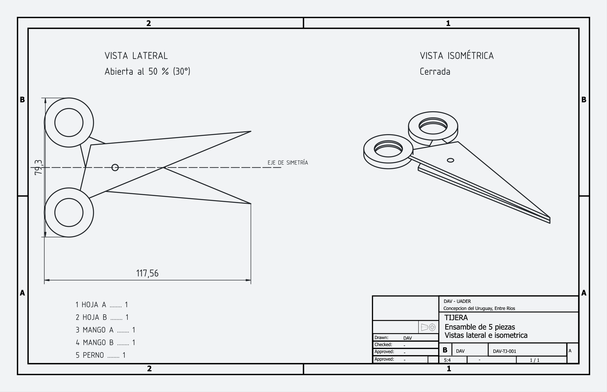

# Guía — una tijera de 5 piezas, de la voz al plano ANSI

Cómo dibujar por voz en DAV un ensamblaje de tijera (2 hojas, 2 mangos y 1 perno) y
ponerlo en un plano técnico con rótulo ANSI, con una vista lateral (tijera abierta al 50 %,
con eje de simetría) y una vista isométrica (tijera cerrada).

Archivos para comparar con tu resultado, en [ejemplo-tijeras/](ejemplo-tijeras/):

| Archivo | Qué es |
|---|---|
| `tijeras_dav.FCStd` | el modelo completo (5 cuerpos, 2 ensamblajes, plano) |
| `tijeras_dav.pdf` / `.png` | el plano exportado |
| `crear_tijeras.py` | arma todo lo anterior con la API de FreeCAD, con los mismos valores de esta guía |

> **Qué está probado y qué no.** Los valores, las juntas y los números de «avanzar» de esta guía
> salen de correr las funciones reales de DAV (`_InsertLink`, `_CreateJoint`, `listConnectors`) y
> el solver de FreeCAD 1.1: el modelo converge y no hay interferencias salvo la abrazadera
> hoja/mango, que es intencional. **No se probó el reconocimiento de voz.** Las frases están
> tomadas de los diccionarios de `Dav/dic/`. La parte de TechDraw (fase 4) ahora se
> hace por voz; solo el rótulo conserva pasos con mouse (🖱).

> **También como ejemplo guiado dentro de DAV:** `explorador` → `ejemplos` → `ejemplos` → *Tijera de 5 piezas*. Cubre las 5 piezas y el ensamblaje cerrado (fases 1 y 2); la tijera abierta y el plano están solo en esta guía.

## Antes de empezar

- FreeCAD con el panel DAV, idioma **español**, documento nuevo y vacío.
- Si te perdés: **`contexto`**. Para subir un nivel: **`subir`**. Para abortar un pop-up: **`cancelar`**.
- Cada valor se dice y se confirma con **`enter`** (`ochenta enter`). Negativos: `menos diez`.
  Decimales: `uno coma ocho`. Los números de 0 a 99 se dicen normal (todos los de esta guía).
- En las listas (cuerpos, piezas, dibujos) se arranca en el primer elemento: **`avanzar`** pasa
  al siguiente y **`enviar`** elige. «Avanzar ×3» = decirlo tres veces y después `enviar`.
- `subir ×N` significa decir `subir` N veces. `banco de trabajo` solo vale desde el menú principal.

## El modelo

La tijera yace en el plano XY; el perno es el eje Z. Medidas en mm.

| # | Pieza | Cómo es |
|---|---|---|
| 1 | Hoja A | triángulo (80,0) (−10,−16) (−26,14) extruido 2; lengüeta Ø20 en (−32,18); agujero de perno Ø4; agujero Ø16 en la lengüeta |
| 2 | Hoja B | espejo de la A en Y: (80,0) (−10,16) (−26,−14); lengüeta en (−32,−18); agujero de perno **Ø3,6** |
| 3 | Mango A | anillo Ø28 × 4 en (−32,18), hueco Ø16 |
| 4 | Mango B | igual, en (−32,−18) |
| 5 | Perno | cabeza Ø10 × 2, eje Ø4 × 2 (hoja A), eje Ø3,6 × 2 (hoja B) |

Por qué así: el **perno es escalonado** (Ø4 y Ø3,6) para que el ensamblaje apile solo la hoja B
2 mm sobre la A sin pedirte ninguna junta de posición. Los **huecos Ø16** de hoja y mango son
cilindros del mismo eje: sobre ellos se hace la junta fija hoja↔mango.

Apertura: máximo 60°, así que 50 % = 30° (cada hoja ±15° respecto del eje X). Se logra con una
junta de distancia entre los mangos: **23,3 mm** de luz (cerrada son 8).

## Fase 1 — las 5 piezas

Hoja A:

| # | Decí | Qué pasa |
|---|---|---|
| 1 | `banco de trabajo` → `croquis` → `geometria` → `triangulo` → `triangulo por vertices` | pop-up de 6 valores |
| 2 | `ochenta enter` `cero enter` `menos diez enter` `menos dieciseis enter` `menos veintiseis enter` `catorce enter` | triángulo de la hoja A |
| 3 | `subir ×3` → `diseño de pieza` → `aditivo` → `extruir por medida` | lista de dibujos |
| 4 | `enviar` · `dos enter` | se crea el cuerpo 1 (hoja A) |
| 5 | `cilindro por medidas` · `diez` `dos` `menos treinta y dos` `dieciocho` `uno` (cada uno con `enter`) · `no` · `enviar` | lengüeta, sumada al cuerpo 1 |
| 6 | `subir` → `cortar` → `cortar cilindro por medidas` · `dos` `diez` `cero` `cero` `uno` · `enviar` | agujero del perno |
| 7 | `cortar cilindro por medidas` · `ocho` `diez` `menos treinta y dos` `dieciocho` `uno` · `enviar` | hueco de la lengüeta |

Hoja B (cuerpo 2):

| # | Decí | Qué pasa |
|---|---|---|
| 8 | `subir ×2` → `croquis` → `geometria` → `triangulo` → `triangulo por vertices` · `ochenta` `cero` `menos diez` `dieciseis` `menos veintiseis` `menos catorce` | triángulo de la hoja B |
| 9 | `subir ×3` → `diseño de pieza` → `aditivo` → `extruir por medida` · **`avanzar ×2`** (el último de la lista) · `enviar` · `dos enter` | cuerpo 2 |
| 10 | `cilindro por medidas` · `diez` `dos` `menos treinta y dos` `menos dieciocho` `uno` · `no` · `avanzar` · `enviar` | lengüeta |
| 11 | `subir` → `cortar` → `cortar cilindro por medidas` · `uno coma ocho` `diez` `cero` `cero` `uno` · `avanzar` · `enviar` | agujero del perno (Ø3,6) |
| 12 | `cortar cilindro por medidas` · `ocho` `diez` `menos treinta y dos` `menos dieciocho` `uno` · `avanzar` · `enviar` | hueco |

Mangos y perno (cada «cuerpo nuevo» es `si`):

| # | Decí | Qué pasa |
|---|---|---|
| 13 | `subir` → `aditivo` → `cilindro por medidas` · `catorce` `cuatro` `menos treinta y dos` `dieciocho` `uno` · `si` | cuerpo 3 (mango A) |
| 14 | `subir` → `cortar` → `cortar cilindro por medidas` · `ocho` `diez` `menos treinta y dos` `dieciocho` `uno` · **`avanzar ×2`** · `enviar` | hueco |
| 15 | `subir` → `aditivo` → `cilindro por medidas` · `catorce` `cuatro` `menos treinta y dos` `menos dieciocho` `uno` · `si` | cuerpo 4 (mango B) |
| 16 | `subir` → `cortar` → `cortar cilindro por medidas` · `ocho` `diez` `menos treinta y dos` `menos dieciocho` `uno` · **`avanzar ×3`** · `enviar` | hueco |
| 17 | `subir` → `aditivo` → `cilindro por medidas` · `cinco` `dos` `cero` `cero` `menos uno` · `si` | cuerpo 5: cabeza del perno |
| 18 | `cilindro por medidas` · `dos` `dos` `cero` `cero` `uno` · `no` · **`avanzar ×4`** · `enviar` | eje de la hoja A |
| 19 | `cilindro por medidas` · `uno coma ocho` `dos` `cero` `cero` `tres` · `no` · **`avanzar ×4`** · `enviar` | eje de la hoja B |

Orden de los cuerpos en las listas: 1 hoja A, 2 hoja B, 3 mango A, 4 mango B, 5 perno
(el panel los muestra como `Body`, `Body001`…).

## Fase 2 — ensamblaje cerrado

Un ensamblaje por estado de la tijera: así cada vista de TechDraw usa un solo objeto de origen.

| # | Decí | Lista que aparece |
|---|---|---|
| 20 | `subir ×2` → `ensamblaje` → `crear ensamblaje` | el ensamblaje nuevo queda activo |
| 21 | `insertar vinculo` | cuerpos: `enviar` (hoja A) |
| 22 | `insertar vinculo` · `avanzar` · `enviar` | hoja B |
| 23 | `insertar vinculo` · `avanzar ×2` · `enviar` | mango A |
| 24 | `insertar vinculo` · `avanzar ×3` · `enviar` | mango B |
| 25 | `insertar vinculo` · `avanzar ×4` · `enviar` | perno |
| 26 | `anclar pieza` · `avanzar ×9` · `enviar` | el vínculo del perno (5 cuerpos + 4 vínculos antes) |
| 27 | `bisagra` | 1.ª lista `avanzar ×9` `enviar` (perno); 2.ª `avanzar ×5` `enviar` (hoja A). Caras: perno `abajo` `enviar` (cilindro Ø4); hoja A `abajo ×2` `enviar` (cilindro Ø4) |
| 28 | `bisagra` | 1.ª `avanzar ×9` `enviar`; 2.ª `avanzar ×6` `enviar` (hoja B). Caras: perno `abajo ×2` `enviar` (Ø3,6); hoja B `abajo ×2` `enviar` |
| 29 | `ensamble fijo` | 1.ª `avanzar ×5` `enviar` (hoja A); 2.ª `avanzar ×6` `enviar` (mango A). Caras: `abajo` `enviar` en cada una (hueco Ø16) |
| 30 | `ensamble fijo` | 1.ª `avanzar ×6` `enviar` (hoja B); 2.ª `avanzar ×7` `enviar` (mango B). Caras: `abajo` `enviar` en cada una |
| 31 | `resolver ensamblaje` | la hoja B sube 2 mm; todo encastra |

En los pasos 27–30 la lista de caras muestra primero los cilindros (de mayor a menor área):
si el panel dice «Cilindro de radio 8» es el hueco, «radio 2» el del perno.

## Fase 3 — ensamblaje abierto al 50 %

Mismos pasos con **otro ensamblaje**. Las listas de piezas ahora incluyen los 5 vínculos del
cerrado, así que los números suben en 5:

| # | Decí | Resultado |
|---|---|---|
| 32 | `crear ensamblaje`, y 5 veces `insertar vinculo` como en 21–25 | 5 vínculos nuevos |
| 33 | `anclar pieza` · `avanzar ×14` · `enviar` | perno anclado |
| 34 | `bisagra` | 1.ª `avanzar ×14`; 2.ª `avanzar ×10` (hoja A); caras como en 27 |
| 35 | `bisagra` | 1.ª `avanzar ×14`; 2.ª `avanzar ×11` (hoja B); caras como en 28 |
| 36 | `ensamble fijo` | 1.ª `avanzar ×10`; 2.ª `avanzar ×11`; caras como en 29 |
| 37 | `ensamble fijo` | 1.ª `avanzar ×11`; 2.ª `avanzar ×12`; caras como en 30 |
| 38 | `junta por distancia` · `veintitres coma tres enter` | 1.ª lista `avanzar ×12` `enviar` (mango A); 2.ª `avanzar ×12` `enviar` (mango B); caras: `enviar` en ambas (cilindro exterior Ø28) |
| 39 | `resolver ensamblaje` | la tijera se abre ±15° |

Si DAV avisa de «2 assemblies in the document», hacé doble clic (🖱) en el ensamblaje que querés
usar para activarlo y repetí el comando.

## Fase 4 — plano ANSI B (ASME Y14.1, 17×11 in)

Proyección en tercer ángulo (norma ASME Y14.3, la usual en EE. UU.). Rótulo ANSI B de la
plantilla `ASME/ANSIB_Landscape.svg`.

| # | Decí / hacé | Qué pasa |
|---|---|---|
| 40 | `subir` hasta el menú principal → `banco de trabajo` → `dibujo tecnico` → `pagina` → `plantilla` | abre el navegador de archivos |
| 41 | `abrir` (entra a `ASME`) · `siguiente ×5` · `okey` | página con `ANSIB_Landscape.svg` |
| 42 | `subir` → `vistas` → `vista de objeto` · en la lista de objetos: **`buscar por deletreo`** → deletreá `te i jota e erre a` `espacio` `a be i e erre te a` (Tijera abierta) · `okey` · `okey` | el cuadro salta al objeto más parecido; `okey` lo elige |
| 43 | Siguen las preguntas de la misma orden: dirección `superior` · escala `uno coma veinticinco enter` · X `uno cero cinco enter` · Y `uno seis cero enter` (las centenas se dicen dígito por dígito) | vista lateral |
| 44 | `vista de objeto` · `buscar por deletreo` → `Tijera cerrada` · `okey` · `isometrica` · `uno coma veinticinco enter` · `tres dos cinco enter` · `uno seis cero enter` | vista isométrica |
| 45 | `proyeccion de pagina` · `tercer angulo` | tercer ángulo |
| 46 | **Eje de simetría:** `lineas` → `eje de simetria` · vista (`avanzar`/`okey`) · `horizontal` · `origen` | línea de centro por el perno, sobre el eje X |
| 47 | Cotas totales: `cotas` → `extension` → `cotas totales` · vista | largo 117,56 y alto 79,3 |
| 48 | Rótulo: `elementos` → `campos` completa lo que sale de las propiedades del documento; el resto (título, número DAV-TJ-001, escala 5:4) se edita con doble clic 🖱 | rótulo lleno |
| 49 | `pagina` → `pdf` · carpeta y nombre por voz | PDF |

### Buscar por deletreo

En cualquier lista de objetos (vistas, ensamblajes, piezas...), en vez de decir `avanzar` cien veces:

1. Decí **`buscar por deletreo`** (basta `deletrear` o `buscar`).
2. Deletreá el nombre letra por letra, con `espacio` entre palabras y `borrar` para corregir; `okey` cierra.
3. El cuadro salta al objeto que **más se parece** (se tolera que el reconocedor confunda letras
   vecinas como be/de/pe/te) y nombra otros dos candidatos. `okey` lo elige; si no era, repetí la búsqueda
   o seguí con `avanzar`.

Fuera de una lista, la misma frase selecciona en el documento el objeto más parecido (te pregunta
«¿Es …?» y respondés `si` o `no`).

### Lo que todavía necesita revisión del usuario

- **Propiedades fuera de estos comandos** (por ejemplo cambiar solo la escala de una vista ya creada): `escala de vista`,
  `direccion de vista` y `posicion de vista` lo hacen sin pasar por el panel de propiedades.
- El eje de simetría y las cotas necesitan la hoja a la vista; DAV la abre solo, pero si FreeCAD avisa que no
  creó el eje, abrí la página (doble clic 🖱 en el árbol) y repetí el comando.
- Estos comandos se verificaron creando vistas, cambiando dirección/escala/posición/proyección y cotas totales en FreeCAD 1.1
  (sin interfaz, con las respuestas de voz simuladas). **El reconocimiento de voz y el trazado del eje (que exige la interfaz)
  no se probaron.**

Si querés saltarte 42–49 y ver el resultado, corré `ejemplo-tijeras/crear_tijeras.py` con
`freecad.exe`: genera el mismo plano.

## Problemas frecuentes

| Síntoma | Causa y solución |
|---|---|
| «la figura no se pudo unir al cuerpo» | la lengüeta o los ejes no tocan el sólido: revisá x, y, z |
| La hoja B queda sobre la A en el mismo plano | falta la bisagra con el eje Ø3,6 (paso 28) |
| La tijera abierta sale invertida o tilteada | repetí `resolver ensamblaje`; si persiste, borrá la junta de distancia y recreála |
| Las listas muestran otros números | contá con el panel: `avanzar` hasta ver el nombre correcto |
