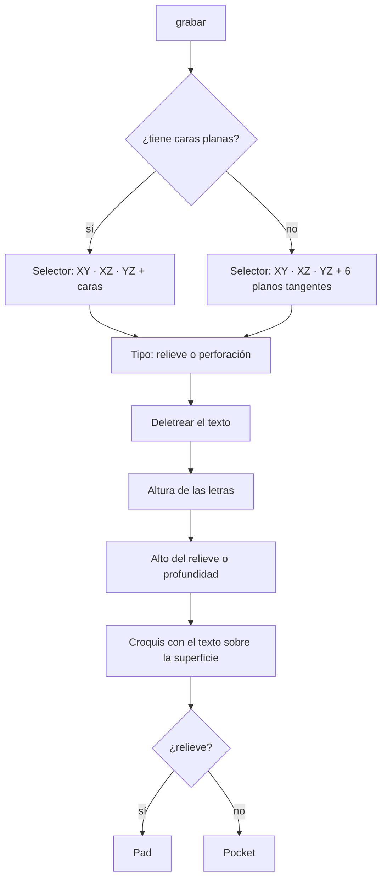
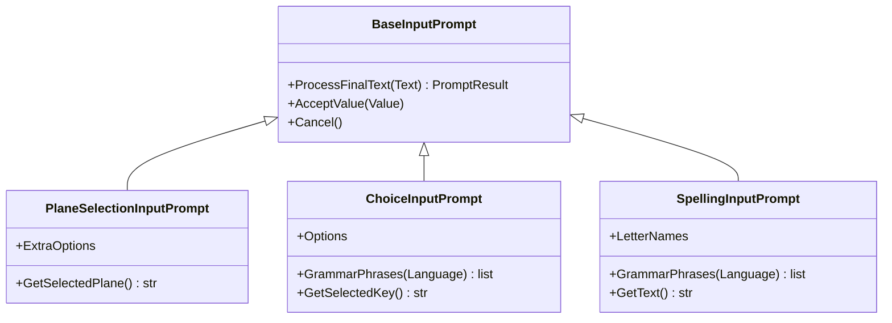

# Manual — Croquis sobre caras, agujero ciego, grabado de texto y revolución por voz

Cubre lo que se agregó a **PartDesign / Sketcher / Part** para dibujar sobre las
caras de una pieza, perforar sin atravesar, grabar texto (relieve o hundido) y
girar perfiles, todo por voz. Incluye un ejemplo completo (una maza), lo que se
probó, lo que **no** se probó y los problemas que aparecieron por el camino.

Las frases están tomadas de los diccionarios reales (`Dav/dic/`). Para las
pruebas de los comandos de PartDesign que ya existían ver
[guia-pruebas-partdesign-voz.md](guia-pruebas-partdesign-voz.md).

> **Números:** de 0 a 99 se dicen normal (`veinticinco`, `sesenta`). De 100 en
> adelante hay que **deletrear** (`dos cinco cero` = 250). Palabras como
> «doscientos cincuenta» **no** dan error: se leen como `50`. Detalle en
> [numeros-por-voz-limites-y-propuesta.md](numeros-por-voz-limites-y-propuesta.md).

---

## Resumen de lo nuevo

| Comando | Dónde está | Frases (español) |
|---|---|---|
| Croquis sobre plano **o cara** | `nuevo croquis` / `nuevo boceto` en PartDesign, Part y Sketcher | las de siempre; el selector ahora lista caras |
| **Agujero ciego** | `restar` (subtractive) | `agujero ciego`, `agujero ciego por medidas`, `hueco ciego` |
| **Grabar texto** | `editar` (modify) | `grabar`, `grabar texto`, `serigrafiar`, `serigrafia`, `texto en relieve`, `poner texto` |
| **Cerrar croquis** | Sketcher (`sketcher`, `geometry`, `tools`) | `cerrar croquis`, `cerrar boceto`, `salir del croquis`, `terminar croquis`, `finalizar croquis` |
| **Revolución** (corregida) | `agregar` (additive) | `transformar` y `revolucion por angulo` |
| Botones de vistas ocultos | panel DAV | (sin frase: es solo la GUI) |

En inglés y portugués:

| Comando | Inglés | Portugués |
|---|---|---|
| Agujero ciego | `blind hole`, `blind hole by size`, `blind drill` | `furo cego`, `furo cego por medidas`, `buraco cego` |
| Grabar texto | `engrave`, `engrave text`, `emboss`, `emboss text`, `silkscreen`, `text relief` | `gravar`, `gravar texto`, `serigrafar`, `texto em relevo`, `colocar texto` |
| Cerrar croquis | `close sketch`, `leave sketch`, `exit sketch`, `finish sketch` | `fechar croqui`, `fechar esboço`, `sair do croqui`, `terminar croqui`, `finalizar croqui` |

---

## 1. Croquis sobre planos y caras

Al decir **«nuevo croquis»** el selector muestra, en este orden:

1. Los tres planos base: `XY`, `XZ`, `YZ` (como siempre).
2. Las **caras planas** del sólido actual.

Se navega con **arriba** / **abajo** y se confirma con **okey** (o **cancelar**).

- **Nombres de las caras:** por hacia dónde miran: *Cara superior, inferior,
  frontal, trasera, derecha, izquierda*. Si hay dos iguales, la segunda lleva un
  `2` (*Cara superior 2*). Se ofrecen las 12 más grandes.
- **Qué sólido:** el que tengas seleccionado; si no, el Body activo; si no, el
  último cuerpo o sólido de Part del documento.
- **Origen y orientación:** el origen del croquis queda en el **centro de la
  cara** (así se dictan coordenadas simples como ±5) y la normal apunta hacia
  afuera. Con una cara, el croquis entra en el Body dueño de esa cara.
- **Sin sólido:** el selector queda con los tres planos, igual que antes.
- Sale igual desde los tres bancos: PartDesign tiene su versión propia; el de
  Part y el de Geometry de Sketcher comparten la del Sketcher.

Código: [`_faces.py`](../dic/Workbench/Sketcher/new_sketch/_faces.py),
[`new_sketch.py` del Sketcher](../dic/Workbench/Sketcher/new_sketch/new_sketch.py) y
[`new_sketch.py` de PartDesign](../dic/Workbench/PartDesign/base/new_sketch.py).

---

## 2. Agujero ciego

Perfora **sin atravesar**, con fondo plano, en el centro de cada círculo del
croquis. Pide **diámetro** y **profundidad**.

```
diseño de pieza → restar → agujero ciego → (diámetro) → (profundidad)
```

- Usa el croquis seleccionado; si no hay, el último croquis con dibujo que todavía
  no alimenta otra operación.
- Solo importa el **centro** del círculo dibujado: el diámetro sale de lo que
  dictás.
- Si el agujero apuntara hacia afuera de la pieza, **invierte el sentido solo**.

Se usa el mismo patrón del dado: círculos en cada cara y `agujero ciego`.

Código: `blind_hole_by_size` en
[`subtractive/_parametric.py`](../dic/Workbench/PartDesign/subtractive/_parametric.py).

> **`agujero por medidas` sigue roto.** Ver [Pendientes](#pendientes-y-hallazgos).

---

## 3. Grabar texto (relieve o perforación)

```
diseño de pieza → editar → grabar
```

Después pregunta, en este orden:

| Paso | Qué decís |
|---|---|
| 1. Superficie | El mismo selector de croquis (planos y caras). `arriba`/`abajo` + `okey` |
| 2. Tipo | **`relieve`** (o `saliente`) o **`perforación`** (o `hundido`); o `arriba`/`abajo` + `okey` |
| 3. Texto | **Letra por letra** (ver abajo) y `okey` al terminar |
| 4. Altura de las letras | Un número, en mm |
| 5. Alto del relieve / profundidad | Un número, en mm |

Cancelar en cualquier paso **no crea nada**: el croquis y la operación se arman
recién con todas las respuestas.

### Deletrear el texto

| Para | Decí |
|---|---|
| Una letra | su nombre: `hache`, `o`, `ele`, `a` (varias por vez: `d a v`) |
| Un dígito | `cero`, `uno` … `nueve` |
| Separar palabras | **`espacio`** |
| Corregir | **`borrar`** (quita el último carácter) |
| Terminar | **`okey`** (o `listo`, `vale`, `enviar`…) |
| Abortar | **`cancelar`** |

- Letras con dos palabras: **`doble uve`** = W, **`i griega`** = Y. La **Ñ** se dice
  `eñe`, aunque el modelo pequeño de Vosk solo conoce la `ñ` suelta y puede fallar.
- Los números del texto van **dígito por dígito**: `24` es `dos cuatro`. Palabras
  como `veinticuatro` se ignoran sin avisar.
- El texto sale **siempre en mayúsculas**, con un máximo de 40 caracteres.
- Mientras se deletrea, Vosk escucha solo estas palabras (gramática acotada), que
  es lo que hace confiable el reconocimiento de letras sueltas.
- Se aceptan los nombres de letra de los tres idiomas a la vez; la gramática
  de cada idioma lista solo los suyos.

Ejemplo: `d a v espacio uno dos okey` → **DAV 12**.

### Qué se genera

El texto se dibuja como contorno en un croquis sobre la superficie elegida y se
extruye: **Pad** para relieve, **Pocket** para perforación. Los huecos de las
letras (O, A, D…) se respetan. El texto queda **derecho** (arriba hacia +Z en las
caras laterales, hacia +Y en las horizontales) y sin espejar.

- **Tipografía:** primero la elegida en las preferencias de Draft; si no, Arial
  Bold (o DejaVu Sans Bold) del sistema; como último recurso, la fuente que trae
  FreeCAD en TechDraw. Con trazos finos el relieve queda frágil.
- **Sentido de la extrusión:** si la primera dirección no cambia la pieza, prueba
  la contraria.

### Superficies curvas (esfera, elipsoide…)

Un elipsoide no tiene ninguna cara plana, así que en vez de caras el selector
ofrece seis **planos tangentes**: *Cara superior (curva)*, *inferior*, *frontal*,
*trasera*, *derecha*, *izquierda*. Cada uno es el plano que toca la pieza en su
extremo, y el texto se dibuja plano sobre ese punto.

> **El texto no se curva con la superficie.** En el relieve, la tapa de las
> letras queda **plana** a la altura pedida sobre el punto central; hacia los
> bordes, donde la superficie se aleja del plano, las letras quedan **más
> altas** que ese valor. Con letras chicas sobre una superficie grande no se nota;
> con texto grande sobre algo muy curvo parece una chapa. Curvarlo de verdad
> requiere proyectar sobre la superficie con las herramientas de Part.

Las opciones `XY` / `XZ` / `YZ` aparecen igual, pero en una pieza centrada pasan
por **adentro** y no sirven para grabar.

Código: [`engrave.py`](../dic/Workbench/PartDesign/modify/engrave.py),
[`SpellingInputPrompt.py`](../scr/ComponentesDAV/IntegracionGUI/GUIFreeCad/InputPrompts/SpellingInputPrompt.py),
[`ChoiceInputPrompt.py`](../scr/ComponentesDAV/IntegracionGUI/GUIFreeCad/InputPrompts/ChoiceInputPrompt.py)
y los ayudantes `askChoice` / `askText` en
[`_prompts.py`](../dic/Workbench/_prompts.py). El ícono es `engrave.svg`, en la
misma carpeta que `engrave.py`.





---

## 4. Revolución y «cerrar croquis»

### Revolución (corregida)

`transformar` y `revolucion por angulo` **no funcionaban**: creaban la operación
sin eje de giro, FreeCAD la marcaba inválida y el sólido no aparecía. Ahora giran
el perfil sobre el **eje vertical del croquis**: dibujá el perfil a un lado de
ese eje, con **x = radio** e **y = altura** sobre el eje, y cerralo (incluida la
línea sobre el eje).

- `transformar` te deja **elegir el croquis por voz** (`avanzar` / `okey`) y
  pregunta el ángulo. **Es la que conviene usar.**
- `revolucion por angulo` toma el croquis **seleccionado o activo**: hay que
  seleccionarlo antes (clic en el árbol).
- Si el perfil cruza el eje, avisa con un error y no deja objetos rotos.

Código: `_revolveProfile` en
[`additive/_parametric.py`](../dic/Workbench/PartDesign/additive/_parametric.py).

### Cerrar croquis

**`cerrar croquis`** ejecuta el «Leave Sketch» de FreeCAD (conserva el dibujo y
cancela la herramienta de dibujo que siga activa). Antes no había forma de
salir del croquis por voz.

- Si no hay croquis abierto, avisa y no hace nada.
- Si el croquis está en un Body de PartDesign, intenta devolver la voz a
  PartDesign. **Solo lo consigue si lo decís desde `sketcher` o `geometry`.**
  Desde un contexto más profundo (`line`, `circle`…) el `Browser` deja la voz en
  `geometry`; desde ahí sigue andando **`diseño de pieza`**.
- Está registrado en `sketcher`, `geometry` y `tools` a propósito. El `Browser`
  busca coincidencias **aproximadas** en el contexto actual antes de mirar los
  superiores, y «cerrar croquis» se parece a «crear croquis» (nuevo boceto) y a
  «borrar croquis» (**borra toda la geometría**). Con la frase exacta en esos
  contextos, esa confusión ya no ocurre: se probó en los 29 contextos del Sketcher.

Código: `_leave_sketch` en
[`new_sketch.py` del Sketcher](../dic/Workbench/Sketcher/new_sketch/new_sketch.py)
y `enterPartDesignContext` en [`_display.py`](../dic/Workbench/_display.py).

---

## 5. Panel: botones de vistas

Los comandos de vista (`frontal`, `acercar`, `zoom caja`…) se propagan a casi
todos los contextos para poder decirlos desde cualquier lado, y llenaban el panel
de botones fuera de lugar. Ahora sus **botones** solo se dibujan dentro del
contexto de vistas (`stdview`). **Por voz siguen andando en todos lados**, y el
listado de texto del historial también los sigue mostrando.

| Contexto | Botones de vista |
|---|---|
| Base > workbench, partdesign, part, sketcher | ninguno |
| stdview y sus submenús | todos |

Código: `_is_view_command` y `_in_view_context` en
[`dav_dock_panel.py`](../scr/ComponentesDAV/IntegracionGUI/GUIFreeCad/integration/dav_dock_panel.py),
con tests en `tests/test_dav_dock_panel.py`.

---

## 6. Ejemplo completo: una maza

Una maza es cabeza + mango: un **sólido de revolución**. Las medidas de abajo son
**de ejemplo** (mango Ø20 × 250 mm, cabeza Ø50 × 60 mm). **La norma DIN 6475 no
está en el repositorio**, así que hay que reemplazarlas por las de su tabla.

**1. Preparar**

```
explorador → archivo → nuevo
banco de trabajo → diseño de pieza → base → nuevo croquis → plano XZ → okey
```

El cuerpo se crea solo. Quedás dentro del croquis.

**2. Dibujar el perfil** — `geometria` → `linea` → **`linea por puntos`**, seis
veces (x1, y1, x2, y2). En el croquis, x es el radio e y la altura:

| Línea | x1 | y1 | x2 | y2 |
|---|---|---|---|---|
| 1. fondo del mango | `cero` | `cero` | `diez` | `cero` |
| 2. lado del mango | `diez` | `cero` | `diez` | `dos cinco cero` |
| 3. escalón | `diez` | `dos cinco cero` | `veinticinco` | `dos cinco cero` |
| 4. lado de la cabeza | `veinticinco` | `dos cinco cero` | `veinticinco` | `tres uno cero` |
| 5. tope de la cabeza | `veinticinco` | `tres uno cero` | `cero` | `tres uno cero` |
| 6. sobre el eje | `cero` | `tres uno cero` | `cero` | `cero` |

**3. Cerrar el croquis:** **`cerrar croquis`**.

**4. Girar**

```
diseño de pieza → agregar → transformar → (avanzar hasta el croquis) okey → tres seis cero
```

`tres seis cero` = 360°.

**5. Opcional: marcar la norma en la base**

```
editar → grabar → Cara inferior → okey → relieve → d i n espacio seis cuatro siete cinco → okey → cinco → uno
```

(altura de letra 5 mm, relieve de 1 mm).

Alternativa sin revolución, con los comandos que ya existían: extruir un círculo
de radio 25 por 60 y, en un croquis sobre la **Cara superior**, un círculo de
radio 10 extruido 250. Da el mismo sólido.

---

## Qué se probó y qué no

Todo se ejecutó en **FreeCAD 1.1.3 sin interfaz** (`freecadcmd`), llamando a las
funciones reales del diccionario y, cuando hacía falta, al `Browser` real con
`FreeCADGui` simulado.

| Prueba | Resultado |
|---|---|
| Dado de 21 huecos (cubo 20 mm, redondeo 2 mm, círculos por cara + agujero ciego 4×2) | 21 huecos, un solo sólido válido, 7276,91 mm³ = esperado |
| Grabado en cubo: relieve arriba, perforación al frente, relieve lateral | Volumen correcto, sólido válido, texto derecho |
| Grabado en elipsoide (planos tangentes) | Relieve +1,0 mm exactos arriba, perforación al frente, +0,7 mm a la derecha |
| Deletreo: `hache o ele a` → HOLA, `d a v espacio uno dos` → DAV 12, `borrar`, `okey`, `cancelar` | Correcto |
| Perfil de maza girado 360° / 180° | 196 349,5 mm³ / 98 174,8 mm³, iguales al cálculo |
| Perfil que cruza el eje | Error claro, sin objetos rotos |
| «cerrar croquis» en los 29 contextos del Sketcher | En los 29 llama a `Sketcher_LeaveSketch` |
| Botones de vistas por contexto (Browser y diccionario reales) | 0 en workbench/part/partdesign/sketcher, todos en stdview |
| Tests del panel y del Browser (`unittest`) | Pasan |

**No se probó:**

- El reconocimiento **con voz real** (Vosk) ni los diálogos en pantalla.
- Nada dentro de la **ventana de FreeCAD**: la navegación de contextos, el diálogo
  de elegir el croquis, el cierre real del croquis ni que `linea por puntos` dibuje
  dentro del croquis abierto.
- Los nombres de letra se comprobaron contra el vocabulario de los modelos pequeños
  de Vosk. **Español:** salvo `eñe`, todas figuran. **Inglés:** `h` (no `aitch`).
  **Portugués:** faltan `efe`, `ene` y `dáblio`; se dicen `fê`, `n` y `duplo vê`.

---

## Pendientes y hallazgos

Problemas que aparecieron y **siguen abiertos** (no se tocaron):

1. **`agujero por medidas` (`hole_by_size`)** falla por tres causas: asigna el
   perfil antes de meter el agujero en el Body («No base set»), no encuentra el
   Body del cubo y crea uno vacío, y usa `DepthType = 1`, que en FreeCAD 1.x es
   **atravesar todo** (ignora la profundidad). Usar `agujero ciego`.
2. **Plano XY espejado en el Sketcher.** `_PLANE_ROTATIONS["XY"]` es `(1,0,0,0)`
   con un comentario que dice orden `(w,x,y,z)`, pero `App.Rotation(a,b,c,d)`
   recibe `(x,y,z,w)`: es un giro de 180° sobre X. Un círculo dictado en (5,5)
   cae en (5,−5). Afecta al «nuevo boceto» del Sketcher en el plano XY.
3. **`cancelar edición`, `detener edición` y `cancelar`** (Sketcher) ejecutan
   `Sketcher_StopEditing`, que no existe en FreeCAD. Los comandos reales son
   `Sketcher_LeaveSketch` (ya usado por «cerrar croquis») y `Sketcher_StopOperation`.
4. **`ayuda` de workbench pisada.** El bloque de vistas en
   `Workbench/TraduceToEs.py` (línea ~207) redefine `ayuda`, `información` y
   `opciones` con la ayuda de StdView.
5. **Part, «nuevo boceto» en inglés:** `Part/new_sketch/TraduceToEn.py` apunta a
   `new_sketch["nuevo sketch"]`, una clave que no existe en el diccionario.
6. **Coincidencia aproximada antes que exacta.** El `Browser` acepta una frase
   parecida del contexto actual antes de mirar una exacta en un contexto superior.
   Un comando nuevo con nombre parecido a otro puede disparar el equivocado (así
   se vio con «cerrar croquis» → «borrar croquis»). Arreglo de fondo: priorizar
   la coincidencia exacta.
7. **Texto grabado sobre superficies curvas:** queda plano (ver la sección 3).
8. **Números ≥ 100** hay que deletrearlos; las palabras compuestas se leen mal en
   silencio (`doscientos cincuenta` → 50).
9. **Documentación:** falta el archivo de `SpellingInputPrompt` y
   `ChoiceInputPrompt` en `docs/diagramas/`.

### Al subir estos cambios a git

El `.gitignore` ignora `Dav/scr/ComponentesDAV/*` (solo se re-incluye `scripts/`).
Los archivos **nuevos** de esa carpeta no aparecen en `git status` ni entran con
un `git add` común, y sin ellos `grabar` falla al importarlos. Hay que agregarlos
a mano:

```
git add -f Dav/scr/ComponentesDAV/IntegracionGUI/GUIFreeCad/InputPrompts/SpellingInputPrompt.py
git add -f Dav/scr/ComponentesDAV/IntegracionGUI/GUIFreeCad/InputPrompts/ChoiceInputPrompt.py
```

Los archivos ya versionados de esa carpeta (`PlaneSelectionInputPrompt.py`,
`PlaneGrammarSwitcher.py`, `dav_dock_panel.py`) sí se detectan normalmente.
