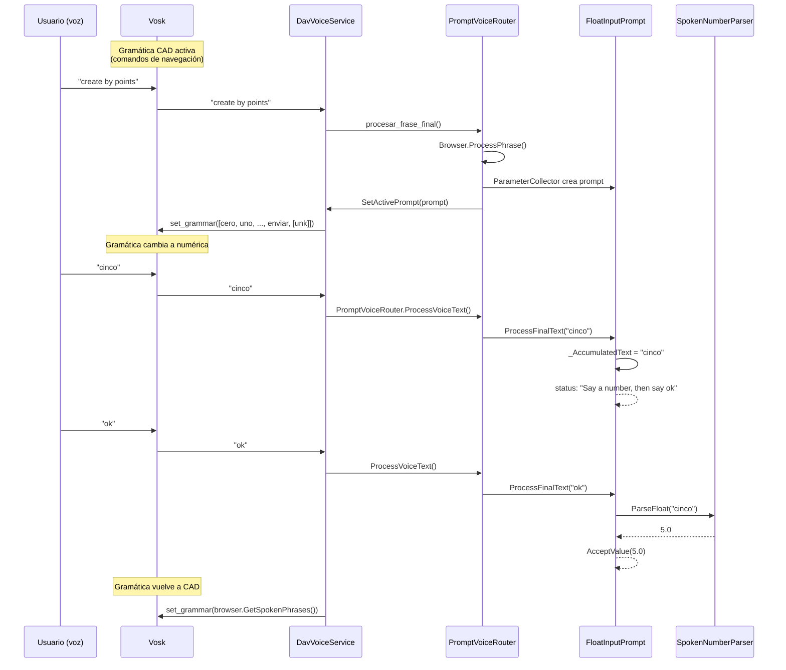
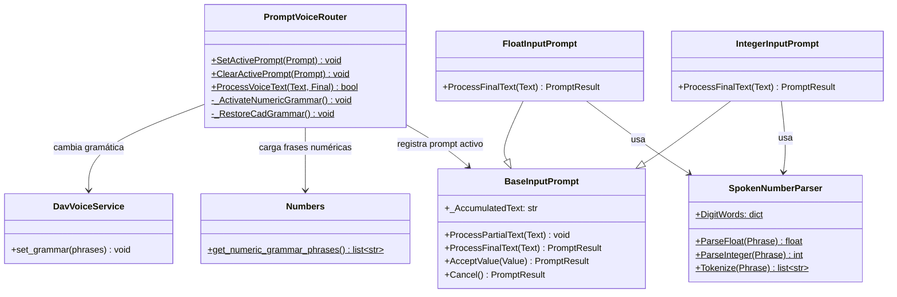

# Diccionario Numbers — Entrada numérica por voz

> Implementación del recognition de números por voz para prompts paramétricos.

---

## Resumen

El sistema permite a Vosk reconocer números hablados (0-9, decimales, cifras compuestas) cuando FreeCAD pide un valor numérico al usuario. Se implementó:

1. **Diccionario `Dav/dic/Numbers/`** — palabras numéricas en español, inglés y portugués
2. **Gramática dinámica** — la gramática de Vosk cambia automáticamente al abrir/cerrar un prompt numérico
3. **Acumulación de texto** — permite decir un número y luego "ok" en frases separadas
4. **Fix del wrapper** — `create_by_points_with_objects` ahora reenvía parámetros

---

## Diagrama de flujo



---

## Diccionario Numbers

### Estructura de archivos

```
Dav/dic/Numbers/
├── __init__.py        # Paquete vacío
├── Numbers.py         # Sentinelas + get_numeric_grammar_phrases()
├── TraduceToEs.py     # Palabras en español
├── TraduceToEn.py     # Palabras en inglés
├── TraduceToPt.py     # Palabras en portugués
└── ayuda.py           # Texto de ayuda
```

### Sentinelas (`Numbers.py`)

Funciones sin-op que representan dígitos y separadores:

| Sentinelas | Valor |
|-----------|-------|
| `Zero`, `One`, ..., `Nine` | Dígitos 0-9 |
| `DecimalPoint`, `DecimalComma` | Separadores decimales |
| `CompoundNumber` | Cualquier palabra numérica de 10 en adelante (10-19, decenas 20-90, contracciones españolas 21-29) y el conector "y"/"e". Un único sentinel para todas: la identidad del valor nunca se usa (`get_numeric_grammar_phrases` solo lee las *keys*), el valor real lo calcula `SpokenNumberParser` a partir de la palabra. |

### Traducciones — dígitos 0-9

| Español | Inglés | Portugués | Sentinel |
|---------|--------|-----------|----------|
| cero | zero | zero | Zero |
| uno, un, una | one | um, uma | One |
| dos | two | dois, duas | Two |
| tres | three | três, tres | Three |
| cuatro | four | quatro | Four |
| cinco | five | cinco | Five |
| seis | six | seis | Six |
| siete | seven | sete | Seven |
| ocho | eight | oito | Eight |
| nueve | nine | nove | Nine |
| punto, decimal | point, decimal | ponto, decimal | DecimalPoint |
| coma | comma | vírgula, virgula | DecimalComma |

### Traducciones — números compuestos 10-99

Rango soportado: **0-99**. Números de 100 en adelante no están implementados:
la palabra ("cien", "cincuenta", "hundred"...) no está en `DigitWords` ni en
la gramática, así que `SpokenNumberParser` la ignora en silencio en vez de
fallar — por ejemplo "seiscientos cincuenta" da **50**, no un error (el
tokenizer descarta "seiscientos" por no reconocerlo y solo parsea
"cincuenta"). Extender a centenas/miles requeriría el mismo mecanismo de
`TensWords`/`_MergeTensAndUnits` para un nivel más.

| Español | Inglés | Portugués |
|---------|--------|-----------|
| diez..diecinueve | ten..nineteen | dez..dezenove (dezenove también admite catorze/quatorze) |
| veinte, treinta, ..., noventa | twenty, thirty, ..., ninety | vinte, trinta, ..., noventa |
| veintiuno..veintinueve (contracción de una sola palabra) | *(se dice "twenty one", dos palabras)* | *(se dice "vinte e um", dos palabras)* |
| conector "y" (treinta **y** dos) | *(sin conector: "twenty two")* | conector "e" (vinte **e** um) |

`SpokenNumberParser._MergeTensAndUnits` combina "decena [conector] unidad" en
un solo valor antes de parsear (`InputPrompts/SpokenNumberParser.py`). El
conector es opcional: si Vosk se lo come, "treinta dos" también da 32. El
dictado dígito por dígito ("uno" "uno" → 11) se mantiene como alternativa:
una palabra de un solo dígito sin decena adelante no se combina, se
concatena como antes.

### `get_numeric_grammar_phrases(language: str = "es")`

Construye la lista de frases para la gramática de Vosk durante input numérico,
**solo para el idioma indicado** — antes cargaba los tres idiomas a la vez, lo
que hacía que Vosk reconociera dígitos en inglés o portugués aunque la app
estuviera configurada en español (o cualquier combinación cruzada). El
llamador (`NumericGrammarSwitcher`) pasa `core.settings.settings.language`,
el idioma efectivamente configurado.

1. Carga solo `TraduceTo{Es,En,Pt}.py` correspondiente a `language` via `importlib`
2. Agrega las palabras de confirmación de ese idioma, leídas de
   `NavCommands/TraduceTo*.py` (mismo origen que usa el resto de la app),
   con un respaldo fijo por idioma si el diccionario no carga
3. Agrega las palabras de cancelación de ese idioma, con el mismo respaldo
4. Agrega `[unk]` (comodín de Vosk para ruido)

Un idioma desconocido cae a español (`"es"`) por defecto.

---

## Gramática dinámica

### Problema

Cuando un `IntegerInputPrompt` o `FloatInputPrompt` está activo, la gramática de Vosk solo contiene comandos de navegación. Palabras como "cinco" no están en la gramática, así que Vosk las descarta o las sustituye por palabras similares ("opciones").

### Solución

`PromptVoiceRouter` detecta prompts numéricos por polimorfismo
(`prompt.RequiresNumericGrammar()`, ver `NumericInputPrompt`) y delega el
cambio de gramática a `NumericGrammarSwitcher`:

```
SetActivePrompt(prompt)
  → _RequiresNumericGrammar(prompt) = True
  → NumericGrammarSwitcher.ActivateNumericGrammar()
  → DavVoiceService.set_grammar(get_numeric_grammar_phrases(settings.language))

ClearActivePrompt(prompt)
  → was_numeric = True
  → NumericGrammarSwitcher.RestoreCadGrammar()
  → BrowserVoiceAdapter.RestoreGrammar() (adaptador activo)
  → DavVoiceService.set_grammar(browser.GetSpokenPhrases())
```

### Import path

`Dav/dic/` no está en `sys.path` por defecto. La solución agrega la ruta dinámicamente:

```python
dic_root = str(Path(__file__).resolve().parent.parent)
if dic_root not in sys.path:
    sys.path.insert(0, dic_root)
```

---

## Acumulación de texto (fix del Bug 2)

### Problema

Cuando el usuario decía "cinco" (frase final) y luego "ok" (frase final), el prompt reemplazaba el texto. El parser veía solo "ok" (sin número) y no confirmaba.

### Solución

`FloatInputPrompt` e `IntegerInputPrompt` acumulan texto en `_AccumulatedText`:

- **Número sin confirmación** → se acumula: `"cinco"` → `"cinco"`
- **Confirmación con número acumulado** → se parsea el acumulado y se limpia
- **Confirmación sin número** → "No value to confirm. Say a number first."
- **Cancelación** → se limpia el acumulado y se cierra

```python
def ProcessFinalText(self, Text):
    tokens = SpokenNumberParser.Tokenize(Text)

    if self._HasCancellation(tokens):
        self._AccumulatedText = ""
        return self.Cancel()

    if self._HasConfirmation(tokens):
        if not self._AccumulatedText:
            self.SetStatus("No value to confirm.")
            return self.GetResult()
        parse_text = self._AccumulatedText
        self._AccumulatedText = ""
        value = SpokenNumberParser.ParseFloat(parse_text)
        return self.AcceptValue(value)

    self._AccumulatedText = (
        (self._AccumulatedText + " " + Text).strip()
        if self._AccumulatedText else Text
    )
    return self.GetResult()
```

---

## Fix del wrapper (line.py)

### Problema

`create_by_points_with_objects()` no declaraba parámetros, entonces `ParameterCollector` no pedía nada y llamaba a `create_by_points()` sin argumentos.

### Solución

El wrapper ahora firma los mismos parámetros que la función original:

```python
# Antes (bug)
def create_by_points_with_objects():
    create_by_points()  # ← falla: missing 4 args

# Después (fix)
def create_by_points_with_objects(x1: float, y1: float, x2: float, y2: float, label: str = "Segment"):
    create_by_points(x1=x1, y1=y1, x2=x2, y2=y2, label=label)
```

---

## Diagrama de clases



---

## Archivos modificados

| Archivo | Cambio |
|---------|--------|
| `Dav/dic/Numbers/*` | **Nuevo** — diccionario completo (6 archivos) |
| `InputPrompts/PromptVoiceRouter.py` | Grammar switching numérico |
| `InputPrompts/BaseInputPrompt.py` | `_AccumulatedText` |
| `InputPrompts/FloatInputPrompt.py` | Acumulación de texto |
| `InputPrompts/IntegerInputPrompt.py` | Acumulación de texto |
| `integration/browser_voice_adapter.py` | `_ActiveAdapter` global |
| `Workbench/Sketcher/Geometry/line/line.py` | Wrapper con parámetros |
