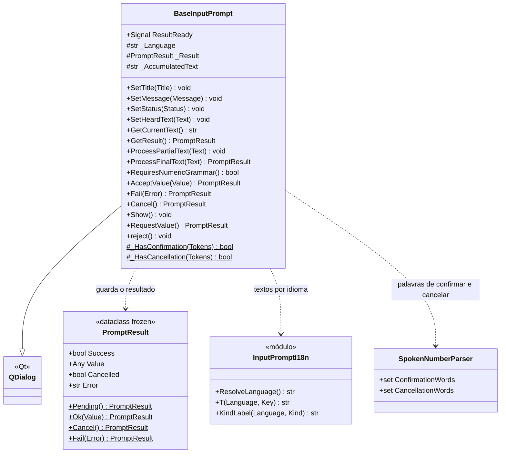
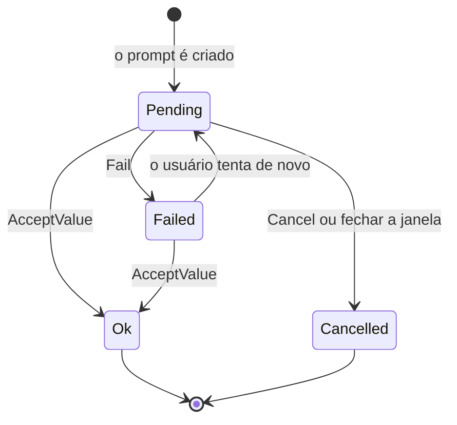

# BaseInputPrompt

> **Arquivo:** `Dav/scr/ComponentesDAV/IntegracionGUI/GUIFreeCad/InputPrompts/BaseInputPrompt.py`

Classe base de todos os diálogos de voz. É um `QDialog` com uma mensagem, uma linha
de status, o texto que foi ouvido e os botões *Aceitar* / *Cancelar*. Não sabe
o que é pedido ao usuário: cada subclasse decide o que fazer com o que ouve
(`ProcessFinalText`) e quando dar o valor por bom (`AcceptValue`).

## Responsabilidades

| Método | O que faz |
| --- | --- |
| `ProcessFinalText(Text)` | Ponto de extensão: a base apenas mostra o texto. As subclasses o substituem |
| `ProcessPartialText(Text)` | Mostra o que vai sendo reconhecido enquanto o usuário fala |
| `AcceptValue(Value)` | Guarda `PromptResult.Ok`, emite `ResultReady` e fecha. Rejeita um texto vazio |
| `Fail(Error)` | Guarda o erro e **deixa o diálogo aberto** para tentar de novo |
| `Cancel()` | Guarda o resultado cancelado e fecha |
| `RequestValue()` | Mostra-o de forma **modal** (`exec`) e devolve o resultado ao fechar |
| `Show()` | Mostra-o sem bloquear (usado por [`GuidedExampleInputPrompt`](GuidedExampleInputPrompt.md)) |
| `RequiresNumericGrammar()` | `False` por padrão; os prompts numéricos devolvem `True` para que o router troque a gramática |
| `reject()` | Fechar a janela conta como cancelar |

## Estados do resultado

## Notas de design

- **Tema claro ou escuro.** `_IsDarkTheme()` lê a preferência de tema do FreeCAD (a
  paleta do Qt dele continua clara com o tema escuro) e só olha a paleta se ela
  não disser nada. Texto preto sobre claro, vermelho sobre escuro.
- **O idioma é lido ao criar o prompt** com `ResolveLanguage()`, a mesma fonte que
  `Browser` e `Tagger` usam.
- **PySide6 primeiro, PySide2 como alternativa**, como o resto da GUI.
- **Subclasses:** [`FileSelectionInputPrompt`](FileSelectionInputPrompt.md),
  [`ObjectSelectionInputPrompt`](ObjectSelectionInputPrompt.md),
  [`NumericInputPrompt`](NumericInputPrompt.md), [`YesNoInputPrompt`](YesNoInputPrompt.md),
  [`ChoiceInputPrompt`](ChoiceInputPrompt.md), [`PlaneSelectionInputPrompt`](PlaneSelectionInputPrompt.md),
  [`SpellingInputPrompt`](SpellingInputPrompt.md), `StringInputPrompt` e
  [`GuidedExampleInputPrompt`](GuidedExampleInputPrompt.md).
