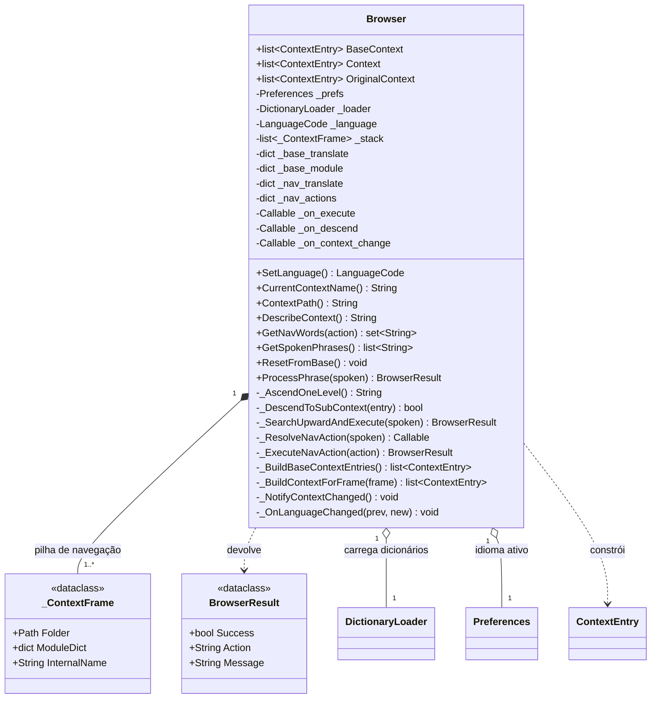

# Browser

> **Arquivo:** `Dav/scr/ComponentesDAV/IntegracionGUI/GUIFreeCad/navigation/browser.py`

Motor de navegação da árvore de comandos por voz. Percorre `Dav/dic/`
mantendo uma pilha de contextos: cada frase reconhecida é resolvida contra o
nível atual e, se for um submenu, desce-se a ele.

É o `DAVAgent` do design conceitual original, com outro nome e outra
implementação: `ProcessPhrase` + `DictionaryLoader` em vez de
`latentListening` + `searchInstruction`.

## Responsabilidades

| Método | O que faz |
| --- | --- |
| `ProcessPhrase(spoken)` | Ponto de entrada. Resolve uma frase contra o contexto ativo: comando de navegação, salto à raiz, descida a submenu, execução ou busca ascendente |
| `GetSpokenPhrases()` | Gramática do Vosk do nível ativo. Ver [`encurtador-gramatica-vosk.md`](../encurtador-gramatica-vosk.md) |
| `GetNavWords(action)` | Palavras ligadas a um sentinel de `NavCommands` (`up`, `send`, `cancel`, `show_context`) no idioma ativo |
| `DescribeContext()` | Texto legível de onde o usuário está e o que pode dizer |
| `ResetFromBase()` | Recarrega tudo a partir de `base.py`. É disparado ao trocar de idioma |

## Notas de design

- **Não conhece o FreeCAD.** Executa callables que vêm dos dicionários; quem
  os fornece é problema do `DictionaryLoader`.
- **Um idioma por vez.** `_OnLanguageChanged` está registrado em `Preferences`,
  então trocar o idioma reconstrói os contextos.
- `_on_context_change` notifica quem precisar recalcular a gramática de voz.
  Hoje quem o usa é o `BrowserVoiceAdapter`.
