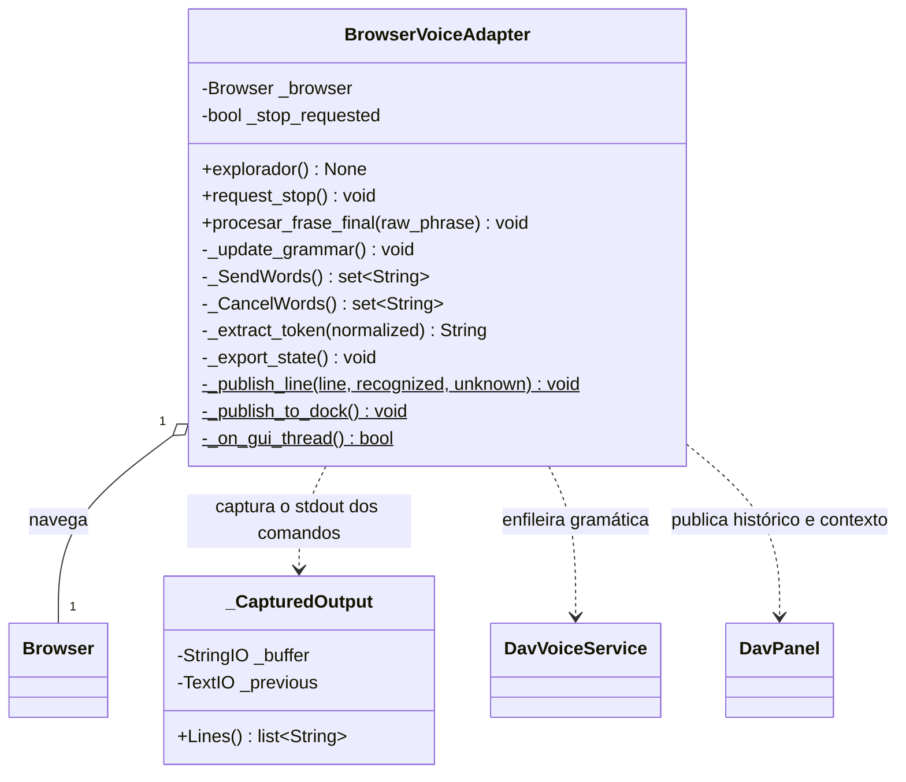
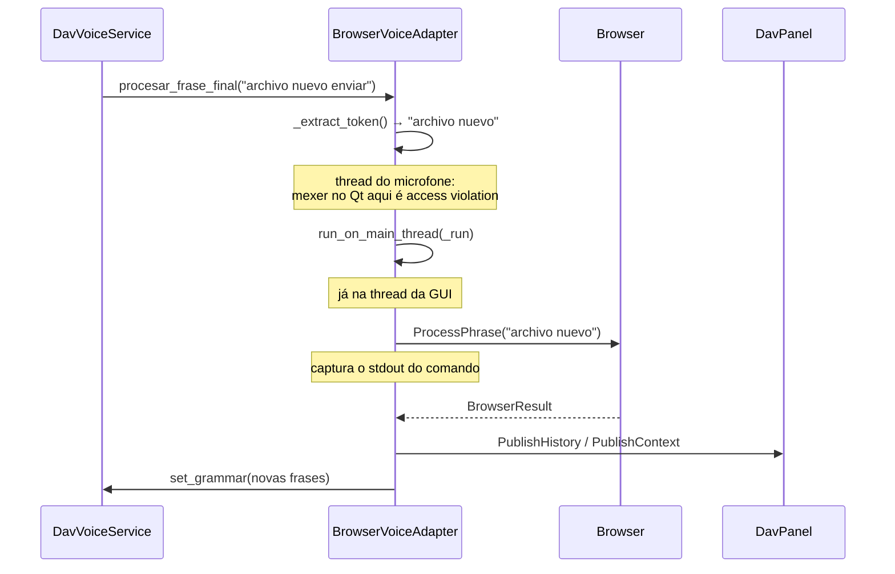

# BrowserVoiceAdapter

> **Arquivo:** `Dav/scr/ComponentesDAV/IntegracionGUI/GUIFreeCad/integration/browser_voice_adapter.py`

Une o motor de voz com o `Browser`. Recebe a frase crua que o Vosk reconheceu,
a limpa, a manda navegar e publica o resultado no painel DAV.

## O fluxo de uma frase

## Por que existe `_CapturedOutput`

Os comandos dos dicionários (os `ayuda.py` sobretudo) escrevem sua saída
com `print`: são **988 chamadas distribuídas em 123 arquivos**. No FreeCAD isso vai
para o Report View, não para o painel DAV.

Em vez de mexer em cada comando, captura-se `sys.stdout` enquanto o comando roda e
o conteúdo é despejado no painel. Restaura `sys.stdout` mesmo se o comando lançar uma exceção.

## Notas de design

- **`procesar_frase_final` roda na thread do microfone.** Mexer em um widget Qt
  a partir dali é access violation: derruba o processo sem passar por nenhum
  `except`. Por isso tudo o que chega à GUI vai dentro de
  `run_on_main_thread`, e `_on_gui_thread()` verifica antes de publicar.
- **`_SendWords()` / `_CancelWords()` saem do dicionário**
  (`Browser.GetNavWords`), não de constantes. As constantes `_SEND_WORDS` e
  `_CANCEL_WORDS` ficam apenas como alternativa caso `NavCommands` não carregue.
- `_extract_token` corta o `enviar` final de «archivo nuevo enviar» e devolve
  `False` se a frase terminar em uma palavra de cancelamento.
