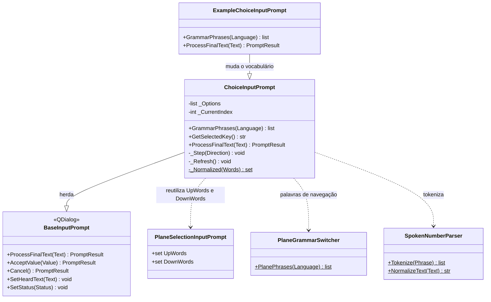

# ChoiceInputPrompt

> **Arquivo:** `Dav/scr/ComponentesDAV/IntegracionGUI/GUIFreeCad/InputPrompts/ChoiceInputPrompt.py`

Diálogo de voz para escolher **uma opção entre poucas** com nome. Funciona como
o seletor de plano ([`PlaneSelectionInputPrompt`](PlaneSelectionInputPrompt.md)):
`arriba`/`abajo` movem a seleção e `okey` confirma. Além disso, dizer o nome
de uma opção a escolhe **imediatamente**. É usado por `grabar` para escolher entre
*relieve* (relevo) e *perforación* (perfuração).



## Responsabilidades

| Método | O que faz |
| --- | --- |
| `ProcessFinalText(Text)` | Cancelar aborta; nomear uma opção a aceita na hora; `abajo`/`arriba` movem; uma palavra de confirmação aceita a opção destacada |
| `GrammarPhrases(Language)` | Gramática do Vosk: navegação, confirmar, cancelar e as palavras de cada opção |
| `GetSelectedKey()` | Chave da opção destacada |

## Como é montado

`Options` é uma lista de três valores por opção: `(chave, texto visível, palavras
que a escolhem)`. O prompt devolve a **chave**.

```python
askChoice("Grabar texto", "¿Relieve o perforación?", [
    ("emboss",  "Relieve (sobresale)",   ("relieve", "saliente", "relief")),
    ("engrave", "Perforación (hundido)", ("perforación", "hundido", "grabado")),
])
```

É criado a partir de `askChoice` em
[`_prompts.py`](../../../dic/Workbench/_prompts.py), que além disso restringe a gramática
do Vosk enquanto o diálogo está aberto e a restaura ao terminar.

## Notas de design

- **Nomear vence navegar.** A busca de palavras de opção vem antes da de
  `arriba`/`abajo`, então uma opção cujo nome coincida com uma palavra
  de navegação seria escolhida diretamente.
- **São comparadas sem acentos.** As palavras de cada opção são normalizadas igual ao
  que se ouve (`perforación` = `perforacion`), mas vão para a gramática do Vosk com
  a forma do vocabulário do modelo, acentos incluídos.
- **Sem estado global.** Tudo o que sabe vem em `Options`, por isso serve para
  qualquer escolha curta e não só para a gravação.
- **Tem uma subclasse.** [`ExampleChoiceInputPrompt`](ExampleChoiceInputPrompt.md)
  reutiliza `_Step` e `GetSelectedKey`, mas navega com *retroceder* / *avanzar* e
  escolhe com *enviar*.
