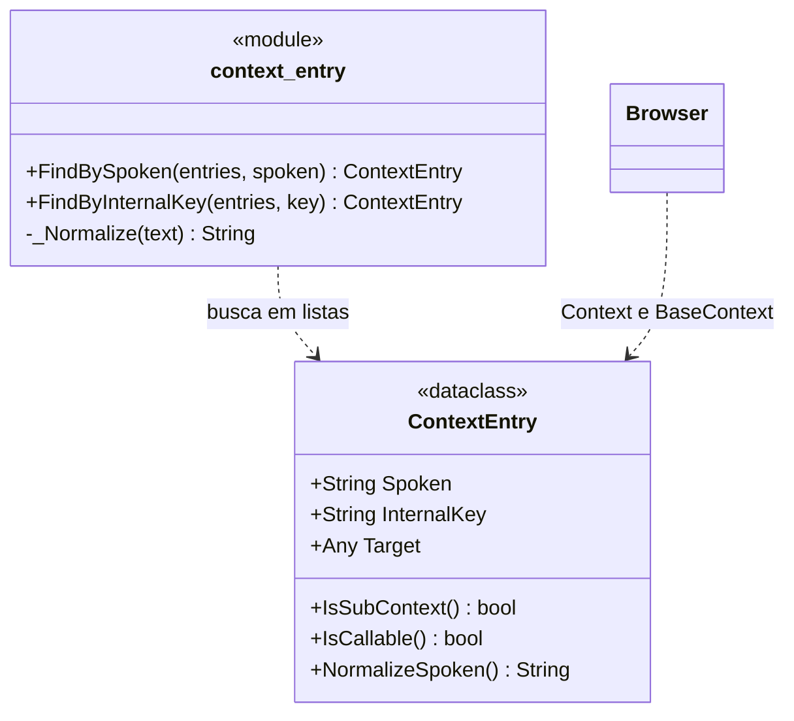

# ContextEntry

> **Arquivo:** `Dav/scr/ComponentesDAV/IntegracionGUI/GUIFreeCad/navigation/context_entry.py`

Uma entrada do contexto de navegação: liga uma frase falada a uma chave
interna e ao que precisa ser executado. É a unidade com a qual o
`Browser` trabalha.

## Os dois tipos de entrada

O `Target` decide o que a entrada é:

| `Target` | `IsSubContext()` | `IsCallable()` | O que acontece ao dizê-lo |
| --- | --- | --- | --- |
| `dict` | `True` | `False` | Desce-se um nível |
| callable | `False` | `True` | Executa-se o comando do FreeCAD |

Essa distinção é o que torna a árvore navegável, e é também a razão da
regra dos subcontextos aninhados: se um submenu é mesclado com `.update()` em
vez de ficar sob sua própria chave, suas folhas ficam soltas no nível pai e a
pasta desaparece da árvore. Ver `pendientes-dav.md` §4.

## Notas de design

- **`Spoken` e `InternalKey` são diferentes de propósito.** `Spoken` é o que o
  usuário diz («explorador»); `InternalKey` é a chave do dicionário base
  (`explorer`). Ambos entram na gramática do Vosk.
- **A busca é por frase normalizada**, não por igualdade exata: `_Normalize`
  tira acentos, passa para minúsculas e colapsa espaços, de modo que «dónde estoy» e «donde
  estoy» resolvem igual.
