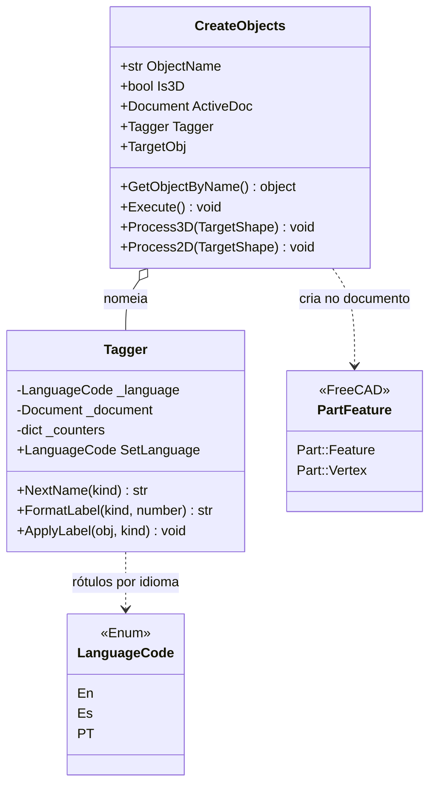

# CreateObjects

> **Arquivo:** `Dav/scr/selection/createobjects.py` (usa `tagger.py`)

Extrai **os subelementos de uma figura já existente** e os converte em objetos
próprios do documento, com nomes sequenciais no idioma ativo. De um sólido
tira faces e arestas; de uma figura plana, linhas e pontos. Os nomes são dados por
[`Tagger`](#tagger): `Superficie1`, `Linea2`, `Punto3`…

## O que `Execute()` cria

| Modo | Entrada | Saída |
| --- | --- | --- |
| `Is3D=True` (`Process3D`) | Um sólido | Um `Part::Feature` por **face** (`surface`) e outro por **aresta** (`edge`) |
| `Is3D=False` (`Process2D`) | Uma figura plana | Um `Part::Feature` por aresta (`line`) e um `Part::Vertex` por **vértice único** (`point`) |

No final recalcula o documento. Os vértices repetidos são descartados comparando a
posição arredondada a 4 casas decimais.

## Tagger

| Método | O que faz |
| --- | --- |
| `NextName(kind)` | Nome único para `Name` (`Linea1`, `Linea2`…). Pula os que já existem no documento |
| `FormatLabel(kind, number)` | Texto para a árvore: «Superficie 3» |
| `ApplyLabel(obj, kind)` | Atribui `obj.Label` com o contador atual |

Tipos válidos: `point`, `line`, `surface`, `edge`. Outro tipo lança `ValueError`.

## Notas de design

- **`Name` sem espaços, `Label` com espaço.** `Name` é o identificador interno do
  FreeCAD (`Linea1`); `Label` é o que o usuário vê (`Linea 1`).
- **O `Tagger` pode ser injetado** (`TaggerInstance`) para compartilhar contadores entre
  várias extrações ou para testes.
- **Erros pelo console, não exceções:** sem documento, objeto inexistente ou objeto sem
  `Shape`, imprime o motivo e `Execute()` não faz nada.
- Estado da integração de `selection/` ao programa e o que falta decidir:
  `pendientes-dav.md` §12.
