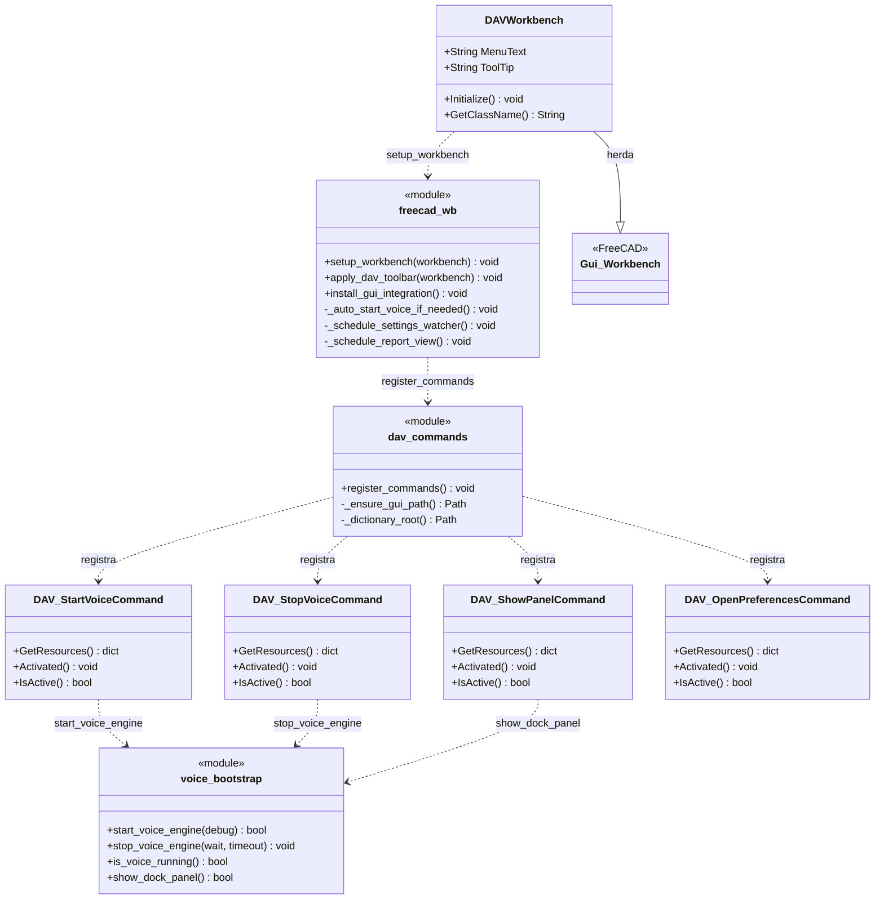
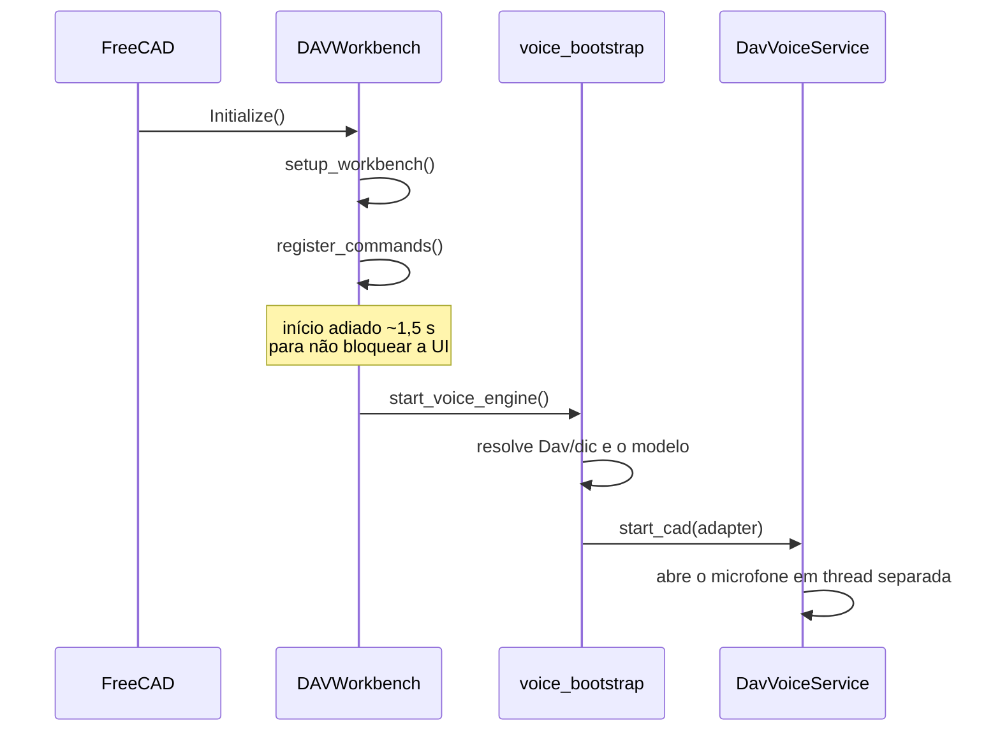

# DAVWorkbench e comandos

> **Arquivos:**
> `Dav/scr/ComponentesDAV/Dav/InitGui.py`
> `Dav/scr/ComponentesDAV/Dav/scr/gui/dav_commands.py`
> `Dav/scr/ComponentesDAV/Dav/scr/gui/freecad_wb.py`

O workbench que o FreeCAD carrega ao iniciar. Registra os comandos da barra
DAV e sobe o motor de voz.

## A inicialização

## Notas de design

- **Há vários pontos que chamam `start_voice_engine`** (o comando da barra,
  o workbench ao ser ativado, `freecad_voice_setup`): o log mostra umas quatro
  chamadas por inicialização. Elas não se atropelam —estão separadas no tempo e são barradas por
  `is_cad_engine_loaded()`— então só a primeira abre o microfone. Por isso a
  inicialização é registrada em nível `debug`.
- As mensagens `[DAV]` vão para a aba **Relatório** do FreeCAD, não para o console
  Python. O log de verdade está em `config/dav.log`.
