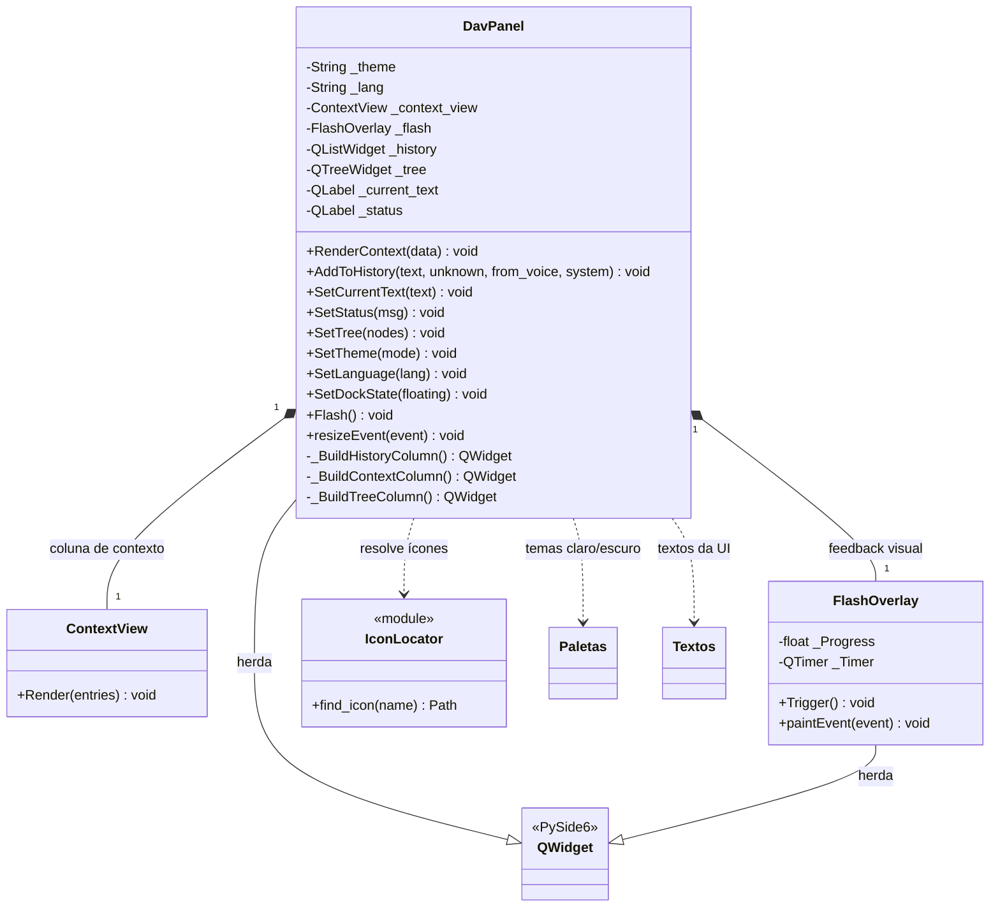
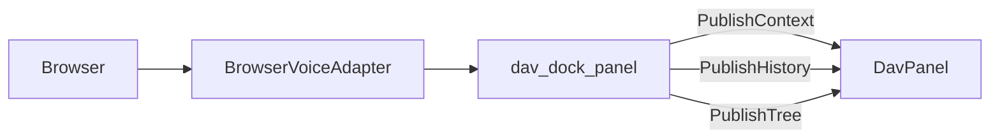

# DavPanel

> **Arquivo:** `Dav/scr/ComponentesDAV/InterfazDAV/DavPanel.py`

A GUI do DAV: um widget que vive dentro do FreeCAD como `QDockWidget`. Mostra
o contexto de navegação, o histórico de comandos e a árvore de objetos do
documento.

Substituiu `MainWindow.py` (1011 linhas, processo externo) na migração
documentada em [`plano-unificacao-guis.md`](../plano-unificacao-guis.md).

## Como é alimentado

O painel **não importa o FreeCAD nem o `Browser`**: recebe dados e emite sinais.
Quem o conecta é `integration/dav_dock_panel.py`.

Essa separação é proposital: permite testar o widget sem subir o FreeCAD.

## Notas de design

- **Tudo o que entra no painel tem que vir da thread da GUI.** Mexer em um
  widget Qt a partir da thread do microfone é access violation. `BrowserVoiceAdapter`
  verifica com `_on_gui_thread()` antes de publicar.
- Ocultar/mostrar é dado pelo `QDockWidget` que o contém, não pelo painel: isso
  cobre o requisito de «minimizar» do MVP.
- A árvore de objetos é montada a partir de `App.ActiveDocument` com um
  `DocumentObserver`, sem macro nem polling.
