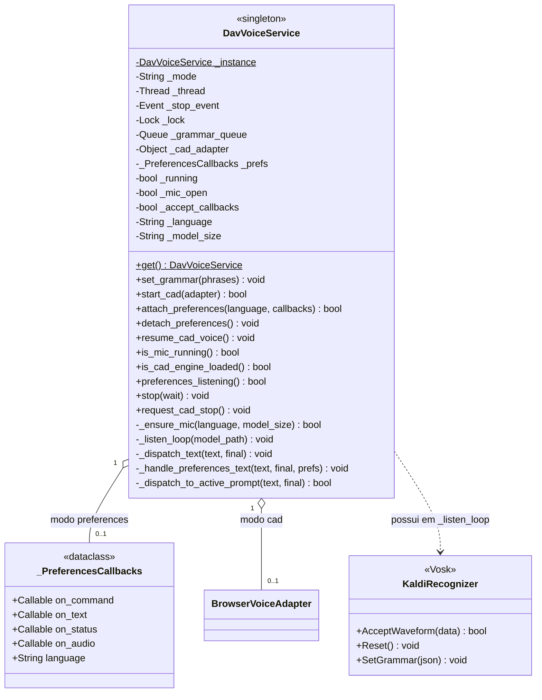
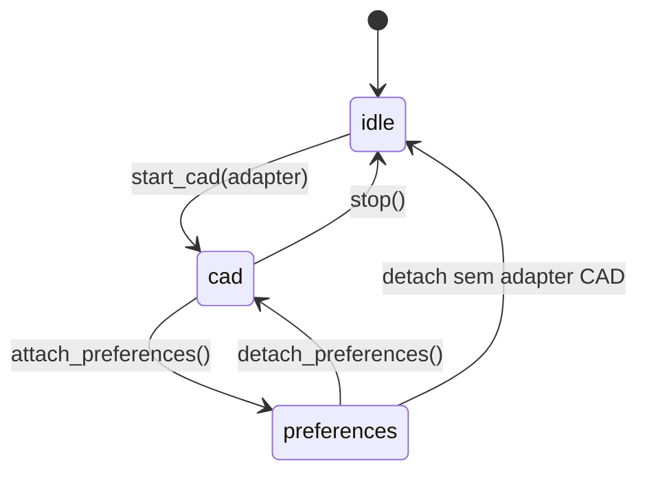

# DavVoiceService

> **Arquivo:** `Dav/scr/ComponentesDAV/IntegracionGUI/GUIFreeCad/speech/dav_voice_service.py`

Singleton que possui o microfone e o recognizer do Vosk. Uma única thread de áudio
para todo o DAV: compartilham-na a navegação CAD e o diálogo de Preferências, que
antes disputavam o dispositivo.

## Os dois modos

| Modo | Quem consome | Gramática |
| --- | --- | --- |
| `cad` | `BrowserVoiceAdapter` | Contexto de navegação ativo |
| `preferences` | Diálogo de Preferências | 81 frases de configuração |
| `idle` | Ninguém | Microfone fechado |

## A thread de áudio

`_listen_loop` roda em uma thread separada (`DAV-VoiceService`) para não bloquear a
UI do FreeCAD. A cada volta:

1. Drena `_grammar_queue` e fica com a última gramática
2. Se mudou: `Reset()` + `SetGrammar()` — **sempre nesta thread**, nunca a partir
   da GUI
3. `AcceptWaveform()` e despacha o texto conforme o modo

Detalhe de por que o `Reset()` é obrigatório (o Vosk aborta o processo sem ele):
[`encurtador-gramatica-vosk.md`](../encurtador-gramatica-vosk.md).

## Notas de design

- **`_ensure_mic` reinicia a thread se o idioma ou o tamanho do modelo mudou**,
  porque o modelo é carregado uma única vez ao criar o recognizer.
- As falhas da thread ficam em `config/dav.log`: se o log cortar sem a linha
  `hilo de voz terminado`, o processo morreu dentro do loop.
- `_dispatch_to_active_prompt` dá prioridade aos `InputPrompts` abertos sobre
  a navegação normal.
