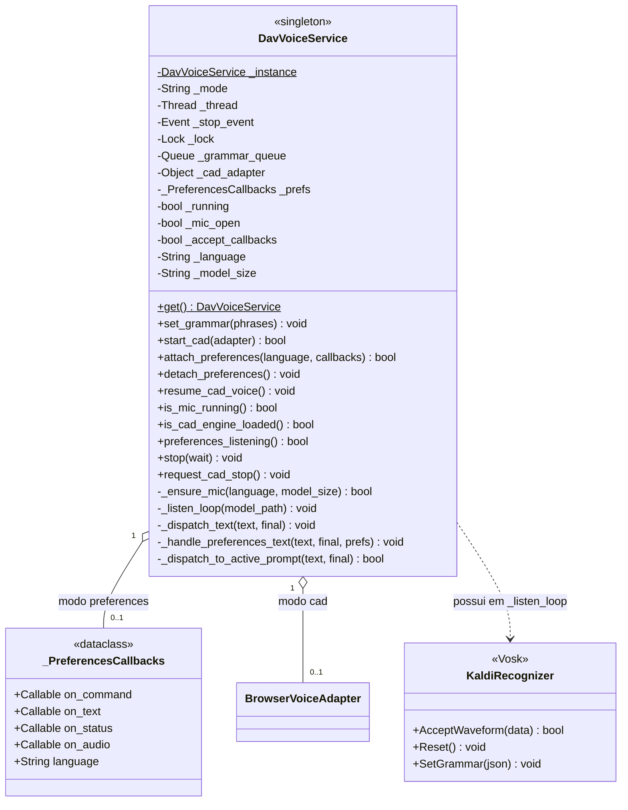
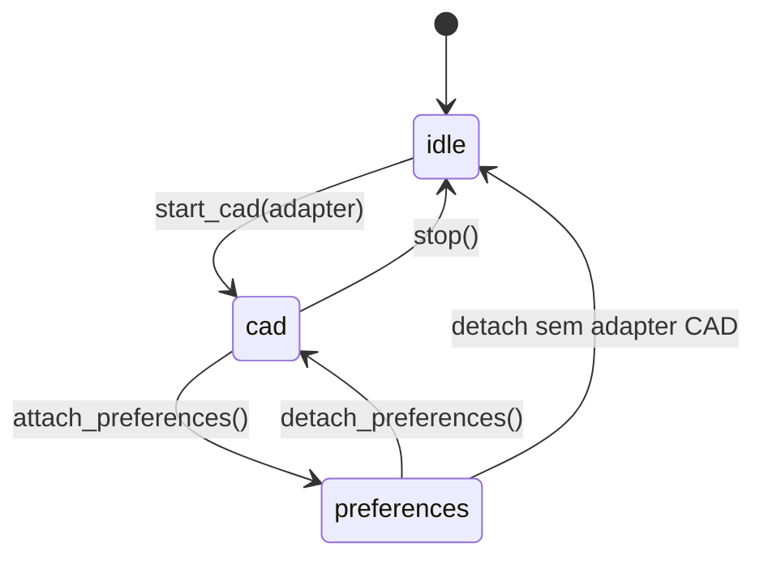

# DavVoiceService

> **Arquivo:** `Dav/scr/ComponentesDAV/IntegracionGUI/GUIFreeCad/speech/dav_voice_service.py`

Singleton que possui o microfone e o recognizer do Vosk. Uma única thread de áudio
para todo o DAV: compartilham-na a navegação CAD e o diálogo de Preferências, que
antes disputavam o dispositivo.

## Os dois modos

| Modo | Quem consome | Gramática |
| --- | --- | --- |
| `cad` | `BrowserVoiceAdapter` | Contexto de navegação ativo |
| `preferences` | Diálogo de Preferências | 81 frases de configuração |
| `idle` | Ninguém | Microfone fechado |

## A thread de áudio

`_listen_loop` roda em uma thread separada (`DAV-VoiceService`) para não bloquear a
UI do FreeCAD. A cada volta:

1. Drena `_grammar_queue` e fica com a última gramática
2. Se mudou: `Reset()` + `SetGrammar()` — **sempre nesta thread**, nunca a partir
   da GUI
3. `AcceptWaveform()` e despacha o texto conforme o modo

Detalhe de por que o `Reset()` é obrigatório (o Vosk aborta o processo sem ele):
[`encurtador-gramatica-vosk.md`](../encurtador-gramatica-vosk.md).

## No Linux: o microfone roda em um processo separado

Dentro do FreeCAD (AppImage), carregar o PortAudio e a `libvosk.so` pode derrubar
o processo inteiro com uma queda nativa (segfault, ou `Illegal instruction` se a
CPU não oferece AVX) que o Python não consegue capturar. Por isso, no Linux,
`_listen_entry` escolhe `_listen_loop_worker`, que lança `speech/voice_worker.py`
como processo filho com o Python do `.venv` do GUIFreeCad
(`DAV_GUI_FREECAD_ROOT/.venv/bin/python`) e sem as variáveis de ambiente do
AppImage (`LD_LIBRARY_PATH`, `PYTHONHOME`, …). Se algo cair, morre o filho e o
FreeCAD continua aberto.

| Sentido | Mensagens (uma linha cada) |
| :--- | :--- |
| filho → DAV (stdout, prefixo `@DAV ` + JSON) | `{"t":"ready"}` · `{"t":"text","text":…,"final":bool}` · `{"t":"audio"}` · `{"t":"error","kind":"import\|model\|mic","msg":…}` |
| DAV → filho (stdin) | `{"cmd":"grammar","json":…}` · `{"cmd":"stop"}` |

- As linhas sem o prefixo (logs do Kaldi) vão para o `dav.log`.
- Se o stdin fechar (o FreeCAD morreu), o filho termina sozinho.
- A gramática é aplicada no filho com o mesmo `Reset()` + `SetGrammar()`.
- Se o filho terminar com código diferente de 0 sem avisar, o DAV emite
  `error:mic:El proceso de voz se cerró (<motivo>)`. Para sinais mostra o nome;
  `SIGILL` indica uma CPU ou máquina virtual sem AVX. No `dav.log` ficam
  `el proceso de voz termino inesperadamente` e a linha final
  `hilo de voz terminado (proceso aparte, salida=…)`.
- No Windows (ou outro sistema, ou se não existir o `.venv`) usa-se a thread
  dentro do FreeCAD descrita acima. `DAV_VOICE_INPROCESS=1` força esse modo
  também no Linux.
- Se o FreeCAD cair por outra causa nativa, o `dav_fault.log` (ao lado do
  `dav.log`) registra onde estava cada thread do Python.

## Notas de design

- **`_ensure_mic` reinicia a thread se o idioma ou o tamanho do modelo mudou**,
  porque o modelo é carregado uma única vez ao criar o recognizer.
- As falhas da thread ficam em `config/dav.log`: se o log cortar sem a linha
  `hilo de voz terminado`, o processo morreu dentro do loop.
- `_dispatch_to_active_prompt` dá prioridade aos `InputPrompts` abertos sobre
  a navegação normal.
