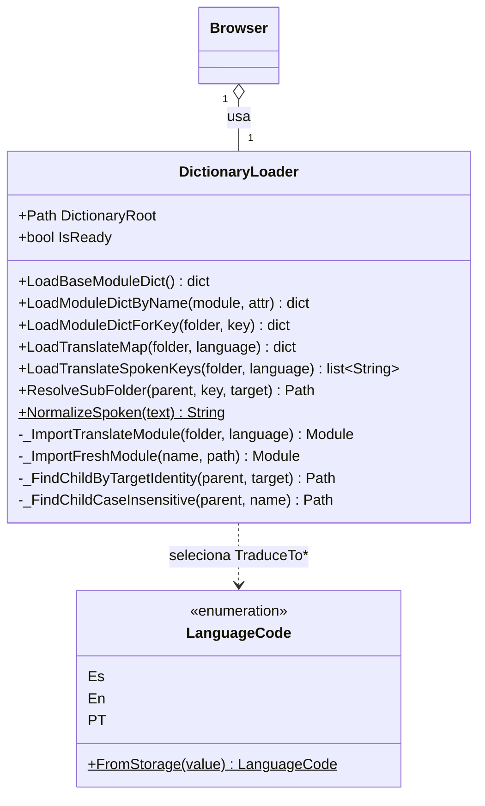

# DictionaryLoader

> **Arquivo:** `Dav/scr/ComponentesDAV/IntegracionGUI/GUIFreeCad/navigation/dictionary_loader.py`

Carrega os módulos de `Dav/dic/` do disco: o dicionário base, as
traduções por idioma e os submenus. Isola o `Browser` do sistema de
arquivos e dos detalhes de importação.



## Quais arquivos procura

```
Dav/dic/
├── base.py                 → LoadBaseModuleDict()
├── TraduceToEs.py          → LoadTranslateMap(root, Es)
├── NavCommands/
│   ├── NavActions.py       → LoadModuleDictByName("NavCommands.NavActions", "NavActions")
│   └── TraduceToEs.py      → LoadTranslateMap(NavCommands, Es)
└── explorer/
    ├── explorer.py         → dicionário base da pasta
    └── TraduceToEs.py      → LoadTranslateMap(explorer, Es)
```

Uma pasta = um nível de contexto. Cada uma tem seu dicionário base (chaves
internas → callables do FreeCAD) e suas traduções por idioma (frases faladas →
os mesmos callables).

## Notas de design

- **Tolera que o dicionário não exista.** Se a pasta faltar ou um módulo falhar
  ao importar, devolve vazio e deixa uma mensagem: o motor inicia com contextos
  vazios em vez de quebrar a inicialização do FreeCAD.
- **`ResolveSubFolder` emparelha pela identidade do `Target`**, não pelo nome da
  pasta: o nome pode diferir da chave interna.
- `_ImportFreshModule` força o recarregamento para que uma mudança em um dicionário
  seja vista sem reiniciar o FreeCAD.
- A normalização de acentos vive aqui (`NormalizeSpoken`) e deve ser a mesma
  que `ContextEntry` usa.
