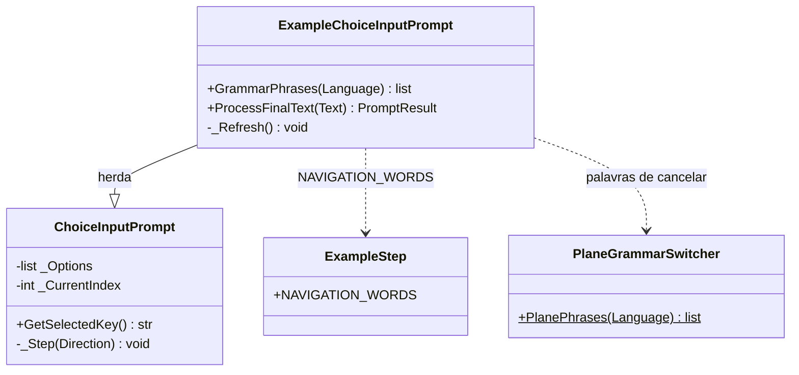

# ExampleChoiceInputPrompt

> **Arquivo:** `Dav/scr/ComponentesDAV/IntegracionGUI/GUIFreeCad/InputPrompts/ExampleChoiceInputPrompt.py`

Seletor de exemplos. Herda de [`ChoiceInputPrompt`](ChoiceInputPrompt.md) mas
muda o vocabulário: **`retroceder`** e **`avanzar`** movem a seleção (voltando ao
início ao chegar ao fim) e **`enviar`** escolhe. `cancelar` aborta. Devolve a chave do
exemplo escolhido.

## O que muda em relação à classe base

| Método | Diferença |
| --- | --- |
| `GrammarPhrases(Language)` | Apenas retroceder, avançar, enviar e cancelar: não inclui nomes de opção |
| `ProcessFinalText(Text)` | Não se escolhe nomeando a opção: só se navega e se envia |
| `_Refresh()` | O status mostra `(n/total)` e as palavras de navegação do idioma ativo |

## Notas de design

- **Reutiliza `_Step` e `GetSelectedKey`** da classe base; só substitui o vocabulário.
- **Aceita as palavras dos três idiomas**, como faz `FileSelectionInputPrompt`,
  mas a gramática do Vosk é restrita ao idioma ativo.
- É aberto por `startExample()` em [`Examples`](Examples.md).
