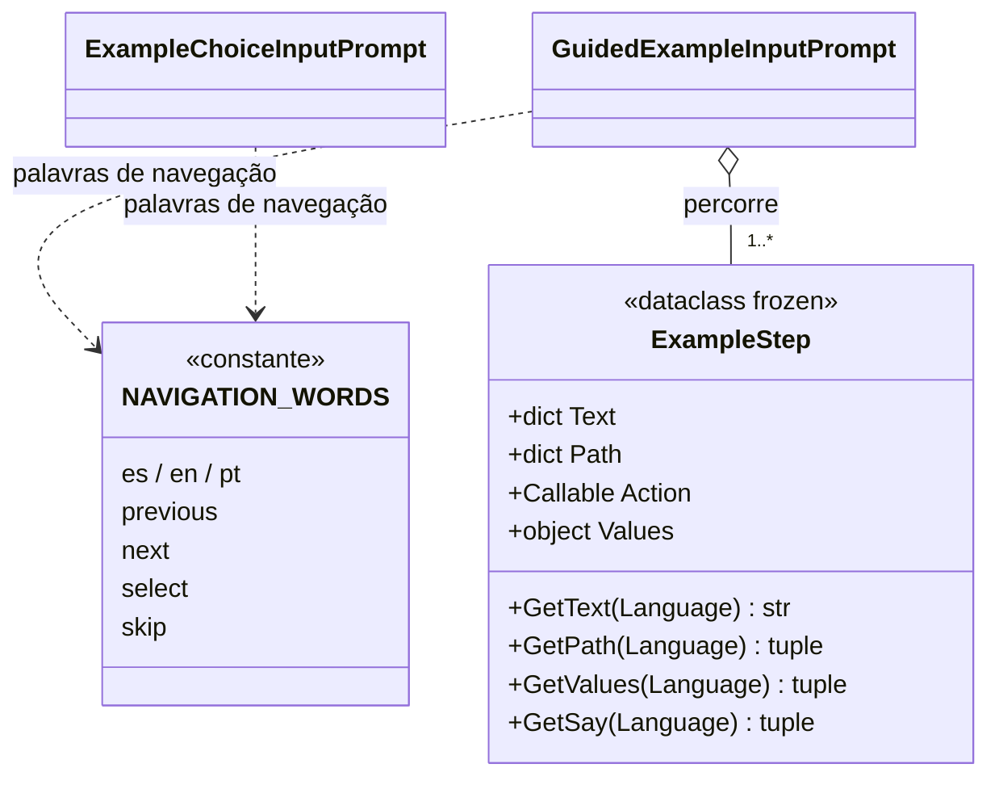

# ExampleStep

> **Arquivo:** `Dav/scr/ComponentesDAV/IntegracionGUI/GUIFreeCad/InputPrompts/ExampleStep.py`

Um **quadro** de um exemplo guiado: o que é mostrado ao usuário, **o que ele diria
para fazer o mesmo no DAV** e o que é executado no FreeCAD quando ele diz tudo. É um
`dataclass` imutável. O mesmo arquivo define `NAVIGATION_WORDS`, as palavras
*retroceder / avanzar / enviar / saltar* nos três idiomas, que o seletor e o reprodutor
compartilham.

## O que o usuário diz: `Path` e `Values`

O que é preciso dizer em um quadro é o mesmo que se diria para fazê-lo sem exemplo. Divide-se
em duas partes que se dizem **nesta ordem**:

| Campo | O que é | Exemplo (es) |
| --- | --- | --- |
| `Path` | As frases que **navegam a árvore de comandos** até chegar ao comando. Cada elemento é uma frase do dicionário (`"nuevo boceto"`, `"tres de"`) | `("banco", "croquis", "nuevo")` |
| `Values` | O que é **ditado nos diálogos** que o comando abre: números, `enviar`, `abajo` para se mover por uma lista | `("cero", "enviar", "cero", "enviar", "doce", "enviar")` |

`GetSay(Language)` devolve `Path + Values`: é o que o reprodutor mostra e espera.

`Values` pode ser um `dict` por idioma ou uma **função** `f(idioma) -> tuple` quando o
que é ditado depende do documento. É avaliada cada vez que o quadro é mostrado, com o
documento tal como está naquele momento. Exemplo: no Dado, quantas vezes dizer `abajo`
para chegar a uma face da lista do seletor.

## Campos

| Campo | O que é |
| --- | --- |
| `Text` | Instrução exibida, por idioma (`es`, `en`, `pt`) |
| `Path` | Frases de navegação, em ordem, por idioma |
| `Action` | Função sem argumentos que faz o trabalho no FreeCAD |
| `Values` | Palavras ditadas nos diálogos do comando (opcional) |

## Notas de design

- **Cai para o espanhol.** `GetText`, `GetPath` e `GetValues` devolvem a versão em espanhol se
  faltar o idioma pedido.
- **Os dados não conhecem a voz.** O quadro apenas declara o que se diz e o que se executa; quem
  o escuta e o compara é [`GuidedExampleInputPrompt`](GuidedExampleInputPrompt.md).
- **`Path` pode ser verificado contra a árvore real** sem executar nada: é o que faz
  `tests/verify_examples_paths.py` (ver [`Examples`](Examples.md)). `Values` não, porque
  depende dos diálogos de cada comando.
- **O comando real e a ação não são a mesma coisa.** O que se diz é o real; a `Action` chama
  diretamente o FreeCAD (ou a mesma função de cota que o dicionário usa), assim um exemplo
  não abre diálogos modais nem depende da seleção do usuário.
