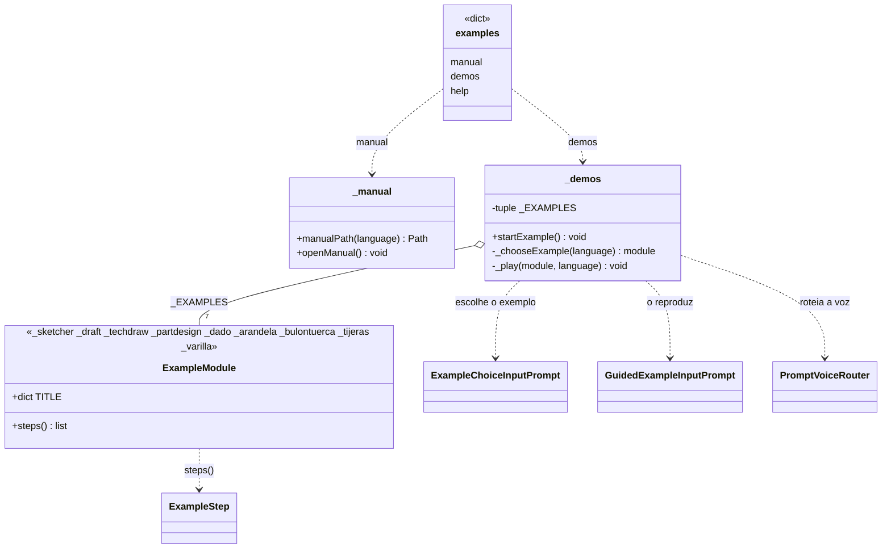

# Examples (pasta `Explorer/Examples`)

> **Pasta:** `Dav/dic/Explorer/Examples/`

Submenu do Explorer para aprender: abre o manual do usuário e lança exemplos
guiados. Entra-se com *ejemplos*, *quiero aprender* ou *aprender* (e seus
equivalentes em inglês e português). A pasta não tem ícone; suas duas folhas têm
(`manual.svg` e `demos.svg`).



## Folhas do submenu

| Chave | Palavras (es) | O que faz |
| --- | --- | --- |
| `manual` | manual, referencia, guía | `openManual()`: abre `Manual_Usuario.pdf` (espanhol), `User_Manual.pdf` (inglês) ou `Manual_do_Usuario.pdf` (português) |
| `demos` | ejemplos, demostraciones, tutorial | `startExample()`: seletor de exemplos e reprodutor |
| `help` | ayuda | Janela de ajuda do submenu |

## Exemplos

| Módulo | Conteúdo | Medidas | Quadros |
| --- | --- | --- | --- |
| `_sketcher` | Um círculo com restrição de raio | Cota 2D | 5 |
| `_draft` | Retângulo, círculo e polígono | Cota 2D | 4 |
| `_techdraw` | Um círculo em uma folha A4 com legenda | — | 4 |
| `_partdesign` | Um parafuso: cilindro, cone, prisma, chanfro e rosca com uma hélice | Cota 3D e «tres de» | 9 |
| `_dado` | Um dado: o 1 com um cilindro, do 2 ao 6 com um esboço e um esvaziamento por face | Cota 3D, seis vistas e «tres de» | 25 |
| `_arandela` | Uma arruela lisa M6: dois círculos em um croqui, extrusão de 1,6 mm e uma folha de TechDraw com vista isométrica, vista do esboço e texto | Restrição de diâmetro e cota 2D | 11 |
| `_bulontuerca` | Um parafuso M6 (simplificado da DIN 931) e sua porca no PartDesign, e uma montagem: vínculos inseridos por voz, parafuso ancorado e junta cilíndrica pelas faces escolhidas | Montagem e «tres de» | 11 |
| `_varilla` | Uma barra roscada M30: núcleo cilíndrico e rosca real (filete de 60° em uma hélice de passo 3,5), cota do passo, e duas porcas sextavadas em uma montagem com juntas de parafuso pelas faces das extremidades | Cota 3D, junta de parafuso e «tres de» | 16 |

Cada módulo expõe `TITLE` (por idioma) e `steps()`, que devolve a lista de
[`ExampleStep`](ExampleStep.md). Para adicionar um exemplo basta criar o módulo
e acrescentá-lo a `_EXAMPLES` em `_demos.py`.

Arquivos de apoio: `_common.py` (documento ativo, ajustar a vista, vistas padrão, localizar uma
primitiva) e `_words.py` (os números e palavras ditados nos diálogos, nos três
idiomas: `numbers`, `send`, `down`, `nextItem`, `no`, `yes`). `numbers` dita qualquer valor, inteiro ou decimal: de 0 a 99 com a palavra natural, de 100 em diante dígito por dígito, e o decimal com «punto» (em espanhol o reprodutor aceita também «coma», ver `WORD_SYNONYMS` em `ExampleStep.py`).

## O que se diz é o real

Os quadros não inventam frases: cada `Path` é o que um usuário diria, percorrendo a árvore, para
fazer exatamente aquilo. O caso do círculo de um croqui:

```
banco → croquis → nuevo → enviar        (escolhe o plano)
geometría → círculo → círculo           (cria o círculo)
cero enviar · cero enviar · doce enviar  (centro X, centro Y, raio)
```

Os diálogos são reproduzidos tal como cada comando os pede; cada dado com seu `enviar`. Quando
o que é ditado depende do documento (o Dado), `Values` é uma função; ver [`ExampleStep`](ExampleStep.md).

## Verificação contra a árvore real

`tests/verify_examples_paths.py` (lançado com `freecadcmd`) reproduz cada `Path`, nos três
idiomas, por um `Browser` real, executa as ações e escreve um relatório com o comando a que
cada quadro chega. Serve para detectar que:

- uma frase não é resolvida (uma palavra que falta em um `TraduceTo*`);
- uma frase chega a **outro comando** por correspondência aproximada (por exemplo «cortar» dito a partir de
  *Sumar* chegava a «cotar»); evita-se com «subir» antes;
- o contexto muda pelo caminho (a partir de *Círculo*, «crear» salta para Workbench; por isso o
  polígono do Draft começa com «subir»).

Para o Dado, depois de «cerrar croquis» volta-se a «banco» e «diseño», porque o fechamento deixa a voz
em *Croquis* mesmo que o esboço seja de um Body.

## Notas de design

- **As chaves não colidem com o ícone da pasta.** O painel procura o SVG pelo
  nome da chave, por isso a folha de exemplos se chama `demos` e não `examples`:
  assim a pasta `examples` fica sem ícone.
- **Manual por idioma.** O português abre o manual em inglês porque não existe um
  em português. O PDF é procurado subindo a partir do arquivo até a raiz do repositório ou
  da instalação.
- **Exemplos com a API do FreeCAD.** O que é **dito** é o real, mas cada `Action` chama
  diretamente o FreeCAD (ou a mesma função de cota do dicionário) e não passa pelos diálogos
  modais do comando; assim o exemplo funciona mesmo que o usuário esteja em outro contexto e não
  depende de uma seleção prévia.
- **Um único exemplo por vez:** `_player` guarda o reprodutor ativo.
