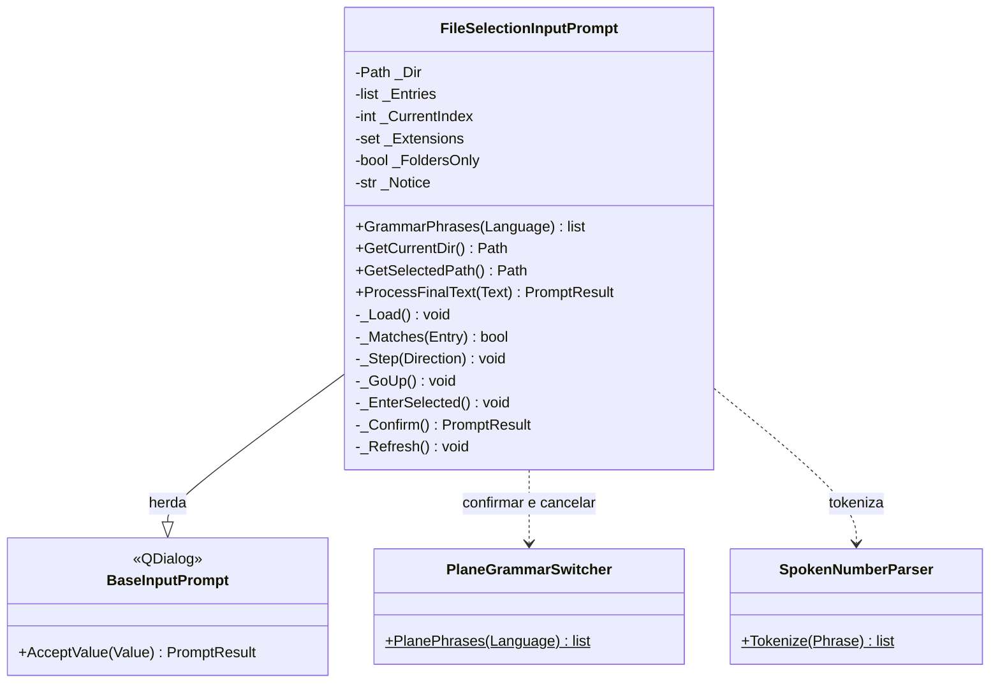

# FileSelectionInputPrompt

> **Arquivo:** `Dav/scr/ComponentesDAV/IntegracionGUI/GUIFreeCad/InputPrompts/FileSelectionInputPrompt.py`

Navegador de pastas por voz. Os nomes de arquivo **não podem ser ditados** (não
estão no vocabulário do Vosk), então percorre-se a lista com
*siguiente / anterior*, entra-se em uma pasta com *abrir*, sobe-se com *subir* e
confirma-se com *okey*. É usado pelo submenu Projeto (abrir, salvar e exportar sem
os diálogos nativos do FreeCAD).

## Palavras

| Papel | es | en | pt |
| --- | --- | --- | --- |
| Seguinte | siguiente, avanzar, abajo, próximo, otro | next, forward, down, advance | seguinte, próximo, abaixo |
| Anterior | anterior, atrás, retroceder, arriba, previo | previous, back, up | anterior, voltar, cima |
| Subir | subir, padre | parent, out | subir, pai |
| Entrar | abrir, adentro | open, inside | abrir, dentro |
| Escolher | elegir, seleccionar | choose, select | escolher, selecionar |

`entrar` **não** serve para entrar em uma pasta porque já é uma palavra de
confirmação.

## Modos

| Modo | Lista | `okey` |
| --- | --- | --- |
| Arquivos (padrão) | Pastas e depois arquivos, filtrados por `Extensions` | Sobre um arquivo o escolhe; sobre uma pasta **entra** |
| Somente pastas (`FoldersOnly=True`) | Somente pastas | Escolhe a pasta que está sendo vista, assim uma pasta sem subpastas também pode ser escolhida |

O valor aceito é o caminho escolhido, como texto.

## Notas de design

- As pastas vêm antes dos arquivos e cada grupo é ordenado sem distinguir
  maiúsculas (`casefold`). As entradas que começam com ponto ficam ocultas.
- Se a pasta não puder ser lida, o erro é mostrado como aviso e a lista fica vazia.
- Quem o abrir deve restringir a gramática com `GrammarPhrases` e registrá-lo em
  [`PromptVoiceRouter`](PromptVoiceRouter.md); ver `_browse` em `Explorer/Proyecto/_project.py`.
