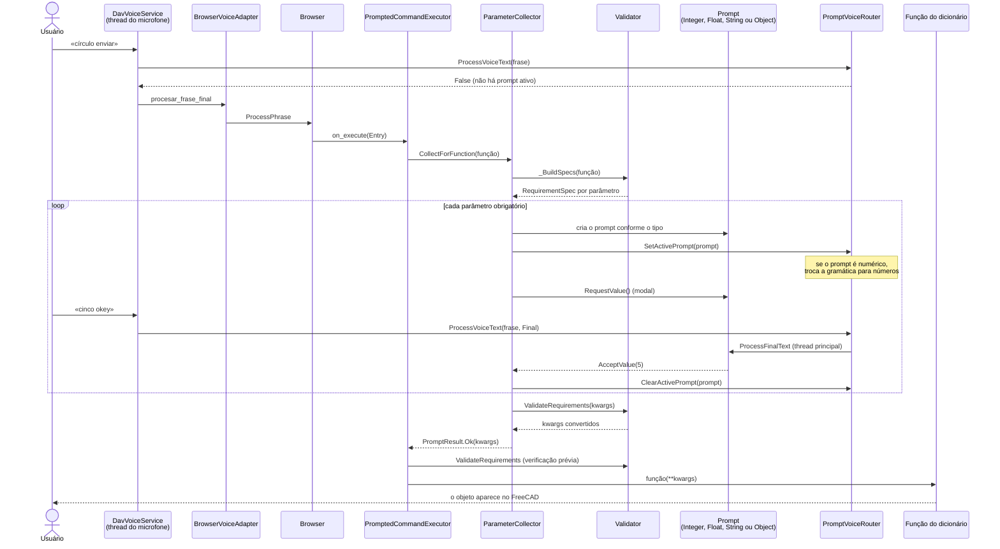
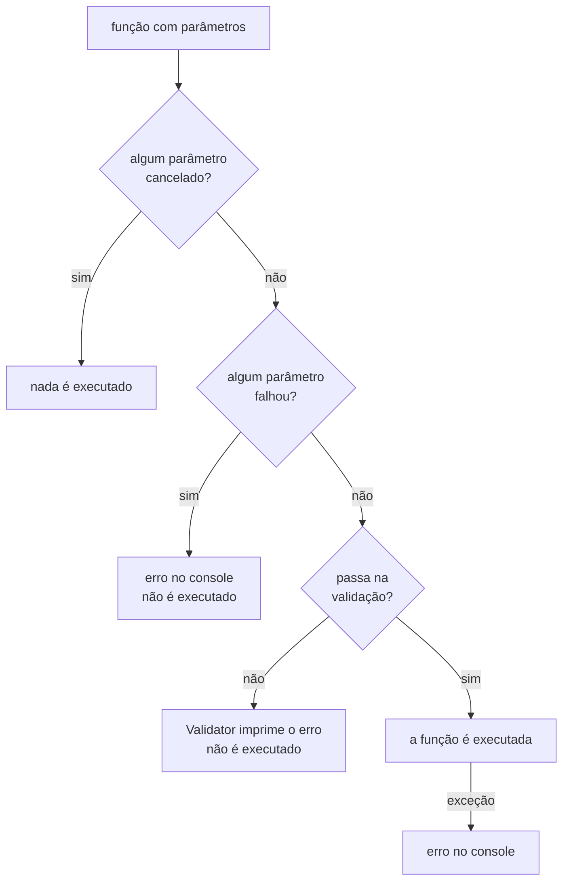

# Fluxo de um comando com parâmetros

O que acontece desde que o usuário diz um comando que precisa de valores (por exemplo
«círculo», que pede raio) até que a função rode no FreeCAD. Reúne
[`Browser`](Browser.md), [`PromptedCommandExecutor`](PromptedCommandExecutor.md),
[`ParameterCollector`](ParameterCollector.md), [`Validator`](Validator.md), os
diálogos de voz e [`PromptVoiceRouter`](PromptVoiceRouter.md).

## Sequência

## O que pode cortar o fluxo

## Pontos a ter em conta

- **Enquanto um prompt está ativo, o `Browser` não ouve.** O router consome as frases
  (`ProcessVoiceText` devolve `True`), e por isso o registro é sempre liberado em um
  `finally`.
- **Os textos dos diálogos são resolvidos com o idioma atual**, não com o da inicialização
  (ver a propriedade `Language` de `ParameterCollector`).
- **Os tipos saem da assinatura da função.** Uma anotação `int` abre um prompt
  numérico inteiro, `float` um decimal, `str` um de texto e qualquer outra coisa um de
  seleção de objetos. Os parâmetros com valor padrão **não são pedidos**.
- **Outros diálogos não passam por aqui.** Os comandos que montam sua própria conversa
  (escolher um plano, abrir um arquivo, um exemplo guiado) abrem diretamente seu prompt
  com os helpers de `Workbench/_prompts.py`; ver
  [`guia-contribuir-dav.md`](../guia-desenvolvimento-dav.md).
- **Testar sem microfone:** `ExecuteEntry(Entry, SimulatedFinalTexts=["cinco okey"])`.
