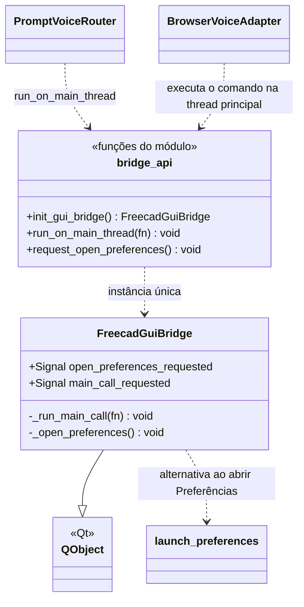
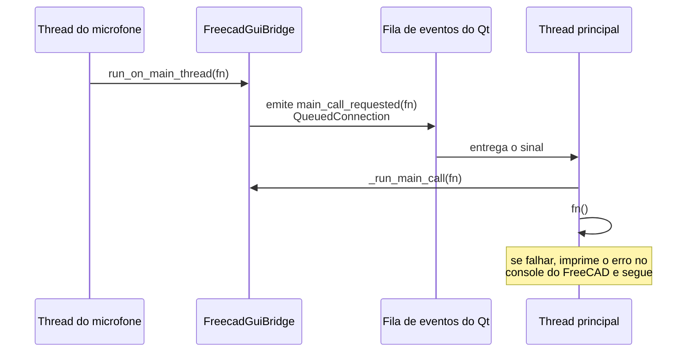

# FreecadGuiBridge

> **Arquivo:** `Dav/scr/ComponentesDAV/IntegracionGUI/GUIFreeCad/integration/freecad_gui_bridge.py`

Ponte **da thread do microfone para a thread principal do Qt**. Os comandos do FreeCAD
(`Gui.runCommand`, criar objetos, abrir diálogos) só podem ser executados a partir da
thread da interface, mas a voz é reconhecida em outra. A ponte recebe uma função
de qualquer thread e a enfileira para que rode na principal.

## Como funciona

## Responsabilidades

| Elemento | O que faz |
| --- | --- |
| `run_on_main_thread(fn)` | Enfileira `fn` na thread principal. É seguro chamá-la de qualquer thread |
| `request_open_preferences()` | Pede para abrir as Preferências do DAV a partir da thread de voz |
| `init_gui_bridge()` | Cria a ponte na primeira vez e devolve sempre a mesma |
| `_run_main_call(fn)` | Executa a função; um erro é informado mas **não derruba a thread da interface** |
| `_open_preferences()` | Tenta `Gui.runCommand("DAV_OpenPreferences")`; se falhar usa [`launch_preferences`](LaunchPreferences.md) |

## Notas de design

- **`QueuedConnection` é o que troca de thread.** Com uma conexão direta a função
  rodaria na thread que emite, não na do Qt.
- **Instância única preguiçosa:** o `QObject` deve ser criado na thread principal; por isso
  `init_gui_bridge()` é chamado ao preparar a voz (`freecad_voice_setup.py`) e não a partir da thread de voz.
- Se `run_on_main_thread` não estiver disponível (fora do FreeCAD), `PromptVoiceRouter` executa
  a função diretamente.
