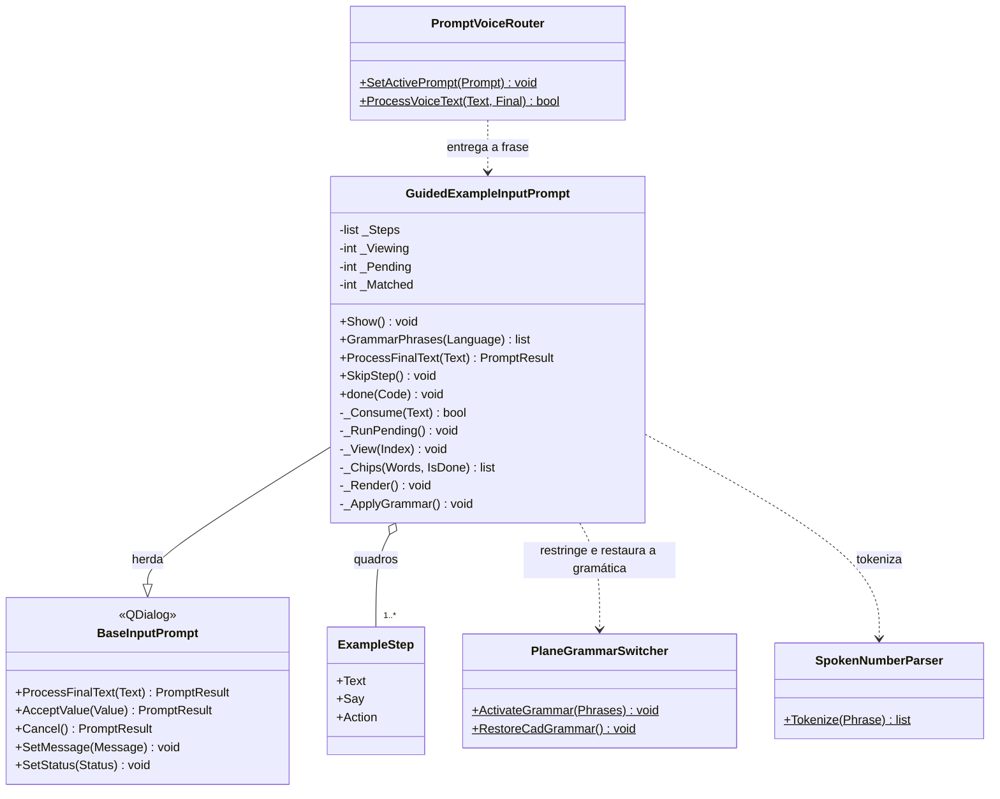
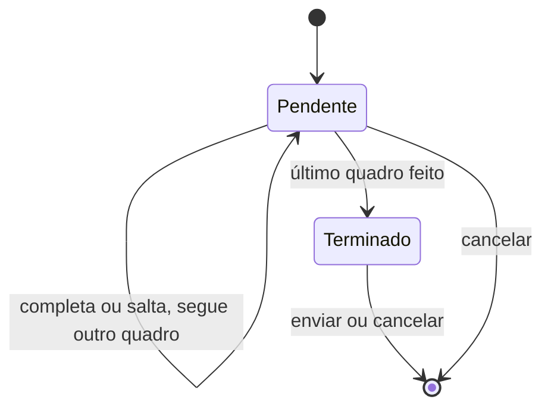

# GuidedExampleInputPrompt

> **Arquivo:** `Dav/scr/ComponentesDAV/IntegracionGUI/GUIFreeCad/InputPrompts/GuidedExampleInputPrompt.py`

Reprodutor de exemplos guiados. Mostra **um quadro por vez** com as palavras
que o usuário deve dizer; quando ele as diz todas, em ordem, executa a ação do
quadro e passa ao seguinte. Diferente do resto dos prompts, é **não modal**:
o usuário vê como a peça é montada na vista 3D enquanto segue o exemplo.

## Responsabilidades

| Método | O que faz |
| --- | --- |
| `ProcessFinalText(Text)` | Primeiro compara as palavras do quadro pendente; se não coincidirem, cancelar fecha, *saltar* executa e *retroceder*/*avanzar* revisam quadros; ao terminar, *enviar* fecha |
| `_Consume(Text)` | Procura na frase as palavras pendentes **em ordem**; guarda o avanço entre frases; ao completá-las chama `_RunPending` |
| `_RunPending()` | Executa `Action`; se falhar, o quadro não avança e o erro é mostrado |
| `SkipStep()` | Executa o quadro sem dizer suas palavras (também é o botão da janela) |
| `GrammarPhrases(Language)` | Navegação, cancelar e as palavras do **quadro atual** |
| `Show()` | Mostra a janela embaixo à direita do editor, sem bloqueá-lo |
| `done(Code)` | Restaura a gramática do CAD ao fechar |

## Estado

- `_Pending`: primeiro quadro não feito. `_Viewing`: o que está sendo visto. Só é possível
  voltar a quadros anteriores (`_Viewing ≤ _Pending`), nunca pular um.
- `_Matched`: palavras já ditas do quadro pendente.

## Notas de design

- **As palavras se acumulam entre frases** dentro de um mesmo quadro, mas uma
  palavra fora de ordem não conta. Podem ser ditas todas juntas ou uma a uma, como no uso real.
- **As palavras do quadro vêm antes de cancelar.** Um quadro pode pedir «no» (a resposta a
  «¿cuerpo nuevo?»), que em qualquer outro momento cancela.
- **As repetições são agrupadas ao serem mostradas**: `abajo abajo abajo` aparece como «abajo ×3», com
  o avanço («2/3») enquanto são ditas.
- **A gramática é restrita por quadro:** o Vosk só escuta as palavras do quadro
  atual e a navegação, o que melhora o reconhecimento.
- **Não modal:** por isso `startExample()` guarda a referência do reprodutor e
  registra a limpeza do router em `finished`.
- O botão *Aceitar* do prompt base passa a ser *Pular quadro* e *Cancelar* passa a *Fechar*.
