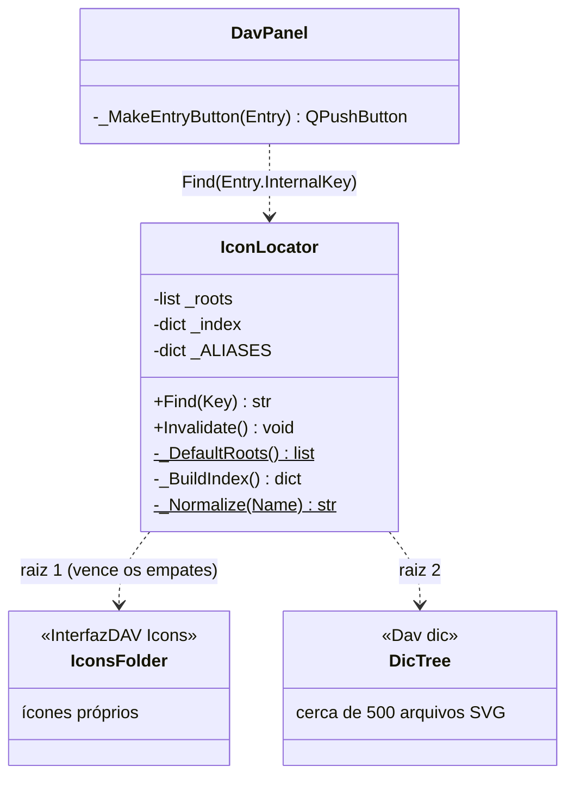
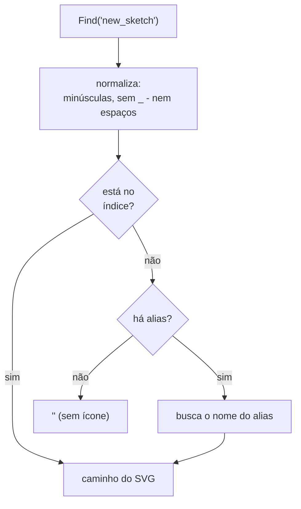

# IconLocator

> **Arquivo:** `Dav/scr/ComponentesDAV/InterfazDAV/IconLocator.py`

Encontra o **SVG de uma chave do dicionário** para que [`DavPanel`](DavPanel.md)
desenhe o ícone de cada botão. Indexa as pastas de ícones **uma única vez** (no
primeiro pedido) e reutiliza o índice. Antes percorria-se toda a árvore a cada botão
e a cada repintura, sem cache.

## Como busca

## Regras que é preciso conhecer ao adicionar um SVG

| Regra | Consequência |
| --- | --- |
| **Busca-se pelo nome da chave**, não pela pasta | Para que um botão tenha ícone, o SVG se chama como sua chave: chave `save` → `save.svg` |
| **O nome é normalizado** | `lineattributes` = `LineAttributes.svg`; `new_sketch` = `NewSketch.svg` |
| **A primeira raiz que define um nome vence** | Um ícone em `InterfazDAV/Icons` se sobrepõe ao da árvore de dicionários |
| **Um nome repetido na árvore: vence o primeiro encontrado** | Duas pastas com `open.svg` compartilham o ícone: `setdefault` não distingue pastas |
| **Sem SVG não há erro** | `Find` devolve `""` e o painel usa sua alternativa de duas letras |
| **`_ALIASES`** | Chaves cujo ícone existe com outro nome: `pieza`→`part`, `circulo`→`circle`, `stdview`→`standardviews` |

## Notas de design

- **Uma pasta sem ícone é válida e às vezes desejada**: por isso a folha de exemplos
  se chama `demos` e não `examples`; assim a pasta `examples` fica sem SVG.
  Ver [`Examples`](Examples.md).
- **A raiz de `Dav/dic` é validada** procurando `base.py` (`ComponentesDAV/Dav/dic` é um
  marcador de posição vazio que aparece antes na cadeia de ancestrais).
- `Invalidate()` descarta o índice; o próximo `Find` volta a percorrer as pastas.
