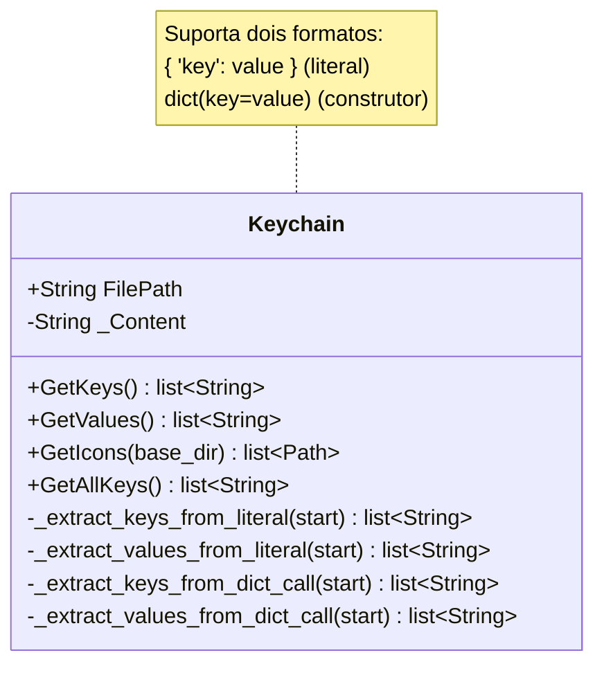

# Keychain

> **Arquivo:** `Dav/scr/ComponentesDAV/Keychain/Keychain.py`

Extrai as chaves e os ícones de um dicionário `.py` **sem executá-lo**:
faz o parsing do texto do arquivo. Serve para ler os dicionários de fora do
FreeCAD, onde `import FreeCADGui` falharia.

## Por que o módulo não é importado

Os dicionários de `Dav/dic/` fazem `import FreeCADGui` no cabeçalho. Fora do
FreeCAD isso lança `ModuleNotFoundError`, então qualquer ferramenta externa
que queira listar os comandos (um teste, um script de auditoria, a GUI quando
rodava como processo separado) não pode simplesmente importá-los.

`Keychain` lê o arquivo como texto e extrai as chaves por parsing. Não executa
nada, então não precisa do FreeCAD.

## Notas de design

- **É tolerante, mas não infalível.** Por ser parsing de texto e não AST, formatos
  incomuns podem escapar. Se um dicionário não aparece onde deveria, verifique
  primeiro se ele usa um dos dois formatos suportados.
- O `Browser` **não** usa `Keychain`: dentro do FreeCAD ele importa os módulos de
  verdade via `DictionaryLoader`, que consegue resolver os callables.
