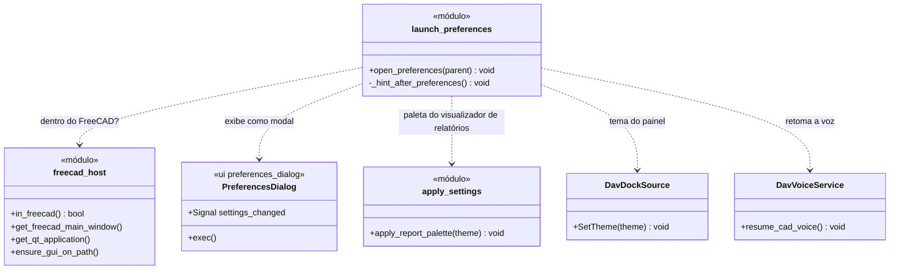
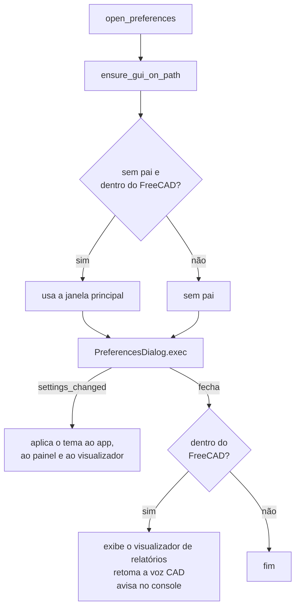

# LaunchPreferences

> **Arquivo:** `Dav/scr/ComponentesDAV/IntegracionGUI/GUIFreeCad/integration/launch_preferences.py`

Abre o **diálogo de Preferências do DAV** dentro do FreeCAD (ou avulso, em testes)
e, ao fechá-lo, aplica o que mudou: o tema, o painel acoplado e a voz. É o
callable que executa o comando «preferencias» do dicionário raiz.

## O que acontece ao abrir

## Notas de design

- **É modal.** Ao fechá-lo, dentro do FreeCAD, chama-se `DavVoiceService.resume_cad_voice()`
  para que a voz volte a controlar o CAD.
- **As mudanças são aplicadas ao vivo** (`settings_changed`), sem reiniciar o FreeCAD.
- **Cada aplicação tem seu próprio `try`:** se o painel não existe ou a paleta falha, o
  restante ainda é aplicado.
- Pode ser aberto a partir da thread de voz com
  [`FreecadGuiBridge`](FreecadGuiBridge.md) (`request_open_preferences`).
- Veja também [`Preferences`](Preferences.md), que salva e persiste a configuração.
