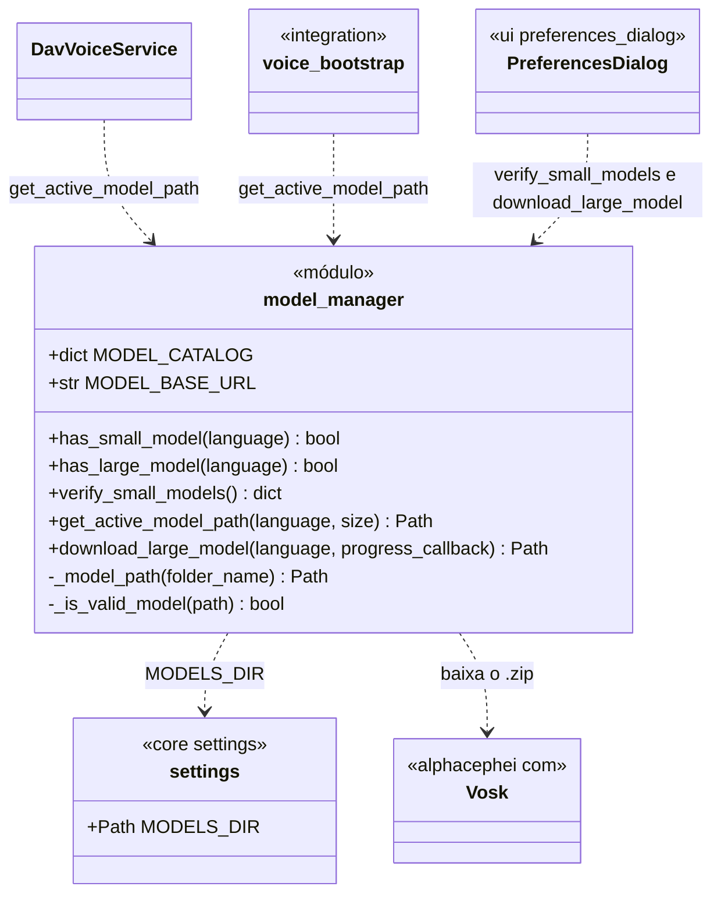
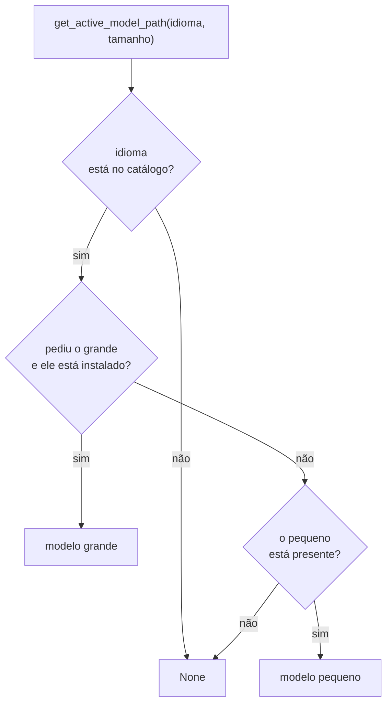

# ModelManager

> **Arquivo:** `Dav/scr/ComponentesDAV/IntegracionGUI/GUIFreeCad/core/model_manager.py`

Módulo de funções (não uma classe) que **verifica e baixa os modelos do Vosk**.
Cada idioma tem um modelo *pequeno* (que vem com o projeto) e um *grande* (baixado
sob demanda). Decide qual pasta usar conforme a preferência de tamanho e o que há em disco.

## Catálogo

| Idioma | Modelo pequeno | Modelo grande |
| --- | --- | --- |
| `es` | `vosk-model-small-es-0.42` | `vosk-model-es-0.42` |
| `en` | `vosk-model-small-en-us-0.15` | `vosk-model-en-us-0.22` |
| `pt` | `vosk-model-small-pt-0.3` | `vosk-model-pt-fb-v0.1.1-20220516_2113` |

## Qual modelo é escolhido

## Notas de design

- **Um modelo é válido se a pasta tem algum dos seus arquivos característicos**
  (`am`, `graph`, `conf`, `ivector`, `final.mdl`, `Gr.fst`). Uma pasta vazia ou com
  download incompleto não conta.
- **Pedir o grande sem tê-lo recorre ao pequeno**, assim o reconhecimento nunca fica sem modelo
  se o pequeno estiver presente.
- **`download_large_model`** baixa o `.zip`, descompacta em `MODELS_DIR`, apaga o `.zip`
  e valida o resultado; se a pasta extraída tiver outro nome, ela é renomeada. Informa o
  progresso com um `progress_callback(baixado, total)`.
- **O tamanho** vem de `settings.model_size` (preferência do usuário).
- **A pasta de modelos** vem de `core/settings.py` e respeita `DAV_MODELS_DIR`.
- Um modelo grande **não melhora** o reconhecimento de comandos:
