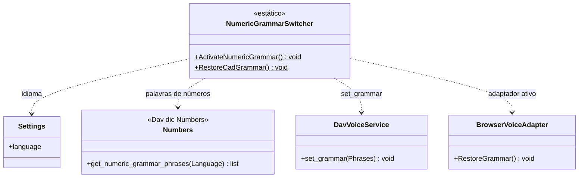

# NumericGrammarSwitcher

> **Arquivo:** `Dav/scr/ComponentesDAV/IntegracionGUI/GUIFreeCad/InputPrompts/NumericGrammarSwitcher.py`

Troca a gramática do Vosk **entre a de CAD e a de ditado de números**. Está
separada do [`PromptVoiceRouter`](PromptVoiceRouter.md) de propósito: o roteador só
sabe *qual prompt está ativo*; trocar a gramática é outra responsabilidade, com
dependências próprias.

## Responsabilidades

| Método | O que faz |
| --- | --- |
| `ActivateNumericGrammar()` | Pede ao `Numbers` as frases de números do idioma ativo e as entrega ao Vosk |
| `RestoreCadGrammar()` | Pede ao adaptador ativo do `Browser` que recalcule a gramática do contexto atual |

## Notas de design

- **O vocabulário numérico vive no dicionário** (`Dav/dic/Numbers/`), não no
  código: adicionar um sinônimo é editar um `TraduceTo*.py`. Veja
  [`numeros-dicionario-gramatica.md`](../numeros-dicionario-gramatica.md).
- **Falha em silêncio:** ambos os métodos capturam as exceções. Se não há voz (por
  exemplo, em testes), um prompt numérico continua funcionando com texto simulado.
- É disparado pelo `PromptVoiceRouter` quando o prompt registrado devolve `True` em
  `RequiresNumericGrammar()`; veja [`NumericInputPrompt`](NumericInputPrompt.md).
