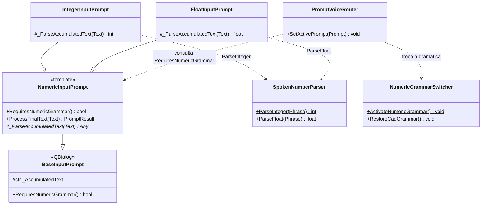
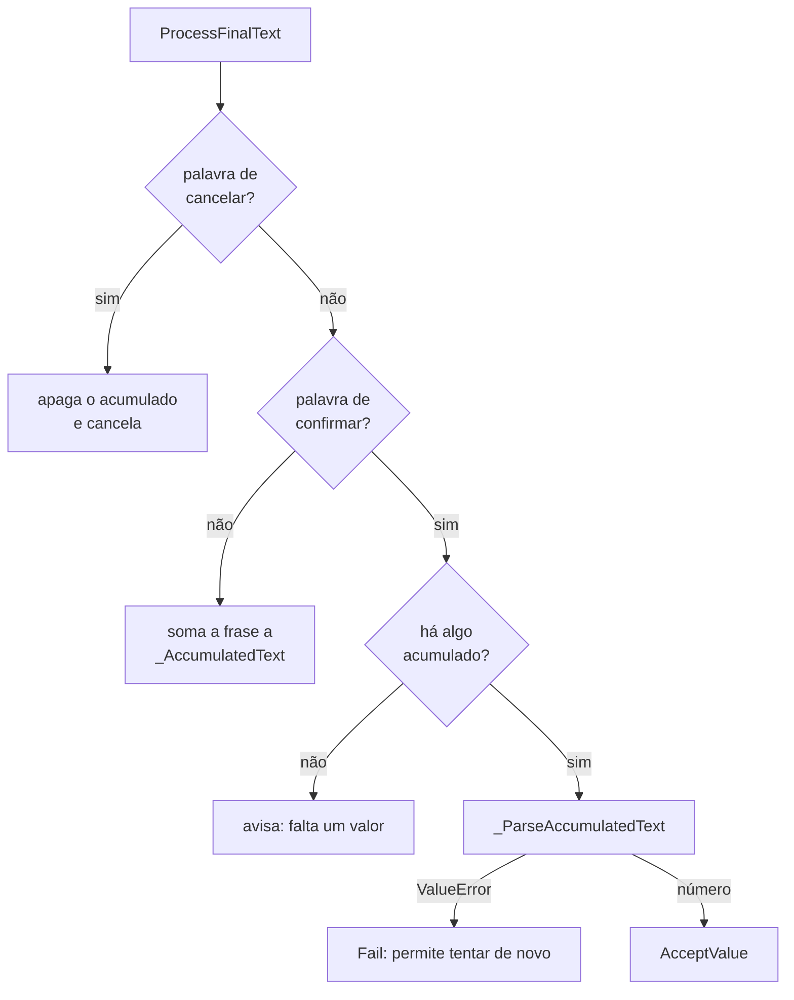

# NumericInputPrompt

> **Arquivo:** `Dav/scr/ComponentesDAV/IntegracionGUI/GUIFreeCad/InputPrompts/NumericInputPrompt.py`

Modelo (template) dos prompts que pedem **um número ditado**. Guarda o que o usuário
vai dizendo, mesmo que o faça em várias frases («cinco» … «coma» … «dos» … «okey»), e
só quando ouve uma palavra de confirmação o converte. As subclasses apenas
implementam **como converter** o texto acumulado.

## Fluxo de uma frase

## Notas de design

- **Padrão template method.** O fluxo acumular / confirmar / cancelar vive uma única vez aqui; um
  novo tipo numérico só sobrescreve `_ParseAccumulatedText`.
- **`RequiresNumericGrammar()` devolve `True`.** Assim o [`PromptVoiceRouter`](PromptVoiceRouter.md)
  troca a gramática do Vosk para as palavras de números **sem verificar tipos concretos**.
- A conversão de palavras em número (incluindo «coma», «menos» e dezenas) está em
  [`SpokenNumberParser`](SpokenNumberParser.md).
- Um erro de conversão (`ValueError`) usa `Fail`: o diálogo permanece aberto e o acumulado
  já foi descartado, então o usuário volta a ditar o número.
